## HackTheBox Writeup — Beep

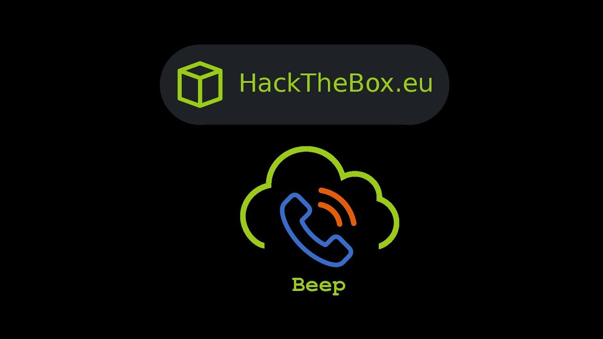

### NMAP Results

So we run NMAP against the target 10.10.10.7 and get

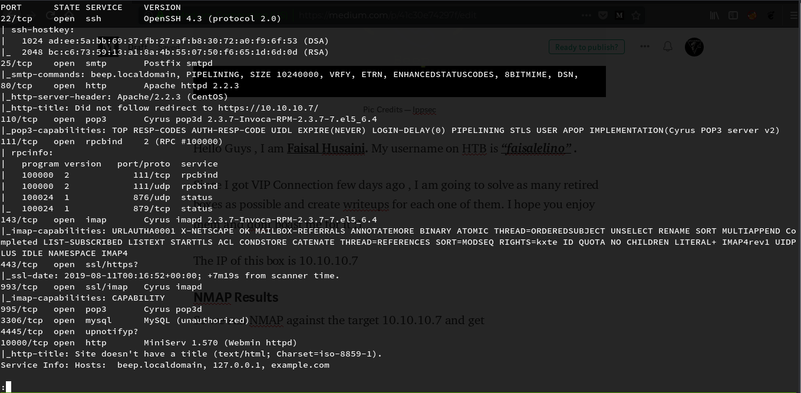

### Web Services

We run the IP in the browser , but it redirects us to HTTPS websites

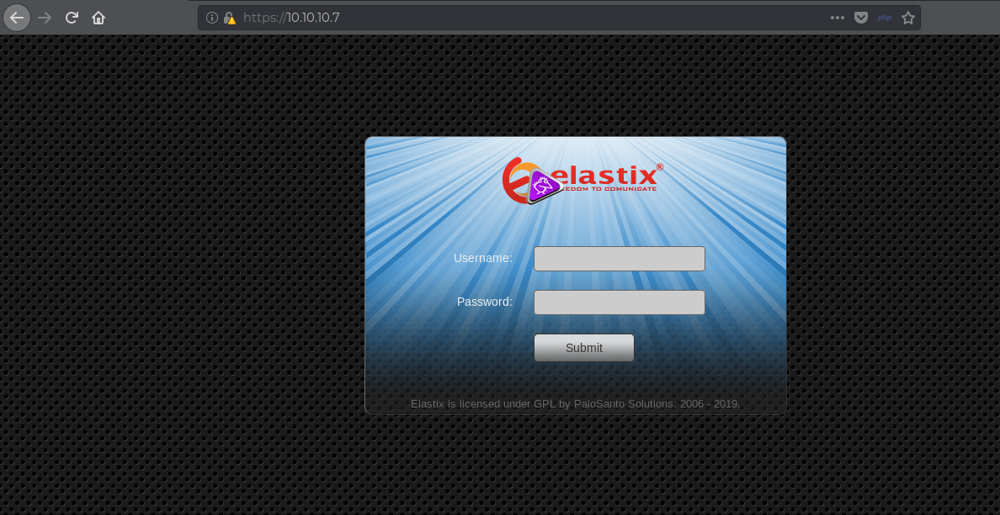

We see that its running Elastix , running Gobuster on it , we get

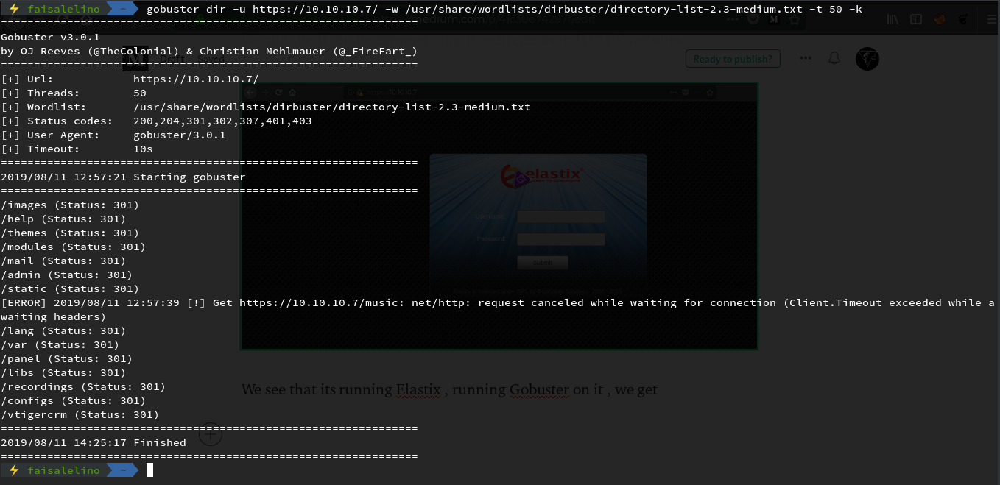

Running searchsploit for elastix , we get

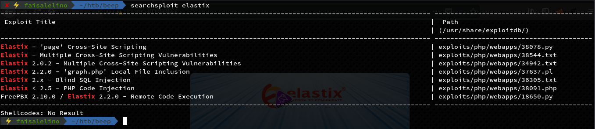

We get few exploits , the one which looks interesting is the LFI and Remote Code Execution one , let’s try the LFI one

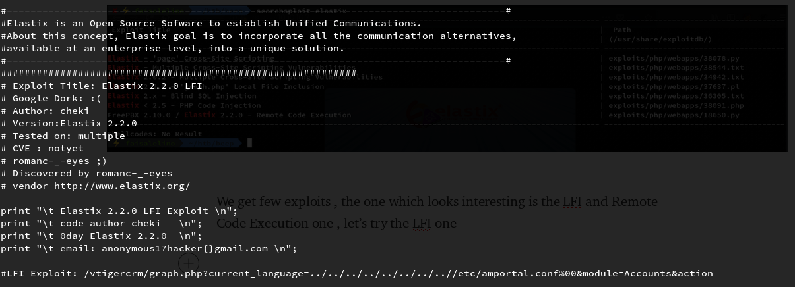

We see it gave us the location of the LFI , which is the /vtigercrm directory , which we saw in the gobuster results too , let’s copy it and see the result

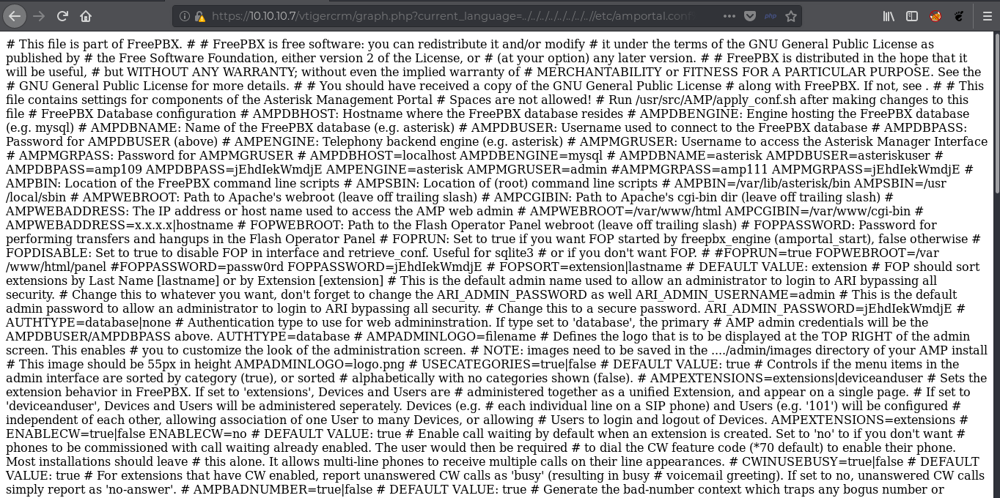

We get something , but its hard to read this rendered file , so we view the source code

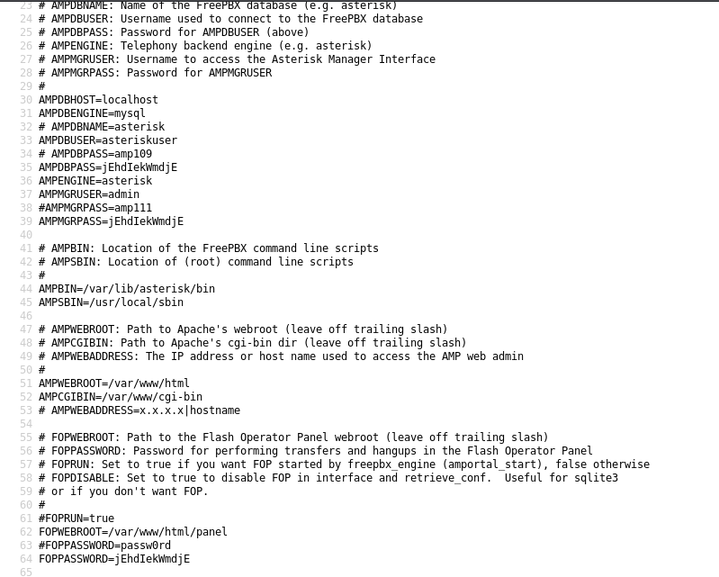

We get many things like users and password for FreePBX which can be accessed through the /admin

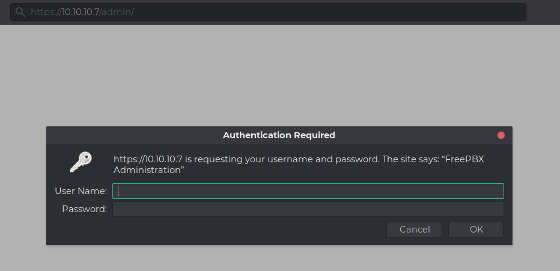

We get prompted for username and password , so we will enter the creds for admin as we got before and hit OK

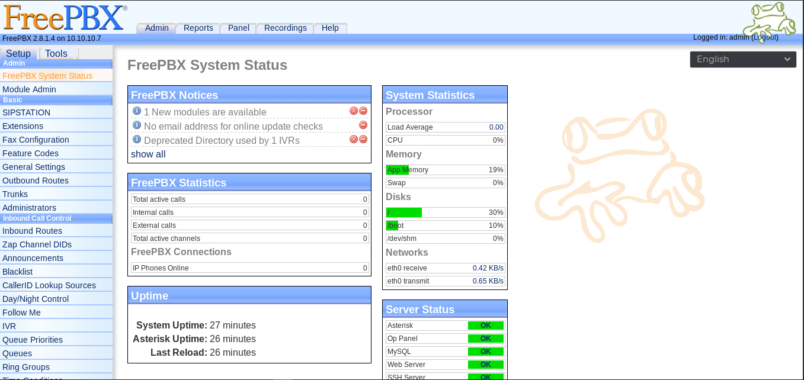

We got successfully logged in and see that its running FreePBX version 2.8.1.4

I tried many exploits for this , but it didnt worked for me , so as we saw that ssh is open and we have password for admin from the config file we got , let’s try to connect to root through it

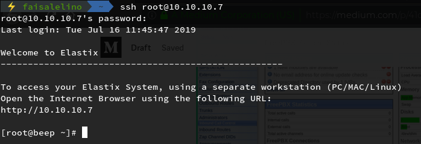

So we got it as root , it was a proper guess work here , coz I have encountered same thing on some other boxes too as well

Let’s get the user flag which is located at home folder of the user as user.txt

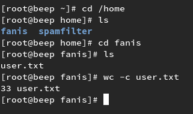

The root flag is located at the root folder as root.txt

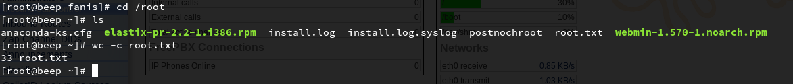

That’s the box , really very CTF type from the perspective I solved this