This is a writeup for the retired machine Blocky from HackTheBox.eu

Host: 10.10.10.37

    root@kali:~/Desktop# nmap -sV -sC 10.10.10.37
    
    Starting Nmap 7.40 ( [https://nmap.org](https://nmap.org) ) at 2017–11–16 02:11 EST
    Nmap scan report for 10.10.10.37
    Host is up (0.14s latency).
    Not shown: 996 filtered ports
    PORT STATE SERVICE VERSION
    21/tcp open ftp ProFTPD 1.3.5a
    22/tcp open ssh OpenSSH 7.2p2 Ubuntu 4ubuntu2.2 (Ubuntu Linux; protocol 2.0)
    | ssh-hostkey: 
    | 2048 d6:2b:99:b4:d5:e7:53:ce:2b:fc:b5:d7:9d:79:fb:a2 (RSA)
    |_ 256 5d:7f:38:95:70:c9:be:ac:67:a0:1e:86:e7:97:84:03 (ECDSA)
    80/tcp open http Apache httpd 2.4.18 ((Ubuntu))
    |_http-generator: WordPress 4.8
    |_http-server-header: Apache/2.4.18 (Ubuntu)
    |_http-title: BlockyCraft &#8211; Under Construction!
    8192/tcp closed sophos
    
    Service Info: OSs: Unix, Linux; CPE: cpe:/o:linux:linux_kernelService detection performed. Please report any incorrect results at [https://nmap.org/submit/](https://nmap.org/submit/) .
    Nmap done: 1 IP address (1 host up) scanned in 24.44 seconds

Used DirBuster and the word list **/usr/share/wordlists/dirbuster/directory-list-2.3-medium.txt **Some interesting files/folders I found were phpMyAdmin a plugins directory with multiple Java Archive files and the Wordpress login page.

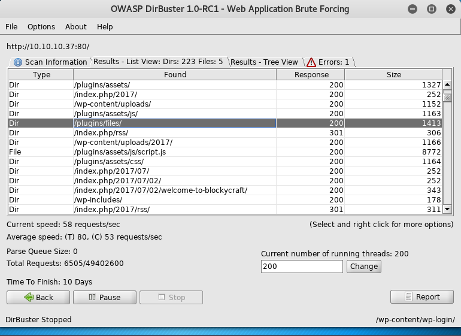

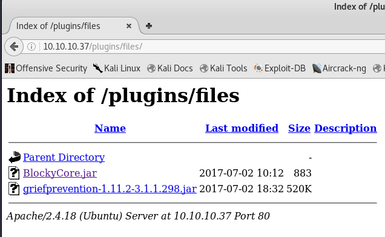

I downloaded the Jar files and decompiled BlockyCore.jar and …

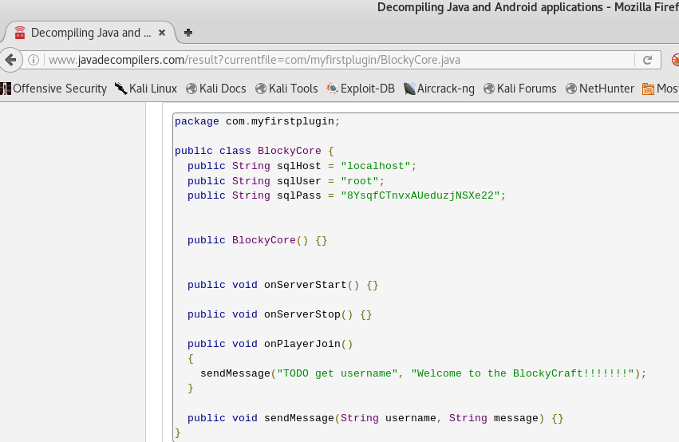

In plain text we can see that the credentials for phpMyAdmin.

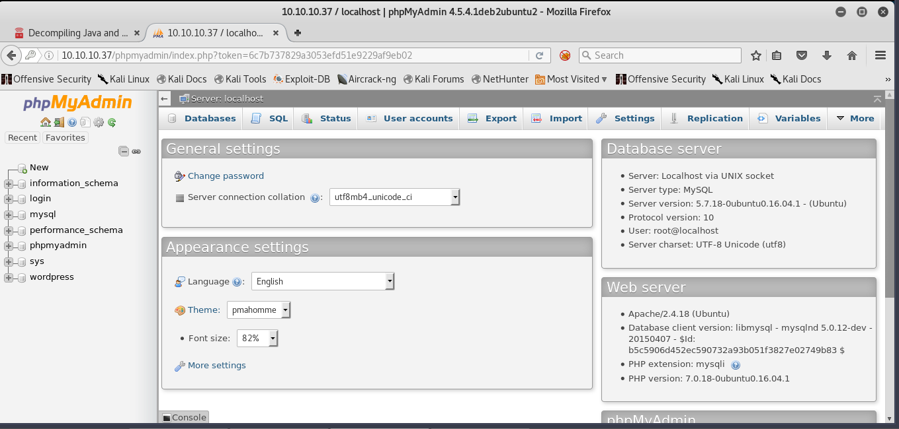

Once we log in into phpMyAdmin I started looking through the SQL database tables and the wordpress users were stored in the wp_users table.

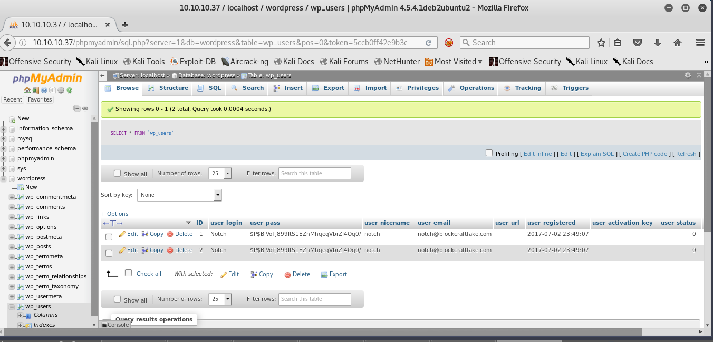

I changed the password to test123for the user Notch

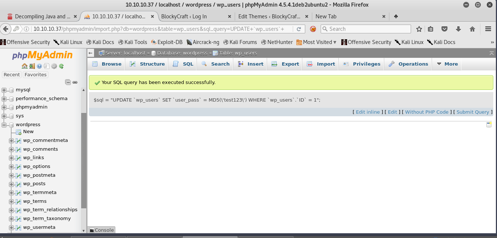

And using the new credentials I logged into the wordpress of dashboard

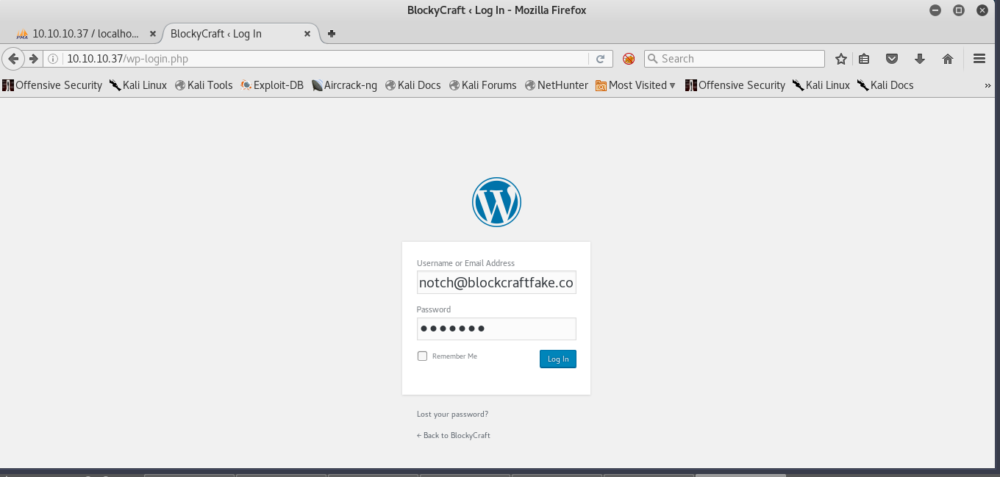

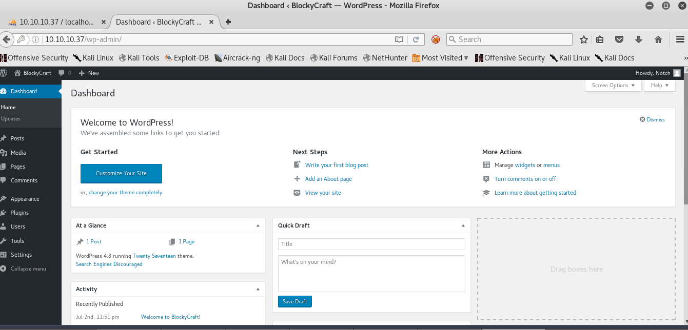

Then I uploaded my php reverse shell

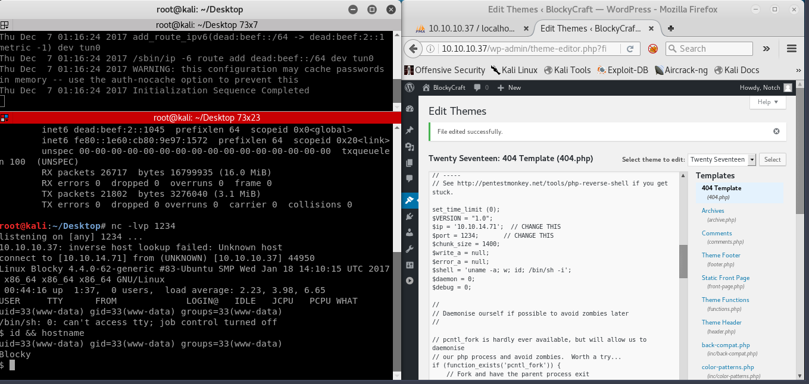

I hit a dead end I couldn’t figure out how to elevate my privileges so I went back and grabbed that password from the jar file and tried logging in through ssh with the same password and it worked!

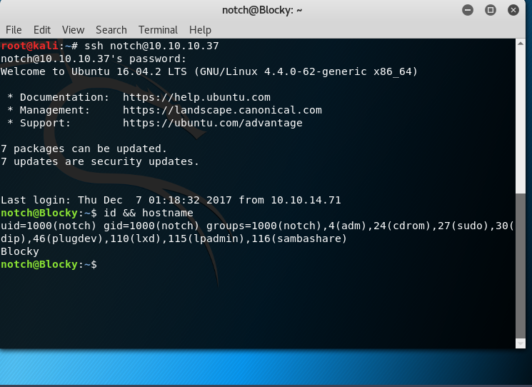

Now for the *hardest* part **Privilege Escalation. **I spent a long time enumerating the system but got nothing … How about we try the same password we got for phpMyAdmin for the SSH service as root …

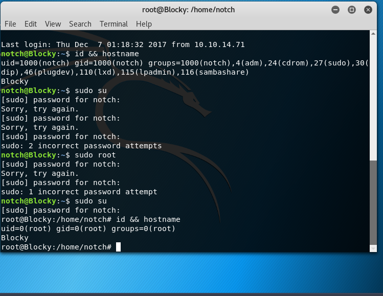

Overall this box was easy but very frustrating I was over thinking it way too much. But the point it’s trying to get across is the dangers of password reuse. You should never use the same password on multiple accounts. If you do this, and an attacker is able to figure out your password for one account, he or she will be able to access all of your accounts. Also, I recommend using a different username for sensitive accounts.

So how does one reduce the risk of password reuse attacks. Here are a few actions:

 1. Enable Two Factor Authentication (2FA) for all applications that support it

 2. Use a password manager to manage logins across applications like
- LastPass
- Intel True Key
- Dashlane
- RoboForm
- KeePass (Local vault)

 3. Use a password generator along with a password manager.

 4. Change your password frequently .

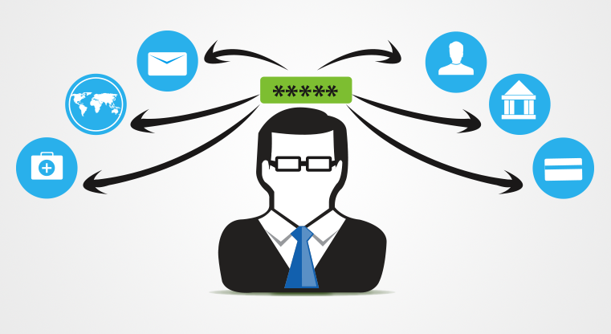

You can find me on twitter @[0Katz](https://twitter.com/0katz)
