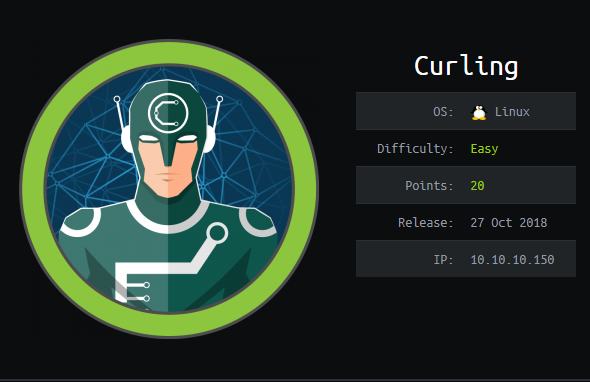

Curling name is probably given by the creator because the way it uses the curl to make a GET request on local files.Curling is a blog site using Joomla, a free open source content management system (CMS). The box is pretty fun and easy doesn’t require lot of enumeration and it isn’t too CTF like. We begin with

_nmap -sC -sV 10.10.10.150_

```
Nmap scan report for 10.10.10.150
Host is up (0.20s latency).
Not shown: 998 closed ports
PORT   STATE SERVICE VERSION
22/tcp open  ssh     OpenSSH 7.6p1 Ubuntu 4 (Ubuntu Linux; protocol 2.0)
| ssh-hostkey:
|   2048 8a:d1:69:b4:90:20:3e:a7:b6:54:01:eb:68:30:3a:ca (RSA)
|   256 9f:0b:c2:b2:0b:ad:8f:a1:4e:0b:f6:33:79:ef:fb:43 (ECDSA)
|_  256 c1:2a:35:44:30:0c:5b:56:6a:3f:a5:cc:64:66:d9:a9 (ED25519)
80/tcp open  http    Apache httpd 2.4.29 ((Ubuntu))
|_http-generator: Joomla! - Open Source Content Management
|_http-server-header: Apache/2.4.29 (Ubuntu)
|_http-title: Home
Service Info: OS: Linux; CPE: cpe:/o:linux:linux_kernel
```

Port 80 is open viewing the site in the browser takes us to the Curling website. There are 3 blog posts and a login form. Since we don’t have any credentials till now we can try some general username password combinations, which don’t work to keep our self away from hitting a dead end we enumerate directories.

The web-page looks likes this and we can see one interesting thing under the first post of curling in 2018! blog post. We have what seems to be a username at the end of the post ==> **FLORIS**

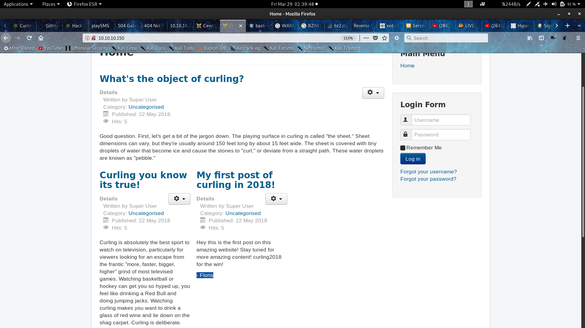

From our results from enumerating directories we see that there is /administrator page.

Before going to that page we see the source page of 10.10.10.150 for good measure and in hope of find something.

And Alas!!! we have a secret at the end of the page .

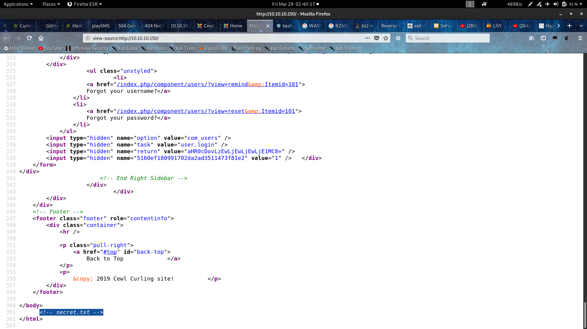

Going to 10.10.10.150/secret.txt we have what appears to be a base64 encoded string decoding it gives **Curling2018!. **Now we have a pair of credentials which we can try on the /administrator page.

Using Floris as username and Curling2018! as password we are successfully brought to the admin control panel.

There are lot of things to try to get our code executed and get a shell many of the ways lead to a rabbit hole. The first thing I tried is going to /media and tried to upload a png with php code in it by renaming it to something.php.png in Burpsuite, this gave an error “_You have tried to upload file(s) that are not safe_” you can check this method in Ippsec’s Popcorn [**video**](https://www.youtube.com/watch?v=NMGsnPSm8iw). The next thing I tried was under Install Extensions, where I installed a Simple file upload extension which i found from this [**site,]\*\*(https://extensions.joomla.org/extension/simple-file-upload/) and tried uploading a php script after changing all the rules to let me upload a php script but again a dead end some internal Joomla function was preventing any type of php script upload.

Then after a bit of googling and research i found templates can be written in php and can be executed. So under Template/styles I made beez3 default and in template section I found all the php scripts the site used and they were editable!!!!

I grabbed php-reverse-shell script from [**git-hub**](https://github.com/pentestmonkey/php-reverse-shell). Pasted it in index.php changed the ip parameter put in my ip and in my terminal I listened on port 1234. I saved the php file.

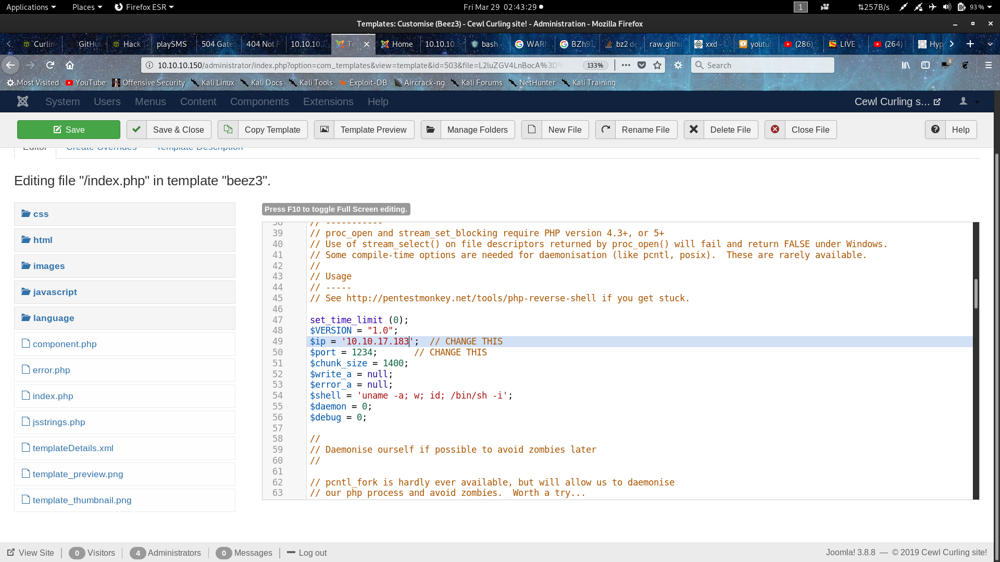

I executed the script by going to [http://10.10.10.150/index.php](http://10.10.10.150/index.php) and boom instantly I had a shell at my terminal through netcat this was still a basic reverse shell.

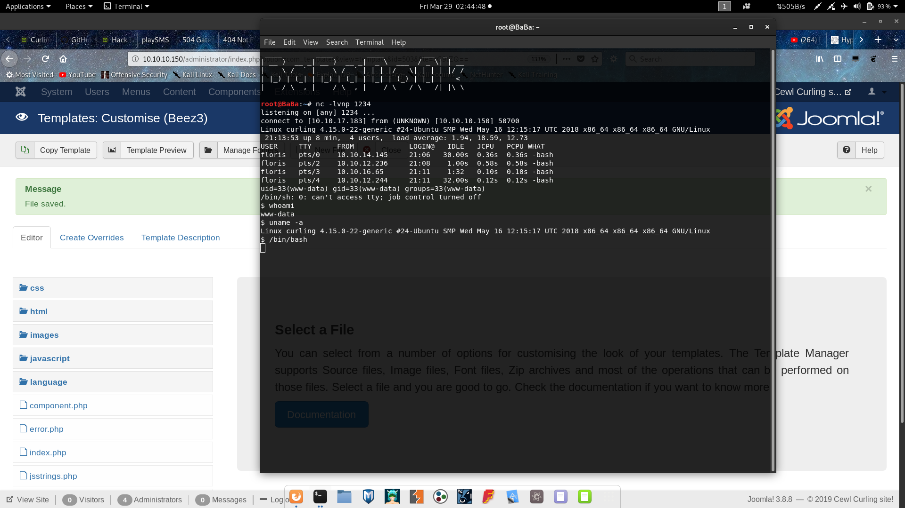

Since this was not a full fledged shell and I was still www-data I couldn’t read user.txt but in /home/floris I found 1 directory admin-area and 2 files named password_backup and user.txt running cat on these files gave me this

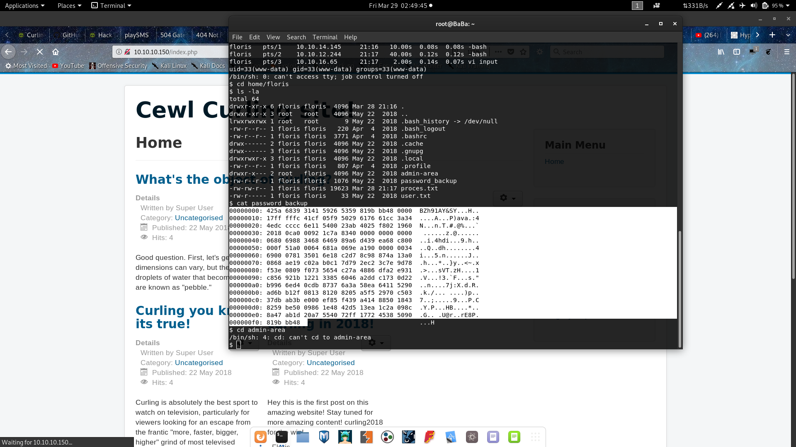

I copied the hex dump to my machine and the initial bytes looked similar they were bzip2 compressed. So i thought this must be a simple decompressing challenge to attain the password. I did repeated decompressing on this file like this: (for more [click](https://www.akashtrehan.com/writeups/OverTheWire/Bandit/level12/))

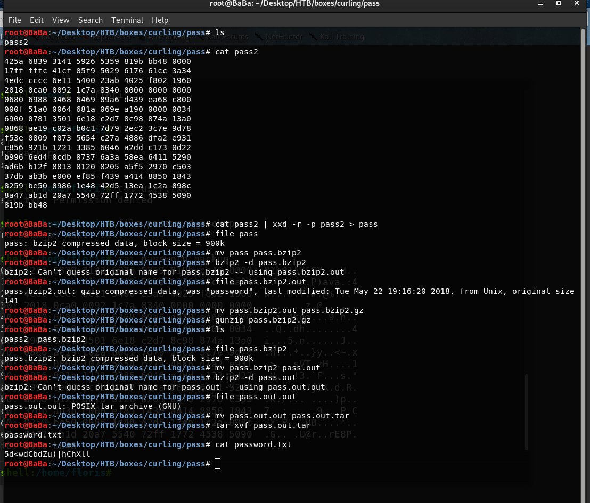

So finally we have the password.txt which gives us the password **5d<wdCbdZu)|hChXll **using floris as username and this as the password we can successfully ssh into the machine, and can get the user flag.

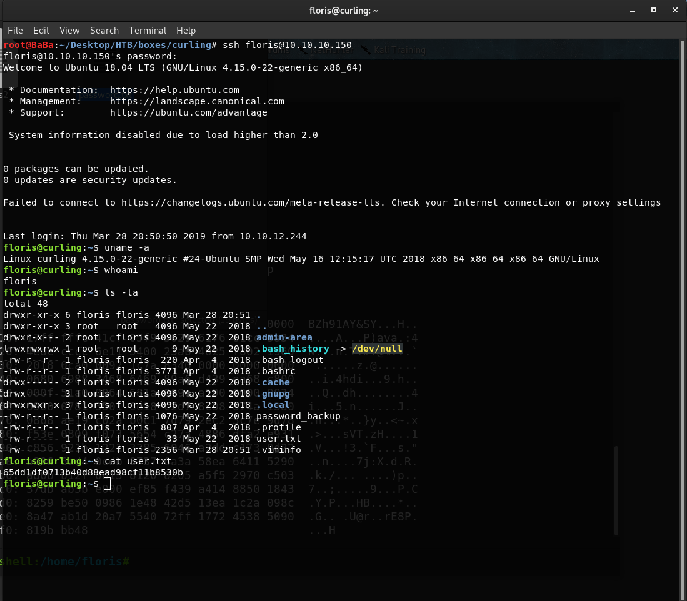

Now onto root, We have admin-area directory in /home/floris this admin-area contains 2 files input and report the file contents are:

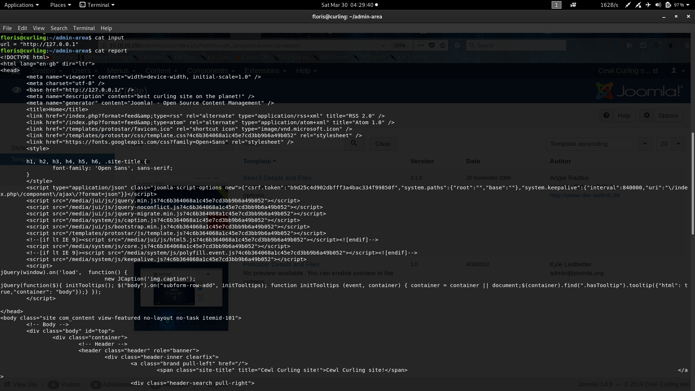

This seems like input is some input to some process and report is executing and displaying the outcome of this some process. To know this process properly, in the input url I put my ip and a port and listened on that port using netcat.

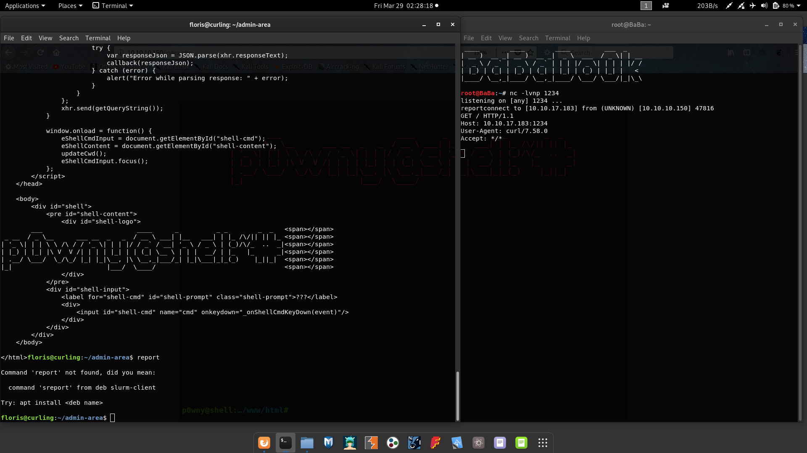

In my terminal I could see user-Agent as **curl/7.58.0** so curl was doing this GET request. I saw that curl was running with floris privileges(ps -elf| grep curl), and after reading the curl man page and a bit of googling I concluded that curl can GET local files also.I tried this on my machine as a local user in root group with a command like this

```
curl file:///etc/shadow
```

And I could successfully get the result even by running curl as not root.So after my little experiment I edited the input file as **_url=”file:///root/root.txt” _**and when I saw the contents of the report file I was staring at the root flag. ROOTED!!!!

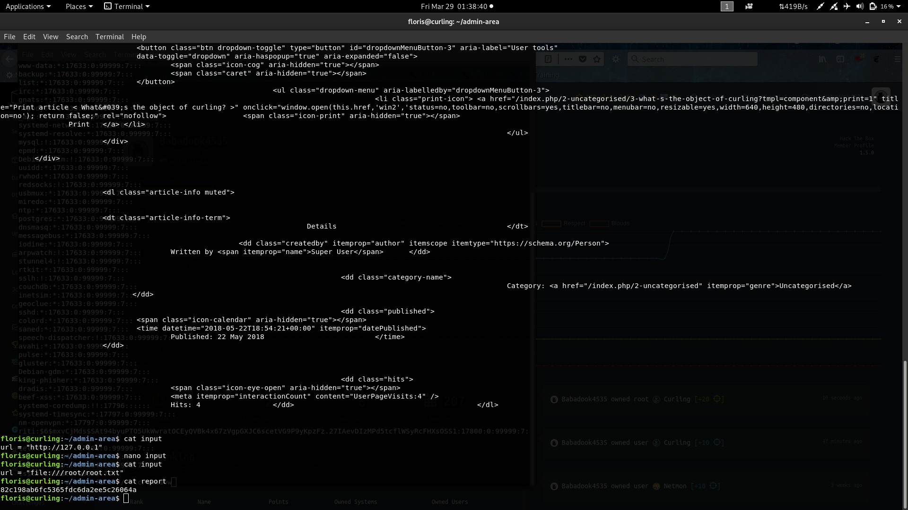

If you had found a way to get a root shell directly without input or report file please do share with me in the comments below. I know I could have replaced url as ”file:///etc/shadow” and grabbed the root password. 
