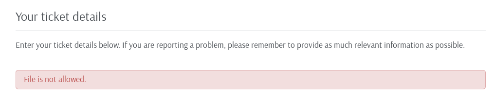

#### Let’s jump in.

# **Enumeration and Recon**

As always, let's start with an **Nmap** scan

Looking at the results,

> **_We see that ports 22, 80 and 3000 are open_**

> **_Port 22 —_** **_OpenSSH_**

> **_80 — Apache Server_**

> **_3000 — Node.js Express framework ( looks interesting _**)

Looking at the 80 port, we see that its a default page of Apache2 server.

Running gobuster on port 80, comes up with an interesting directory

Lets check what we’ve got at **_http://10.10.10.121/support_**.

> _Its a HelpDeskZ application, a quick google search says_ **
> HelpDeskZ is a free PHP based software which allows you to manage your site’s support with a web-based support ticket system.**

We have a login option and an option to submit a ticket. Let's try to submit a ticket.

Page says **_php _**file is not allowed ( filter bypass may be ).

One more crucial point here is to find the location to where the files are uploaded to. Let's have a look at the code as its an open-source application.

[https://github.com/evolutionscript/HelpDeskZ-1.0/blob/master/controllers/submit_ticket_controller.php](https://github.com/evolutionscript/HelpDeskZ-1.0/blob/master/controllers/submit_ticket_controller.php)

> [**evolutionscript/HelpDeskZ-1.0**](https://github.com/evolutionscript/HelpDeskZ-1.0/blob/master/controllers/submit_ticket_controller.php)
>
> <small>HelpDeskZ v1.0. Contribute to evolutionscript/HelpDeskZ-1.0 development by creating an account on GitHub.</small>

> Looking at the code, we see that an md5 in run on the uploaded filename with the **time() **function\*\* \*\*appended to it. And although, we see an error message saying file type is not allowed. But its actually getting uploaded and what we see in just an error message after uploading. ( Nice!!! )

But the Server is in another timezone **(GMT).** So I had to convert the server response time to epoch as, PHP time() **_function returns the current time measured in the number of seconds since the Unix Epoch._**

What I did here was just checked the response header from network tab after clicking submit button in the browser( too lazy to intercept the request in Burp ).

There it is,. **07 Jun 2019 05:52:14 GMT **is the server response time. It’s corresponding epoch is **1559886734.**

I did the conversion using [**_https://www.epochconverter.com/_**](https://www.epochconverter.com/)

Awesome. We got the timestamp and the upload directory. Forgot to mention, I have uploaded a phpshell and yes, let's get our shell.

Here “**phpshell.php**” is our filename and appended to it is the server response time in Epoch.

Our file is uploaded to **http://<HelpDeskBaseUrl>/uploads/tickets/<MD5>.<file extension>**

To grab you shell don’t forget to start your listener.Browsing to the URL
**http://10.10.10.121/support/uploads/tickets/04215397f1a751cf60d7e42fc06a6767.php**

Banggg!! Got shell.

# **Privilege Escalation**

Looking at the directories manually, I couldn’t find anything of great interest. Also running [**procmon.sh ( Ippsec Process Monitoring script )]\*\*(https://gist.github.com/jsvazic/8fe9dde369f6396f65a1aa795dd77744) went in vain.

<iframe
                width="0"
                height="0"
                src=""
                frameborder="0"
                allow="accelerometer; autoplay; encrypted-media; gyroscope; picture-in-picture"
                allowfullscreen
              ></iframe>

As usual, I ran [**LinEnum**](https://github.com/rebootuser/LinEnum) and didn’t see anything fishy there too. But, the kernel was old. I didn’t consider the option of using kernel exploit as more often than not it is not the intended way to privesc . But here kernel exploit was the intended way. I went forward with kernel exploit. Have a look at the kernel version below.

[A quick google search](https://www.exploit-db.com/exploits/44298), showed a privilege escalation exploit. Let's run the exploit there and get root shell.

Rooted and done. Go get your flags if you haven’t still.

# **Additional**

#### Port 3000 — Node.js Express Framework

Checking the 3000 port, we are greeted with a JSON response.

Well, maybe we got a potential username **( Shiv )**. Lets put it in our back pocket and enumerate more.

Page says, we have to get the creds with a given query. Friend of mine told me that its using **GRAPHQL**, an alternative to [**REST**](https://en.wikipedia.org/wiki/Representational_state_transfer). And the endpoint in GraphQL is **/graphql**

#### And the URL is http://<site>/graphql?query={query}

After a lot of trial and error. I managed to get the correct query.

[\*\*http://10.10.10.121:3000/graphql?query={user{username,password](**http://10.10.10.121:3000/graphql?query={user{username,password)}}

Use these creds( after cracking the hash, of course ) to login to HelpDeskz application and rest everything is same. There are exploits for the same in the wild, they need some editing though, I will leave them up to you to try them out.
