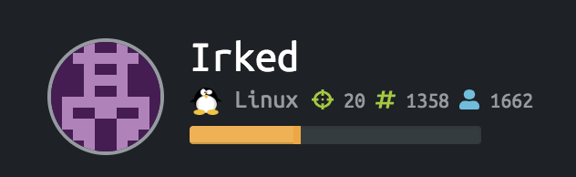
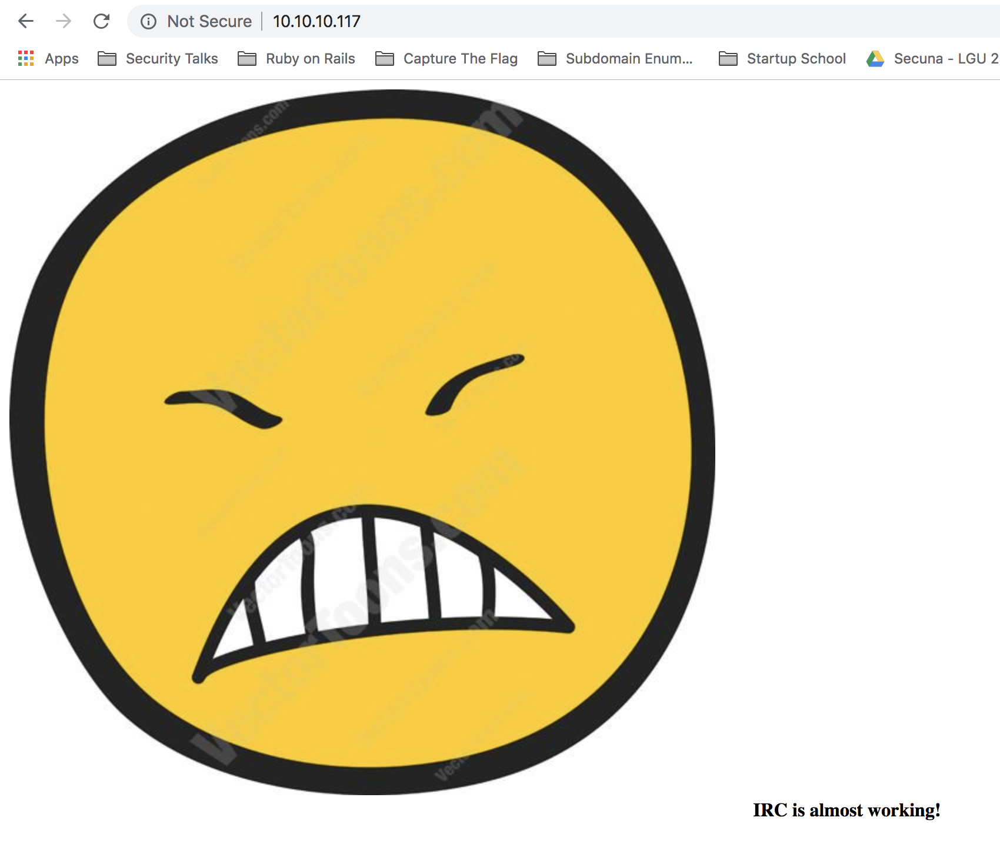
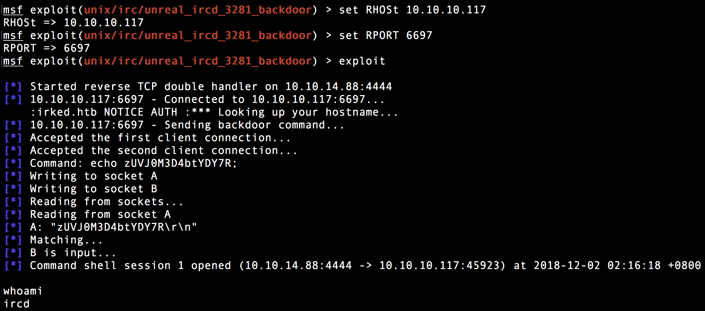
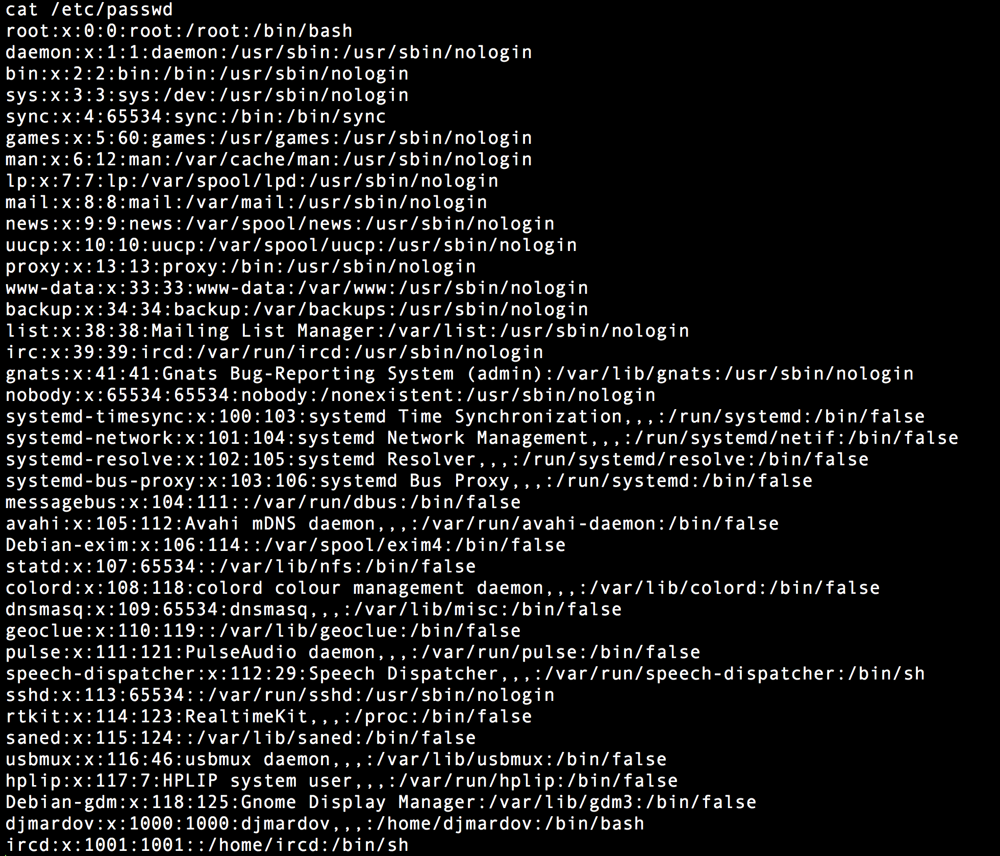
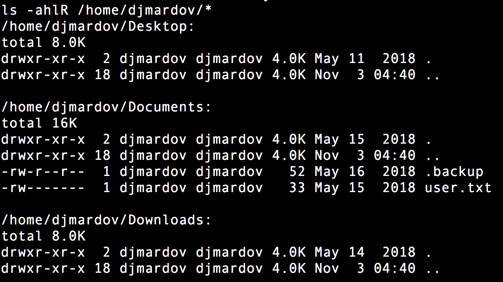
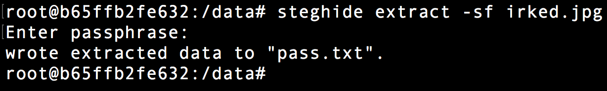
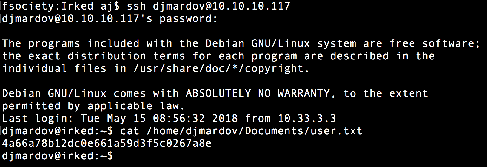
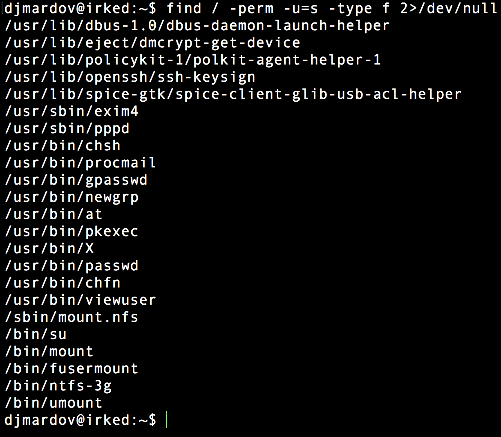
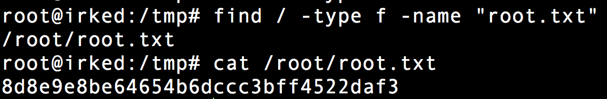

# Summary

Irked is a Linux host running an [UnrealIRCD](https://www.unrealircd.org/) service that is vulnerable to Command Execution due to a malicious backdoor that was added to the Unreal IRCD version 3.2.8.1. This was leveraged to access files on the system in order to enumerate users, read files, and retrieve the user.txt file. The root access was gained by executing a file called **viewuser** that gives root permission to a user to retrieve the root.txt file.

# Reconnaissance

I immediately fired up NMAP to retrieve the list of services running on the machine.

```
fsociety:~ aj$ nmap -sV -sC -p- -T4 10.10.10.117

Starting Nmap 7.70 ( https://nmap.org ) at 2018-12-01 23:08 PST
Nmap scan report for 10.10.10.117

Host is up (0.20s latency).
Not shown: 65364 closed ports, 165 filtered ports

PORT      STATE SERVICE VERSION
**22**/tcp    open  ssh     OpenSSH 6.7p1 Debian 5+deb8u4 (protocol 2.0)
| ssh-hostkey:
|   1024 6a:5d:f5:bd:cf:83:78:b6:75:31:9b:dc:79:c5:fd:ad (DSA)
|   2048 75:2e:66:bf:b9:3c:cc:f7:7e:84:8a:8b:f0:81:02:33 (RSA)
|   256 c8:a3:a2:5e:34:9a:c4:9b:90:53:f7:50:bf:ea:25:3b (ECDSA)
|_  256 8d:1b:43:c7:d0:1a:4c:05:cf:82:ed:c1:01:63:a2:0c (ED25519)

**80**/tcp    open  http    Apache httpd 2.4.10 ((Debian))
|_http-server-header: Apache/2.4.10 (Debian)
|_http-title: Site doesn't have a title (text/html).

**111**/tcp   open  rpcbind 2-4 (RPC #100000)
| rpcinfo:
|   program version   port/proto  service
|   100000  2,3,4        111/tcp  rpcbind
|   100000  2,3,4        111/udp  rpcbind
|   100024  1          39726/udp  status
|_  100024  1          49785/tcp  status

6697/tcp  open  irc     UnrealIRCd

8067/tcp  open  irc     UnrealIRCd

65534/tcp open  irc     UnrealIRCd

Service Info: Host: irked.htb; OS: Linux; CPE: cpe:/o:linux:linux_kernel

Nmap done: 1 IP address (1 host up) scanned in 1583.20 seconds
```

The NMAP result returned 4 services which are **http**, **ssh**, **rpc**, and **irc**.

Visiting [http://10.10.10.117](http://10.10.10.117)/ will return the page below.



Executing _dirsearch_ to look for directories and files returns Apache HTTP Server Documentation only.

Next step that I did was to search on Google for **OpenSSH 6.7p1 Debian 5+deb8u4** exploit and **rpcbind 2–4** **RCE** exploit but I got nothing.

# Exploitation

The last service is **UnrealIRCd**, an IRC server deployed on this machine. I searched for an exploit on Google and learned that it was vulnerable to [UnrealIRCD 3.2.8.1 Backdoor Command Execution](https://www.rapid7.com/db/modules/exploit/unix/irc/unreal_ircd_3281_backdoor).

I fired up Metasploit and used **exploit/unix/irc/unreal_ircd_3281_backdoor** module to exploit the machine.

After I successfully exploited the machine, I immediately typed `whoami` command to check the user I’m currently using and executed`cat /etc/passwd` command to check the list of other users.





From there, I learned that there was a user named **djmardov**.

So, I executed `ls -ahlR /home/djmardov/*` to find anything interesting in djmardov’s home directory and I found these files shown in the picture below inside Documents folder.



It clearly shows that we cannot access the file named **user.txt** but we can definitely read the **.backup** file.

```
fsociety:~ aj$ cat /home/djmardov/Documents/.backup
Super elite steg backup pw
UPupDOWNdownLRlrBAbaSSss
```

The **.backup** file contains a password(pw) and it mentions “steg”. I already guessed that there was some kind of steganography challenge on this machine. Then, I remembered that there was an image in the [http://10.10.10.117/.](http://10.10.10.117/.)

I downloaded the image named **irked.jpg. **Using **steghide, **I extracted a hidden file named **pass.txt** from the image.



Opening the file will give us the password.

```
fsociety:~ aj$ cat pass.txt
Kab6h+m+bbp2J:HG
```

Now that I have recovered the password, I decided to use it in **SSH** with username as **djmardov **then\*\* \*\*I read the content of the user.txt file.



Next step is to root the machine. To do this, I executed the following command to find an executable file that can be run by djmardov.

```
find / -perm -u=s -type f 2>/dev/null
```

And here is the result.



After running some of those binaries shown in the picture above, I ended up with **/usr/bin/viewuser **that gives me a root access in the machine.

A message saying that a file named **listusers** in **/tmp/** folder was not found after running **viewuser**. So what I did was to create the missing file with **su root** as content and executed **viewuser** again, but this time, I got Permission denied message. But by simply changing the permission of the file and running it, I successfully got root access on the machine.

I executed find command to look for root.txt and get the hash inside the file.

