## Hack The Box — Jerry Write-up

*This is my write-up for the ‘Jerry’ box found on [Hack The Box](https://www.hackthebox.eu).*

*In short: Default credentials and authenticated RCE using metasploit module, Apache was running as root so no privilege escalation required.*

## Part 1: User

The information we start with is that it’s IP is 10.10.10.95, and it runs Windows. Of course, this is hardly enough information! So we use nmap to see what this machine has to offer.

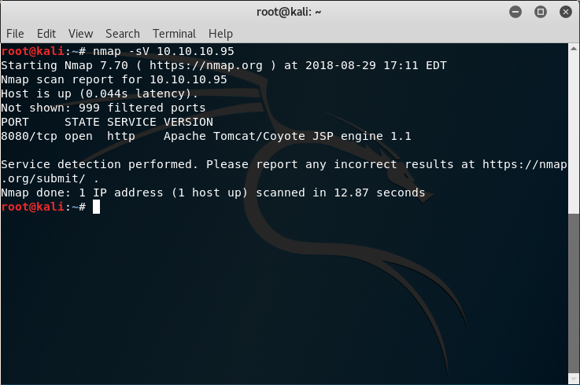

We see that it’s running Apache Tomcat on port 8080, so our first instinct would be to visit the page.

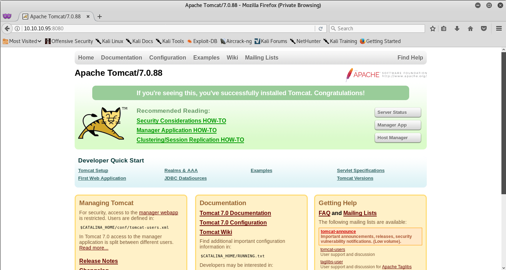

Manager App sounds interesting!

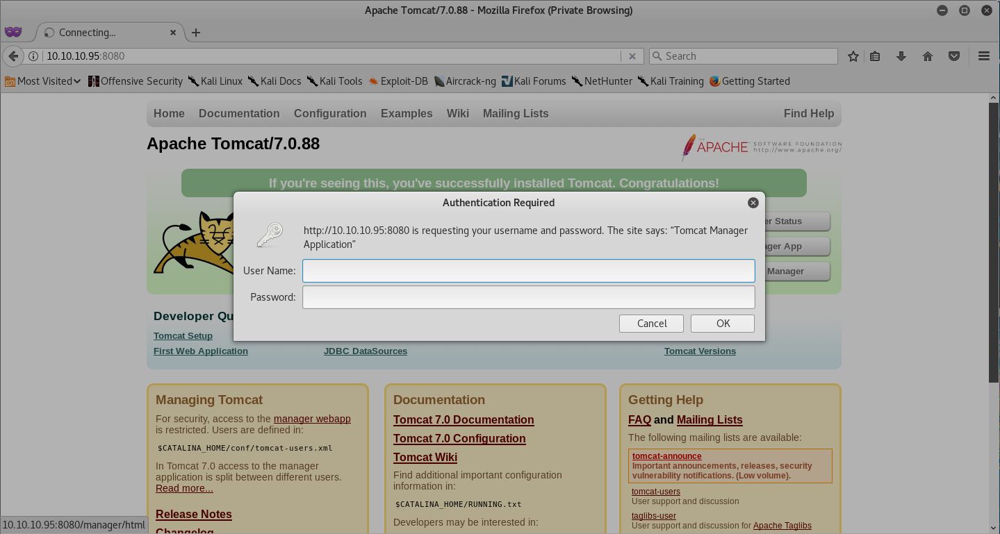

Looks like we need login information, or we could just try ‘admin’ and ‘admin’?

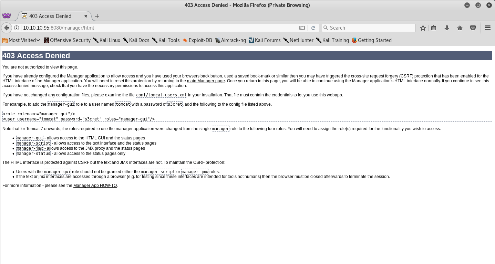

Well, something happened.

If we have a read of this, we can see it’s showing us how to set up an account that can access the Manager App, with the username ‘tomcat’ and the password ‘s3cret’. So we tried ‘admin’ and ‘admin’, it didn’t work, but we are presented with new login credentials now, so let’s try them!

However we’re already logged in, so I quickly close Firefox and open it again, this will wipe the cookies as we’re in Private Browsing mode, thus logging us out. We then log back in with the new credentials and…

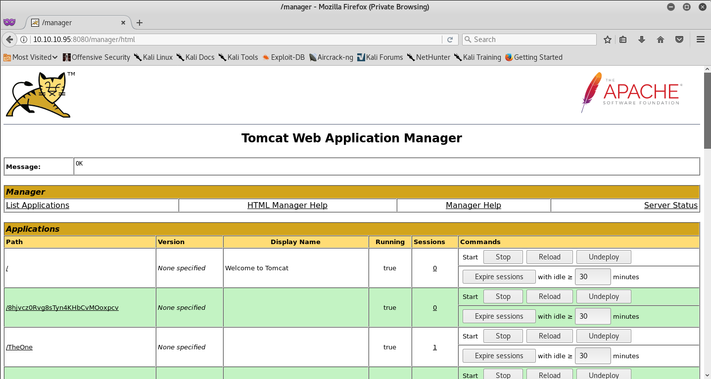

This looks promising! Let’s have a gander at what we can do.

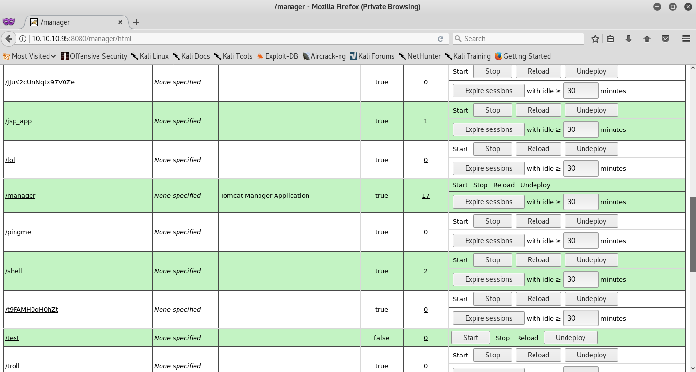

Some of these names don’t look standard, indicating that this may be our way to getting user access.

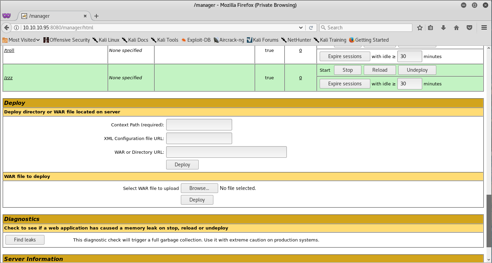

Scrolling further down, we see the reason for the strangely named apps. There’s an option to upload a WAR file, which is basically a JAR file for web apps. This sounds like our vulnerability to me, so we go to our best friend Google.

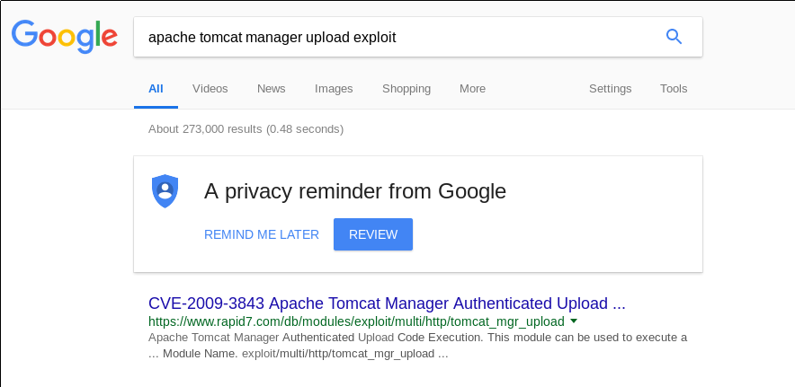

After chucking some random words together, we come across an exploit that makes use of authenticated upload, so the next step is to load up msfconsole

*Side note: The module I’m using is multi/http/tomcat_mgr_upload which uses a POST to /manager/html/upload to get the payload on the server, there is another similar module called multi/http/tomcat_mgr_deploy which uses a PUT to upload the payload, from testing the deploy payload has given limited success, so I’d suggest using the upload payload.*

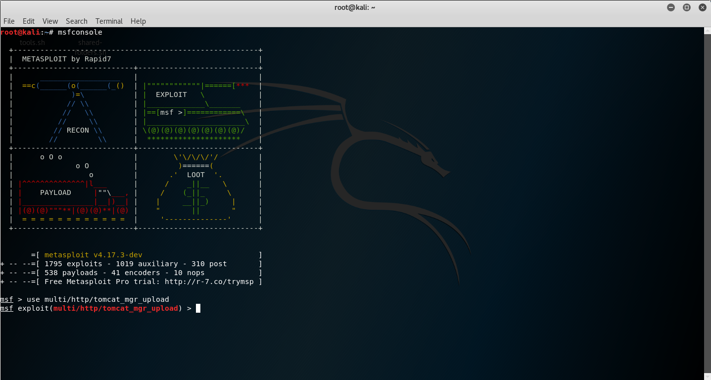

We set our exploit by typing in use multi/http/tomcat_mgr_upload .

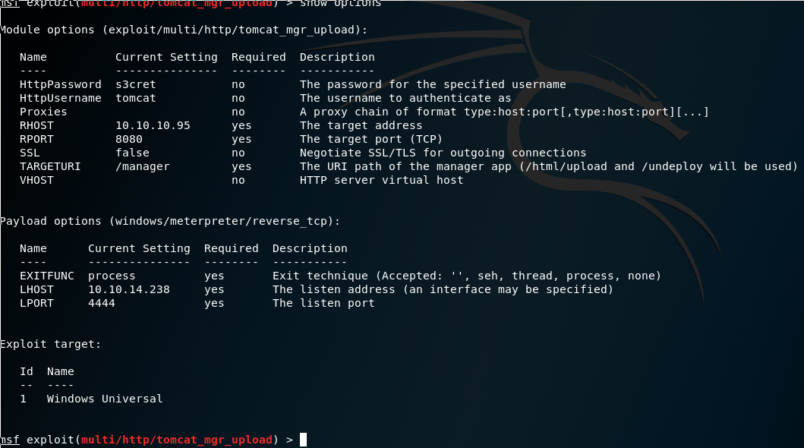

We then configure our exploit with the login credentials, the host, the payload, and the target. Once that is all set up all we need to do type is exploit , fingers-crossed!

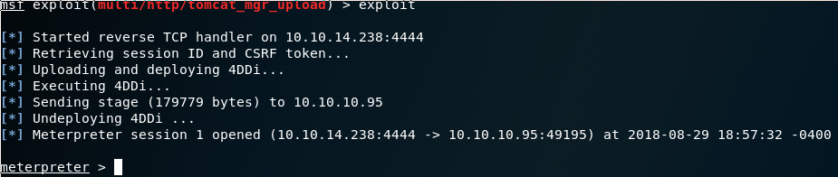

Ta-da!

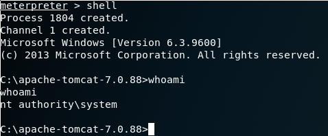

I drop into a shell, and… what? I guess we’re already System, that was easy!

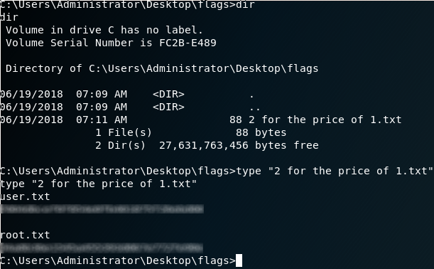

After we navigate to the Administrator’s desktop, we find a directory named flags, which contains a text file called 2 for the price of 1.txt , which contains both of the flags we need to submit.

## Part 2: Root

Well, we already have System, and the root flag, so this section is pretty useless.

*Jerry was my first own on HTB, mainly because it was rated as ‘Piece of cake’ by a large majority of those who owned it. And, whilst it’s pretty easy (Especially because you get System as soon as you get a shell!), we all start somewhere.*

