Hello friends!! Today we are going to solve another CTF challenge “**Mirai**” which is lab presented by **Hack the Box** for making online penetration practices according to your experience level. They have a collection of vulnerable labs as challenges from beginners to Expert level. HTB have two partitions of lab i.e. Active and retired since we can’t submit a write-up of any Active lab, therefore, we have chosen retried Mirai lab.

**Level:** Intermediate

**Task:** find **user.txt** and **root.txt** file in the victim’s machine.

**Let’s Breach!!!**

Lab IP: **10.10.10.48**

Firstly let’s enumerate ports in context to identify running services and open ports of victim’s machine by using the most popular tool Nmap.

nmap \-p\- \-A  10.10.10.48  \--open

**Awesome!!** Nmap has done a remarkable job by dumping the details of services running on open port 22 53, 80, 1031, 32400, 32469.

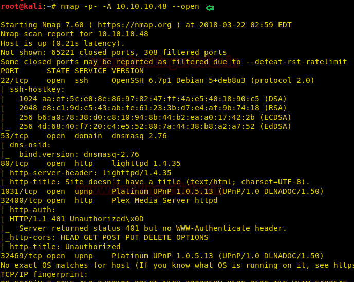

Without wasting time I used the dirb tool of Kali to enumerate the directories and found some important directories such as /admin/

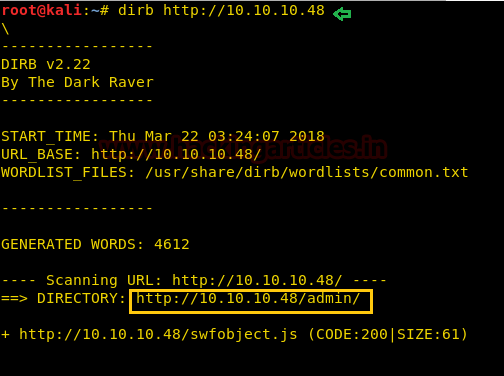

So next I decided to explore **http://10.10.10.48/admin** through browser URL. Here we have a Login Page, Lets Go through That.

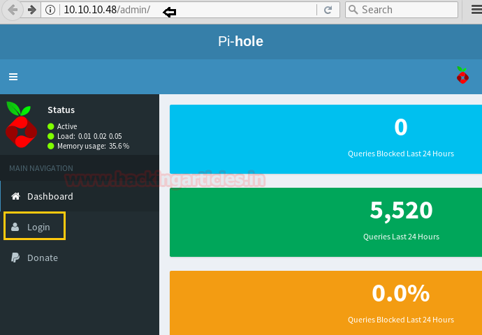

When I link on login tab I saw following web page. The Pi-hole and the Logo gives us a pretty huge hint that the target machine is a Raspberry Pi, and Raspberry Pi comes with a default ssh

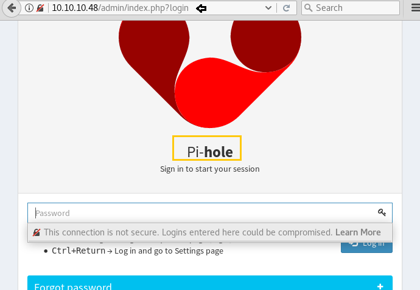

So we tried default ssh credentials on the Raspberry Pi.

Username: pi

Password:  raspberry

**Great!!** Our prediction works successfully and we got PTs shell of the victim’s machine.

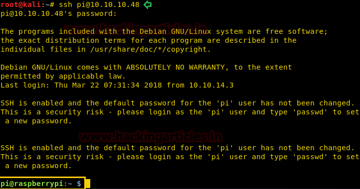

Now Let’s Look for the User Flag

Here I found a** user.txt** file and used cat “filename” command for reading this file. cat user.txt

**Great!!** We got our 1st flag

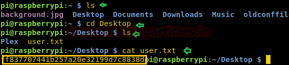

And After Browsing we got the flag user.txt on the Location: ~/Desktop/user.txt

by executing **sudo -l command** it tells us that user pi has full privileged in this machine.

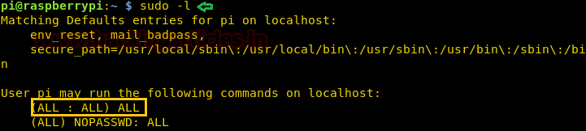

Then I moved for **root access** using the previous same password and again I **get root access successfully**.

After going through the root directory we get a **root.txt**  But we get a Hint that our Root Flag is on a USB stick.

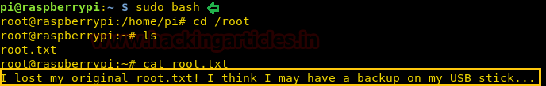

Let’s check if it is mounted by following command **df**

**df** (abbreviation for **_d_**_isk **f**ree_) is a standard Unix command used to display the amount of available disk space for file systems on which the invoking user has appropriate read access. As you can see in the below screenshot that we have the USB stick on the Device. (From Wikipedia)

From given below image we can /**media/usbstick**.

Then execute given below command for further steps

Here we found a text file damnit.txt, using cat command we can read this file.

**Oops!!** James has accidentally deleted the root.txt file. Now let’s try to find it somewhere with a little hope.

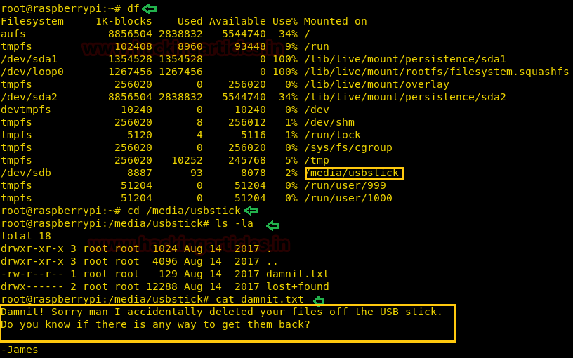

Move back to root directory and type following command which will scan **/dev/sdb** file system completely and hopefully, it can find deleted root.txt file also.

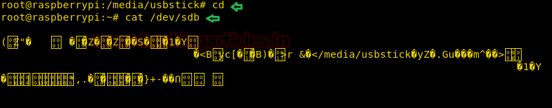

**Great!!** We got our 2nd flag successfully **Enjoy Hacking!!**

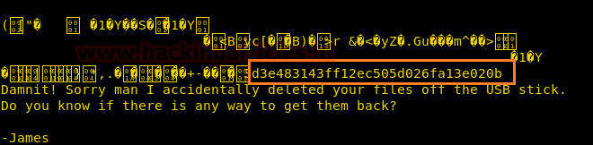

