Hello Guys , I am [**Faisal Husaini](http://twitter.com/faisalelino)** and this is my writeup on Medium for Netmon machine which has retired. My username on HTB is [***“faisalelino”](https://www.hackthebox.eu/home/users/profile/7404) .***

I was not able to publish other writeups as I was off since 6 months from Infosec and related stuffs due to my exams. Now finally after getting free , the first box I thought to do the simplest one as I almost forgot everything I had in my mind as my skills. So I tried to solve Netmon as suggested from my friends.

The IP for this box is 10.10.10.152, so let’s get started

### **NMAP Results**
>  nmap -sC -sV 10.10.10.152

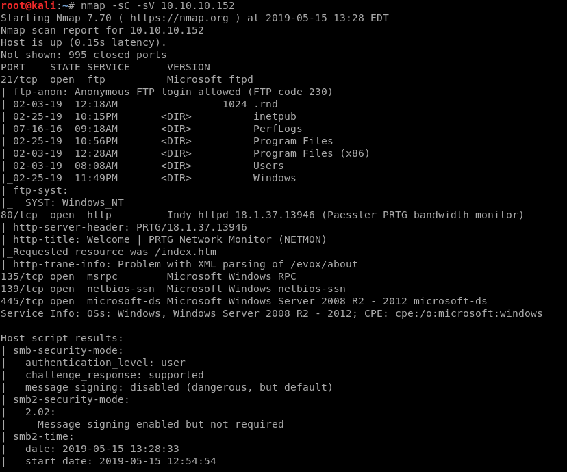

We see that 5 ports are open for which 2 are of our current interest , Port 21 , 80 which runs FTP and HTTP service

### Port 21 — FTP

As we saw from the NMAP scan that Port 21 is open running FTP and also have anonymous login available , so which go and try to login through FTP

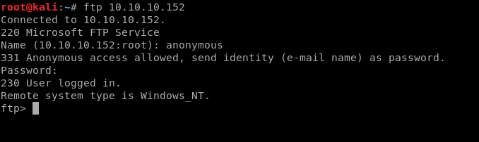

So we successfully logged in through FTP using Anonymous login. Now we dig into the things we have in the box.

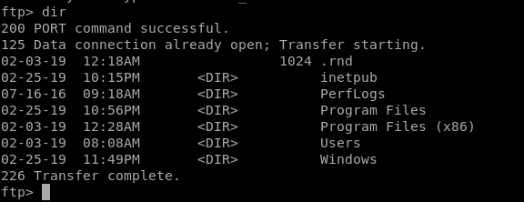

We see that the files and folders here are exactly like we have in Windows machines. So we enter the Users folder

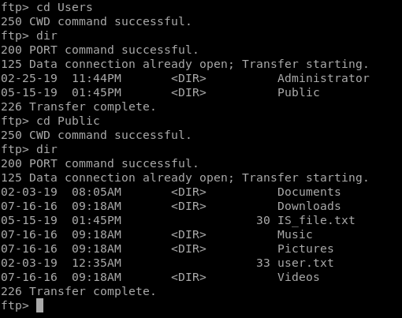

When I went into Users/Public folder and listed out the files and folders , I was shocked to see that I got the user flag so easily. Seriously , it didnt even took 1 minute to get the user flag in this box. So here we got the user flag.

After crawling , I went on to see what the web service is running

### Port 80- HTTP

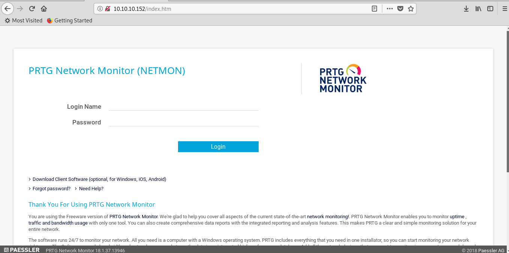

We get a login page to PRTG Network Monitor , I did a gobuster scan but it was of no use here. I tried to search for default login username and password from Google, which I got was Username:prtgadmin and Password:prtgadmin , then I went on to try login through these credentials and…

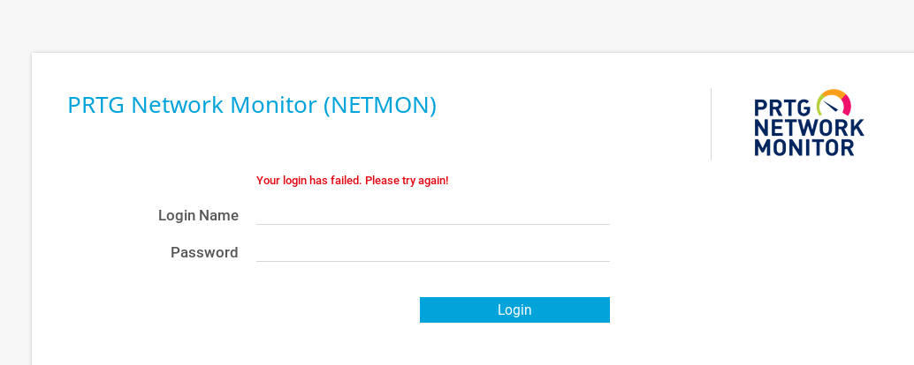

We get login failed message as these credentials were not valid. So as I know this Network Monitor is installed in the box , so I will go on and look on the installation path of it and check whether it has any sensitive files or something like that. We go again back to the FTP and search for the PRTG Installed path.

When searching about PRTG Network Monitor issues and all on Google , I got a reddit link which had to be saying that the version on PRTG on the box was exposing username and password in clear text on their config files. So I go to FTP and enter that path and get those config files.

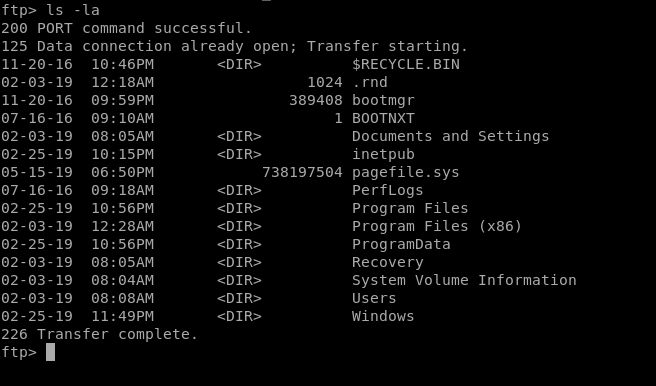

After searching on google , I found that the configuration files are stored under C:/ProgramData/Paessler/PRTG Network Monitor Folder

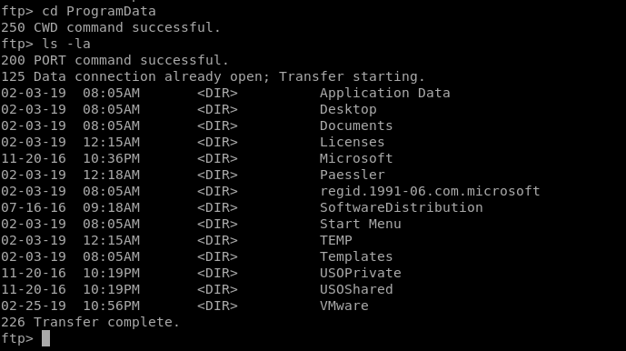

So we dig into that folder and see there are 3 files of our interest

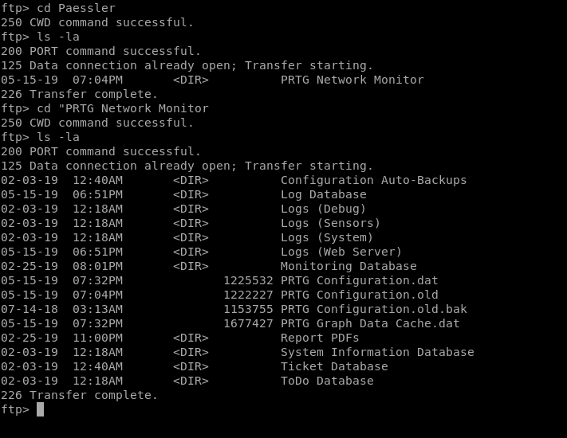

I see there are 3 configurations files , so we get them to our box in binary mode

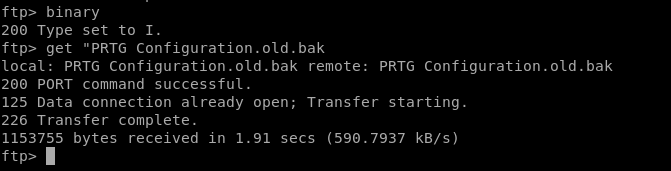

After getting those files and going through all of them , I saw that “PRTG Configuration.old.bak” file had username and password in clear text.

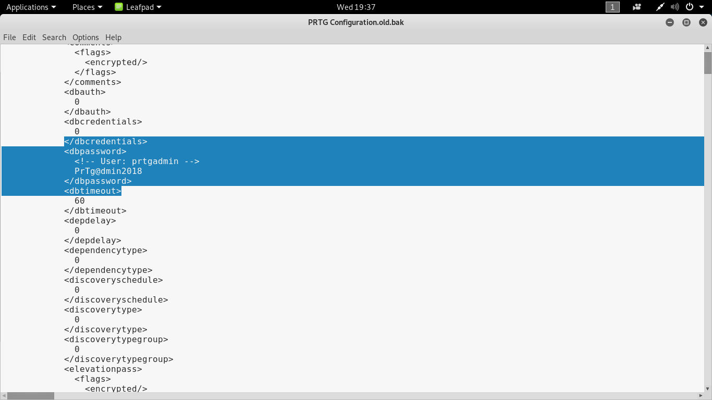

So we got the credentials
>  Username: prtgadmin
>  Password: PrTg@dmin2018

We now try to login into the PRTG Monitor Login Page

### PRTG Network Monitor Login

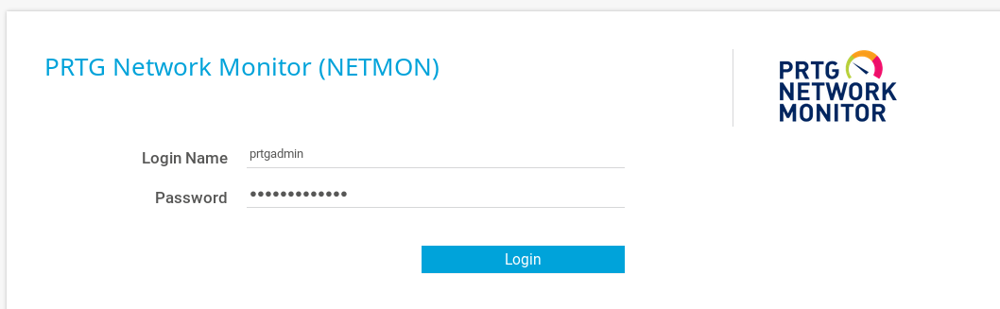

When I try to login with the credentials I got

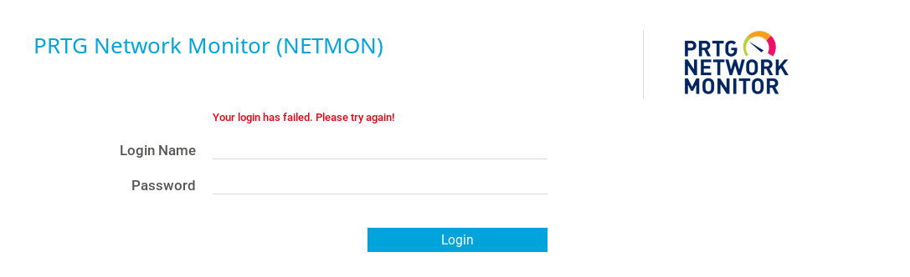

We get login failed message , so I noticed the password had 2018 at the end and we currently here were long far from the beginning of 2019 and also we got the password from a old config backup file , so I tried changing the last part of the password from **PrTg@dmin2018** to **PrTg@dmin2019 **and then try to login

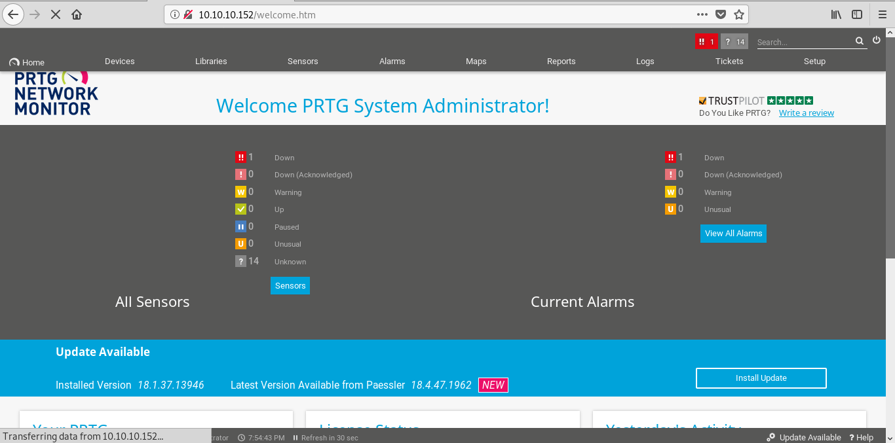

We got into the page , now we move onto the priv esc part

### Privilege Escalation

After searching on Google for exploits for PRTG Network Monitor , I got a script which we will use here

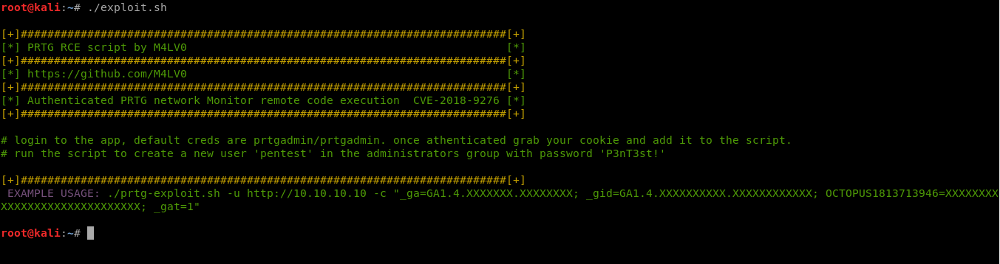

We use the above script to create a new user “**pentest**” in the administrator group with password “**P3nT3st**!”

But before that we need to put our current session cookies as given in the usage , so we go and grab it

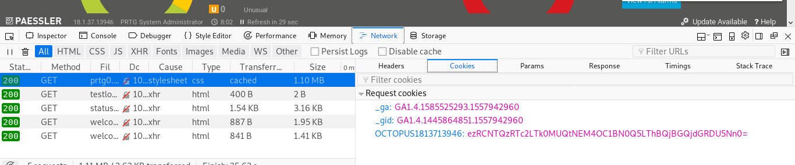

So we got the cookies required for the script and now we finally use the script

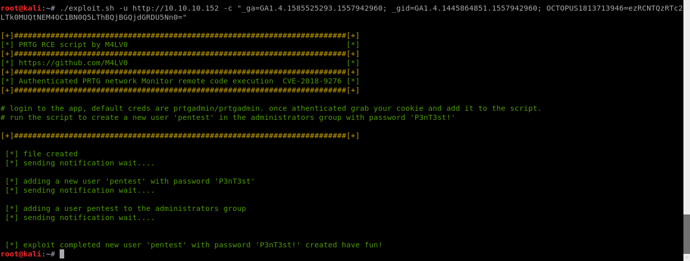

So we successfully created our new user “**pentest**” in the administrators group

Now we try to login into the box using **psexec , **so I will get the psexec for linux in my box

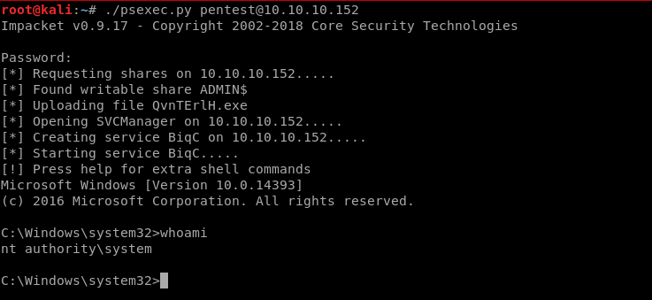

We successfully logged in through our newly created user “**pentest**” which holds administrator privileges.

Now we move onto getting the root flag

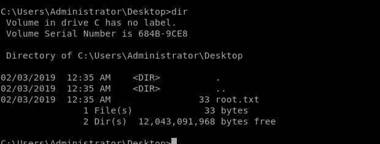

The root flag was under C:\Users\Administrator\Desktop folder

