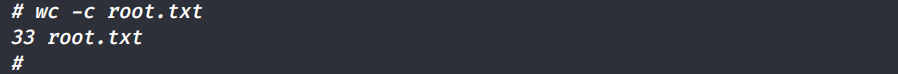

# RECON

As usual, let’s start with a Nmap scan.

```
Nmap scan report for 10.10.10.171
Host is up (0.25s latency).

PORT   STATE SERVICE VERSION
22/tcp open  ssh     OpenSSH 7.6p1 Ubuntu 4ubuntu0.3 (Ubuntu Linux; protocol 2.0)
| ssh-hostkey:
|   2048 4b:98:df:85:d1:7e:f0:3d:da:48:cd:bc:92:00:b7:54 (RSA)
|   256 dc:eb:3d:c9:44:d1:18:b1:22:b4:cf:de:bd:6c:7a:54 (ECDSA)
|_  256 dc:ad:ca:3c:11:31:5b:6f:e6:a4:89:34:7c:9b:e5:50 (ED25519)
80/tcp open  http    Apache/2.4.29 (Ubuntu)
|_http-server-header: Apache/2.4.29 (Ubuntu)
|_http-title: Apache2 Ubuntu Default Page: It works
Service Info: OS: Linux; CPE: cpe:/o:linux:linux_kernel
```

SSH and HTTP ports are open. Let’s start with port 80.

#### Manual Visit

On visiting the page, we are presented with the default Apache installation page.


#### Gobuster

Here’s the gobuster output,

```
/music (Status: 301)
/artwork (Status: 301)
/sierra (Status: 301)
/server-status (Status: 403)
```

Visiting /music


There’s a login button, on clicking it gets us to `[http://10.10.10.171/ona](http://10.10.10.171/ona)`


The software version is exposed. A quick google search shows us a Remote Code Execution vulnerability.

I exploited it using [this.](https://github.com/amriunix/ona-rce)

> [**amriunix/ona-rce**](https://github.com/amriunix/ona-rce)
>
> <small>OpenNetAdmin 18.1.1 - Remote Code Execution https://amriunix.com/ check -- Verify if the target is vulnerable exploit -- Exploiting the target URL -- The remote target pip3 install --user requests git clone https://github.com/amriunix/ona-rce.git All the code provided on this repository is for educational/research purposes only.</small>

Just update the value of `xajxr` in the exploit, by intercepting the request.


# Shell as www-data

We gain code execution on the box with the above exploit.


Time to get a reverse shell.


Looks like we found some usernames and passwords. Let’s try these against SSH for potential password reuse.


# Shell as Jimmy

The credentials work for jimmy user on SSH.


#### Internal services

On running linpeas, we can see that there’s a service running locally on port 52846. Let’s port forward it to our box and check what it’s got.


#### Port Forwarding


We are presented with a login page, the usual admin:admin , admin:password and so on do not work here. Moving on with enumeration.

We find this interesting lines from `/var/www/internal/index.php`

```
<?php
      $msg = '';

      if (isset($_POST['login']) && !empty($_POST['username']) && !empty($_POST['password'])) {
      if ($_POST['username'] == 'jimmy' && hash('sha512',$_POST['password']) == '00e302ccdcf1c60b8ad50ea50cf72b939705f49f40f0dc658801b4680b7d758eebdc2e9f9ba8ba3ef8a8bb9a796d34ba2e856838ee9bdde852b8ec3b3a0523b1') {
                  $_SESSION['username'] = 'jimmy';
                  header("Location: /main.php");
              } else {
                  $msg = 'Wrong username or password.';
              }
            }
```

The hash got cracked


We can login now too,


# Shell as Joanna

The above SSH key is of Joanna, but it’s encrypted. Time for ssh2john and john to get to work.


# Privesc to Root

Joanna has sudo permission on `nano`


Following[ https://gtfobins.github.io/gtfobins/nano/#sudo](https://gtfobins.github.io/gtfobins/nano/#sudo), we get root shell,



