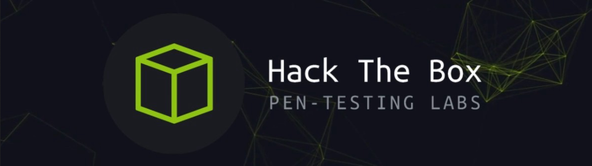

## Summary

This is a

## Recon

The first thing I do is run an nmap on the target to see which ports are open.

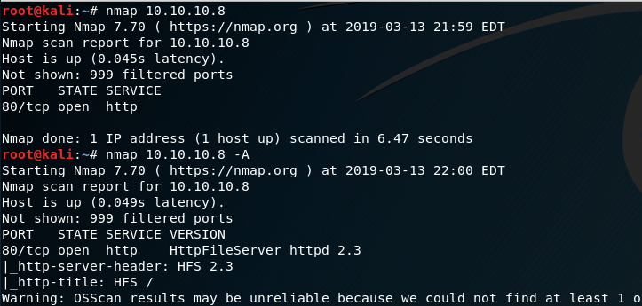

This box only has one port open, and it seems to be running HttpFileServer httpd 2.3. Lets take a look in searchsploit and see if we find any known vulnerabilities.

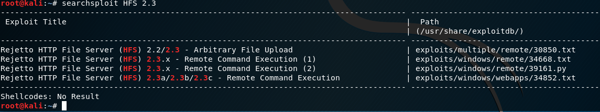

We see a remote code execution exploit for our exact version, lets take a look.

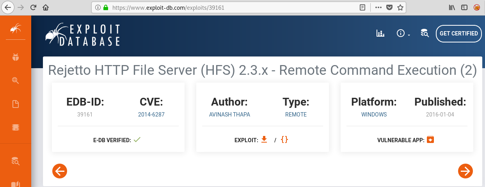

For this RCE exploit to work, we need nc.exe to be reachable in our web server. Lets fire out our listener, and copy over the executable to the required location.

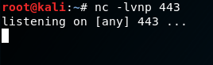

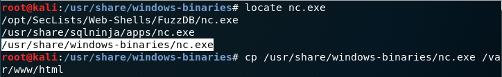

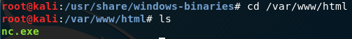

Now that we have met the pre-exploit requirements, lets download and run the exploit. It could take several attempts, so if you do not get a shell on your listener the first time, try it again.

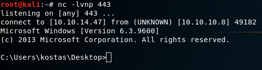

## Foothold/ Local Enumeration

Now that we got a shell, lets run the command systeminfo to enumerate this box.

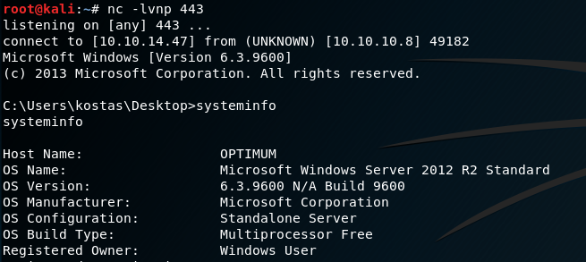

There is a great tool in Kali called windows-exploit-suggester which we can use, now that we have the data from systeminfo . To utilize this tool we need to save the output of systeminfo and save it to a text file. You might also have to update the tool like me, which I did below.

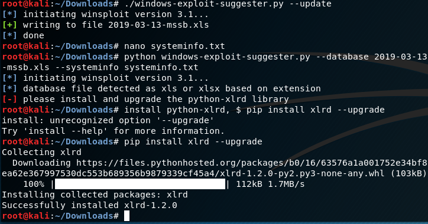

Now that the tool is updated, we can run the tool and see some suggested exploits.

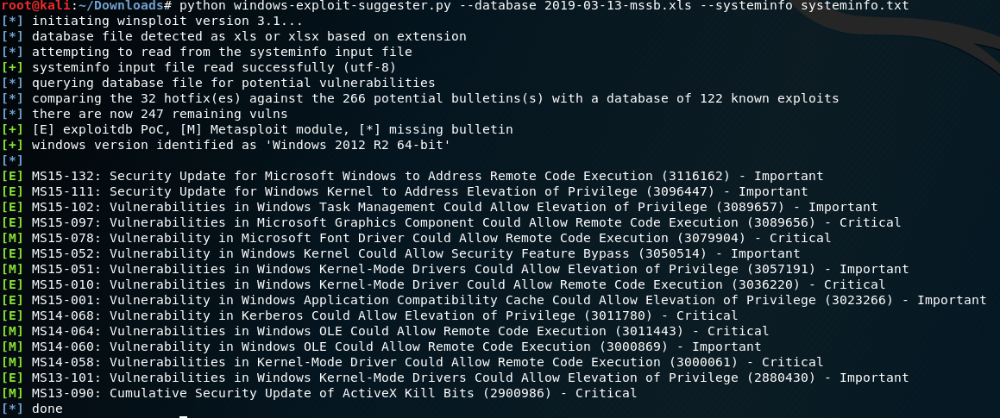

## Privilege Escalation

While this tool gave us some great suggestions, i found an easier exploit while looking around on Google.

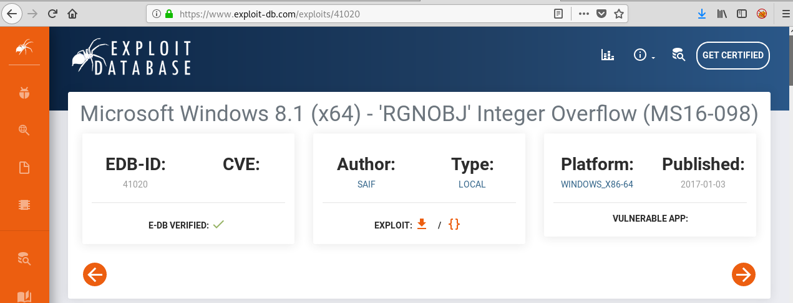

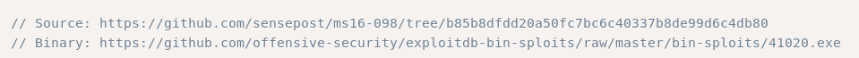

I found this executable that will elevate our privileges on this box. To get this executable on the target box, check out the Privilege Escalation section of my ‘Access’ walkthrough for a guide to build a powershell wget script.

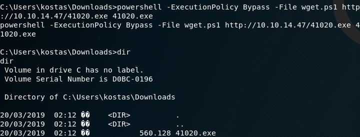

Now that we have the our executable on our target, we can run it to get nt authority\system shell.

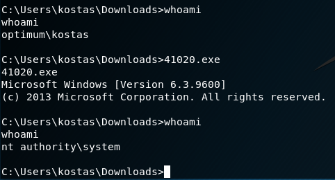

Pwned!!!

Lets go get our flags.

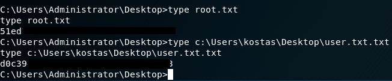

