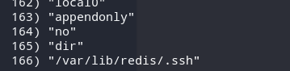

](https://cdn-images-1.medium.com/max/1162/1*2j3KMD5ILPENt6Jkm9bhEg.png)

# TL;DR

Postman from Hack the Box is an easy-rated box which includes exploiting a misconfigured Redis service, allowing you to drop your public key to ssh in the box. It leads to an encrypted SSH private key which is easily crackable through John to get user. For root, I exploit a authenticated vulnerability using Metasploit.

# Scanning

I first run an nmap scan with -sV (determine service/version info) and -sC (run default nmap scripts on ports), saving it to all formats (-oA), calling it initial:

```
nmap -sV -sC -oA nmap/initial 10.10.10.160
```

The results show that port 22 which is running OpenSSH 7.6p1, port 80 running Apache httpd 2.4.29, and port 10000 running MiniServ 1.910 (Webmin httpd). Note that it mentions that the box is Ubuntu. I won’t bother with SSH as the version is recent and there are no recent exploits for OpenSSH that are useful in this scenario.


I also run a scan for all TCP ports with the -p- flag. Note that nmap only scans the top 1000 ports(not in order, but really the top 1000 common ports).

```
nmap -p- --max-retries 1 -oA nmap/allports-tcp 10.10.10.160
```


It shows that port 6379 is open, which is missed by my initial scan.

#### Port 80

Visiting the page, it mentions that it is under construction.


Scrolling down mentions a “postman@htb”, and a thing about cookies.


I then run [Gobuster ](https://github.com/OJ/gobuster)to check for interesting directories:

```
gobuster dir -u [http://10.10.10.160](http://10.10.10.160) -w /usr/share/wordlists/dirbuster/directory-list-2.3-medium.txt -o gobuster-root
```

The results shows an upload folder:


Visiting /upload, I can see images that are used in the website. I found nothing interesting in the other directories.


#### Port 10000

Since nothing is interesting in port 80, I visit port 10000 and it mentions that the web server is running in SSL mode.


I also add an entry to my hosts file(/etc/hosts) since I’m using Kali when I solved this box. Visiting the page shows login page to the server postman.

> Webmin is a web-based interface for system administration for Unix. Using any modern web browser, you can setup user accounts, Apache, DNS, file sharing and much more.


I try to login using basic credentials like admin:admin, but it doesn’t work:


Since it is a web-based interface for system administration for Unix, I check searchsploit for any exploits I can use:


Since Webmin is running version 1.910, only a few exploits is available. One exploit that is an RCE for version 1.910 requires a valid login when inspecting the exploit.

#### Port 6379 — Redis

I now try to dig in with the Redis service.

> Redis is an open source (BSD licensed), in-memory data structure store, used as a database, cache and message broker. It supports data structures such as strings, hashes, lists, sets, sorted sets with range queries, bitmaps, hyperloglogs, geospatial indexes with radius queries and streams.

I first look for ways to interact with the Redis service. Common ways are using telnet, and using the redis-cli. When I initially solved this box, I used telnet but for this writeup I used redis-cli. Using the redis-cli is much easier in this scenario but it is good to know that you can interact with it using telnet.

I first check if I connected properly:


Then I check the current directory I am in:


Finding out that I’m at /var/lib/redis, I try if I can change directories. I did this to find out if I can guess which directories are available/accessible as this Redis user.


I then run config get \* to list all the supported configuration parameters. One thing that stands out is “authorized_keys”. I usually come across this in an SSH directory. An authorized_keys file contains the public keys of the users who can login through SSH using key-based.


There is also an entry for /var/lib/redis/.ssh:



I tried to change my directory to it:


Knowing that a /.ssh directory is inside the redis folder, I then looked for write ups on how I can leverage Redis with a /.ssh and came across this page: [http://antirez.com/news/96](http://antirez.com/news/96). I suggest you read it to learn more about Redis security misconfigurations.

I then generate a ssh key pair using the ssh-keygen command:


I then save the contents of the public key using with new lines to make sure the format is consistent:

```
(echo -e "\n\n"; cat sifo.pub; echo -e "\n\n") > foo.txt
```

I then pipe the contents to the redis-cli command and dump it into its memory:

```
cat foo.txt | redis-cli -h 10.10.10.160  -x set crackit
```

I then save what’s in memory to a file called authorized_keys


I then try to SSH using the Redis user, and is able to do so.


#### Redis → Matt

Checking the files in the current directory, I tried to read what’s inside its bash_history file.


There is an entry of “su Matt” in the bash_history file, a mention of an “id_rsa.bak” and a mention of the sshd_config.


I check the passwd file and see that there is a user Matt.


I then check for files owned by the Matt:

```
redis@Postman:~$ find / -user Matt 2>/dev/null
/opt/id_rsa.bak
/home/Matt
/home/Matt/.bashrc
/home/Matt/.bash_history
/home/Matt/.gnupg
/home/Matt/.ssh
/home/Matt/user.txt
/home/Matt/.selected_editor
/home/Matt/.local
/home/Matt/.local/share
/home/Matt/.profile
/home/Matt/.cache
/home/Matt/.wget-hsts
/home/Matt/.bash_logout
/var/www/SimpleHTTPPutServer.py
```

It seems that there is backup of an id_rsa file(usually a private key use for SSH) stored in /opt. I move the file to my machine using netcat:


Checking its contents, it is encrypted:


I then try to crack it using John. I first have to convert the file in a format that John accepts. This can be done using ssh2john.py:

```
ssh2john.py id_rsa.bak > id_rsa.enc
```

I then crack it using John:

```
john --wordlist=/usr/share/wordlists/rockyou.txt id_rsa.enc
```

The password is computer 2008.


I then tried to login using the private key, and when asked for the password, use computer2008:


The login is unsuccessful, and prompts me to the root login, asking me for a password. I tried to just switch to the user Matt, using the password computer2008, and it works.


I can now read user.txt:

```
Matt@Postman:~$ cat user.txt
517ad0ec24....
```

#### Matt → Root

I then check for running processes, and find that Webmin is running as root:


I tried to login using the credentials Matt:computer2008, and it works!


I then comeback to the exploit mentioned earlier which requires credentials. The vulnerability allows a user authorized to the “Package Updates” module execute arbitrary commands with root privileges. Details of the vulnerability and exploit can be found here: [https://www.cvedetails.com/cve/CVE-2019-12840/](https://www.cvedetails.com/cve/CVE-2019-12840/)

I then run Metasploit and use exploit/linux/http/webmin_packageup_rce. The options that were set can be seen below:


Running the exploit leads to a root shell:


And now I can now read root.txt..

```
cat /root/root.txt
a257741c5bed8b....
```

I checked into the /etc/ssh/sshd_config and found out that Matt was denied to login using SSH, hence it not working.


I also tried to get a shell, which I am able to by using bash -c:


I checked the files under root’s home directory, and found that bash_history is not empty and its size is 14350 characters, which means that maybe I can see how the box creator made the box:


Checking the first few commands, it shows how the user installed ssh, installed net-tools, and added the user Matt 😺


And that’s how I solved Postman from HacktheBox! It was a very long journey but definitely worth it! Thanks for reading! 🍺

---

_Follow [Infosec Write-ups](https://medium.com/bugbountywriteup) for more such awesome write-ups._

> [**InfoSec Write-ups**](https://medium.com/bugbountywriteup)
>
> <small>A collection of write-ups from the best hackers in the world on topics ranging from bug bounties and CTFs to vulnhub machines, hardware challenges and real life encounters. In a nutshell, we are the largest InfoSec publication on Medium. Maintained by Hackrew</small>