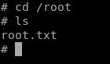

Hello Guys , I am [**Faisal Husaini**](http://twitter.com/faisalelino) and this is my writeup on Medium for Swagshop machine which has retired. My username on HTB is [\*\*\*“faisalelino”](***https://www.hackthebox.eu/home/users/profile/7404) .

I was not able to publish other writeups as I was off since 6 months from Infosec and related stuffs due to my exams. Now finally after getting free , the first box I thought to do the simplest one as I almost forgot everything I had in my mind as my skills. So I tried to solve SwagShop as suggested from my friends.

The IP for this box is 10.10.10.140, so let’s get started

#### NMAP Results

> **nmap -sC -sV 10.10.10.140**

We see that only 2 ports are open , Port 22 and Port 80 , which runs OpenSSH and Apache httpd services

#### Port 80 — Web Service

As we can see that it is running Magento , in background , we run gobuster

#### Gobuster

> gobuster dir -u [http://10.10.10.140](http://10.10.10.140) -w (wordlist) -t 50

We get few results , but before we check all these , lets check the magento version so that we can find any available exploit for the magento version.

#### Magento Version

If we check the /downloader directory on webpage , we get the Magento version of the below

#### Exploiting Magento

After searching alot for exploit on Magento version 1.9.0.0 or onwards , I got the exploit which worked for me , link for which will be at the end of this writeup.

The exploit is actually creates a user on the database of Magento

Now we try to login with the creds we just created through the exploit and login on ‘**_http://10.10.10.140/downloader_**”

As to go further and add or edit stuffs , we need to upload a Magento upload package

We find another admin panel to the Magento ,i.e, “**_http://10.10.10.140/index.php/admin_**” and we can login to it as admin through the same credentials we got from the exploit

We edit one of the php files and put our reverse shell and get a shell through Netcat by accessing the php file (here get.php) , i.e , “**http://10.10.10.140/get.php**”

#### Getting Reverse Shell

> nc -nvlp (port)

We successfully get our reverse shell , now we do the formalities of getting a better tty shell

So we get a better shell now , time to get the user flag first

#### User Flag

The user flag was located at “**/home/haris/**” folder as **user.txt** file

#### Privelege Escalation

For privelege escalation , we run the “**_sudo -l_**” command to see the sudoers

As we can see that we can run **_/usr/bin/vi_** as **root** without password on **\*/var/www/html/\*\***

Lets use the vi privelege escalation technique

As soon as we press Enter , we get a root shell

We successfully got the root shell , the root flag on HTB boxes are usually located at **/root** folder

So here ends the writeup part of the box , below I will mention the vulnerabilities used to pwn this box and also the resources.

#### Vulnerabilities Used To Pwn

1. Remote Code Execution and SQLi to create the admin creds

1. Uploading PHP shell after admin access

1. vi post exploit technique to get root as vi was allowed as sudo without password

# Important Links Which were Used To Solve This Box

> [**joren485/Magento-Shoplift-SQLI**](https://github.com/joren485/Magento-Shoplift-SQLI)
>
> <small>Proof of Concept code of the Shoplift code This is code exploits a few pretty big flaw in the very popular webshop CMS Magento. I did not find the exploit, all credits go to Checkpoint.</small>

> [**pentestmonkey/php-reverse-shell**](https://github.com/pentestmonkey/php-reverse-shell/blob/master/php-reverse-shell.php)
>
> <small>Contribute to pentestmonkey/php-reverse-shell development by creating an account on GitHub.</small>

> [**Ethical Hacking: sudo vi exploit**](https://computersecuritystudent.com/UNIX/SUDO/lesson1/)
>
> <small>Computer Security Student LLC provides Cyber Security Hac-King-Do Training, Lessons, and Tutorials in Penetration Testing, Vulnerability Assessment, Ethical Exploitation, Malware Analysis, and Forensic Investigation.</small>

<iframe
                width="854"
                height="480"
                src="https://cdn.embedly.com/widgets/media.html?src=https%3A%2F%2Fwww.youtube.com%2Fembed%2FpDKb_LOoDes%3Ffeature%3Doembed&url=http%3A%2F%2Fwww.youtube.com%2Fwatch%3Fv%3DpDKb_LOoDes&image=https%3A%2F%2Fi.ytimg.com%2Fvi%2FpDKb_LOoDes%2Fhqdefault.jpg&key=a19fcc184b9711e1b4764040d3dc5c07&type=text%2Fhtml&schema=youtube"
                frameborder="0"
                allow="accelerometer; autoplay; encrypted-media; gyroscope; picture-in-picture"
                allowfullscreen
              ></iframe>

> [**Magento Web Exploit Case Studies**](https://medium.com/magebit/magento-web-exploit-case-studies-bac57add8c0e)