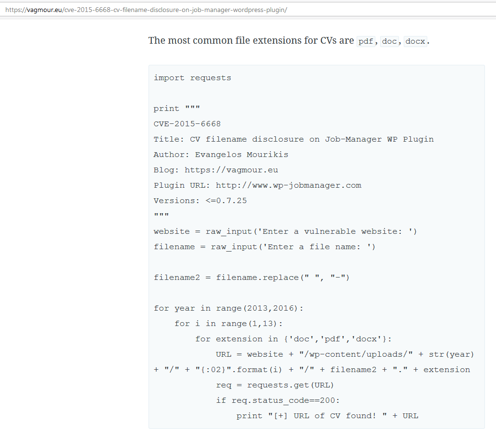
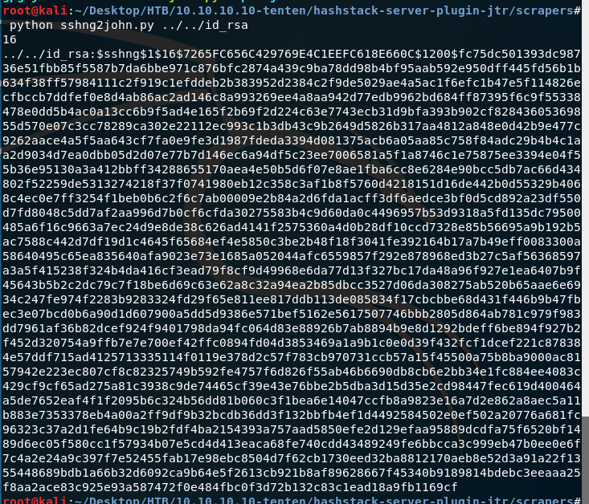

---

**Tools Used: \***NMAP
WPScan
Steghide
John\*

**Difficulty: 5/10**

**Network Enumeration
**Let’s start with a simple NMAP scan.


We can see from the NMAP scan we can see that ports 22 (SSH) and 80 (HTTP) are open.


After running a more intense scan on port 80, a few things stick out. We can see Apache 2.4.18 and WordPress 4.7.3. After searching on Exploit-DB, there are no exploits for either of these applications.


After browsing to port 80, we can see the WordPress site running.


The first thing to do on a WordPress site is to run wpscan for any vulnerabilities.


WPScan results returned a vulnerability finding regarding the job manager.



The second reference links of the exploit findings give us a website with a PHP script for exploitation. In the script, it’s calling for two inputs website and file name. We already have the site we now need to find the file name.


If we go to the apply link on the jobs page title says Pen Tester.


If we change the number, we get a different job application. Let’s see what all of the titles say. We can do this with a simple bash script.

> for i in $(seq 1 20); do echo -n “$i: “; curl -s [http://10.10.10.10/index.php/jobs/apply/\$i/](http://10.10.10.10/index.php/jobs/apply/$i/) | grep ‘<h1 class=”entry-title”>’; done


The results look typical except for line 13 that says “HackerAccessGranted.”

We need to make a few changes to our script.

```
for year in range(2017,2018):
    for i in range(1,13):
        for extension in {'php','html','pdf','png','gif','jpg','jpeg'}:
```


After running the script, we get a file name returned. HackerAccessGranted.jpg


Looking at the photo, I don’t see anything unusual and being a CTF machine the first thing that comes to my mind is steganography.


Using steghide to extract the hidden content we see there is an RSA Private key. Most likely this will be used to ssh into the server, however, we need to figure out the password for the key.


To brute force the key’s password we need sshng2john python script to get the hash in john format.




Running the hash through john, we find out the password is “superpassword”


I tried using the key to SSH into the server, and it was not working. Looking back at the WPScan I remember seeing a username discovered.


Using the user “takis,” the RSA key, and the passphrase we now have user-level SSH into tenten.


We can read user.txt.

Privilege escalation
Now that we user access we need to elevate our permissions to root. Let’s start with getting system information.

> takis@tenten:~\$ cat /etc/issue
> Ubuntu 16.04.2 LTS \n \l


Escalating to root shows that we have access to a file called “/bin/fuckin.” We need to find out what in this file.


fuckin seems to be a batch script that contains arguments that we can pass on.


Adding an argument after the file while running it as sudo allows us to run commands as root.


Adding bash to the first argument gives us root shell.


As root, we can view root.txt
